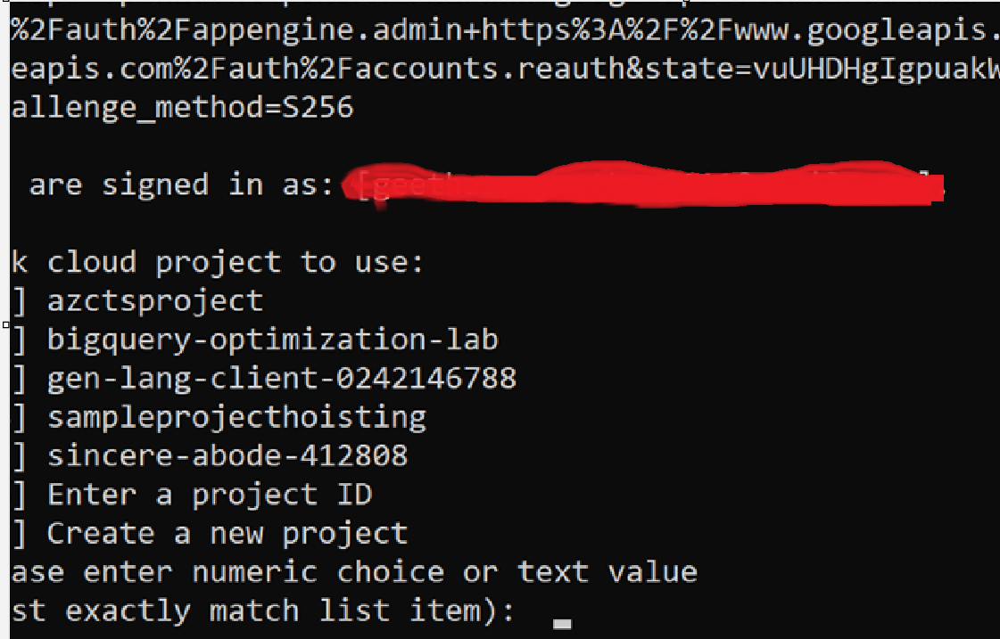

# Google Cloud CLI (gcloud) Installation Guide (Windows)

## Install using the official installer

### Option 1 – Download from Google
https://cloud.google.com/sdk/docs/install

Download **GoogleCloudSDKInstaller.exe**.

---

## Option 2 – Download using PowerShell

Run **one command at a time**.

### Step 1

```powershell
$installer = "$env:TEMP\GoogleCloudSDKInstaller.exe"
```

### Step 2

```powershell
Invoke-WebRequest -Uri "https://dl.google.com/dl/cloudsdk/channels/rapid/GoogleCloudSDKInstaller.exe" -OutFile $installer
```

### Step 3

Verify the download.

```powershell
Test-Path $installer
```

Expected output

```text
True
```

You can also inspect the file:

```powershell
Get-Item $installer
```

### Step 4

Launch the installer.

```powershell
Start-Process -FilePath $installer
```

or

```powershell
& $installer
```

---

# Alternative Download Command

```powershell
(New-Object Net.WebClient).DownloadFile(
"https://dl.google.com/dl/cloudsdk/channels/rapid/GoogleCloudSDKInstaller.exe",
"$env:TEMP\GoogleCloudSDKInstaller.exe"
)
```

Run it:

```powershell
& "$env:TEMP\GoogleCloudSDKInstaller.exe"
```

---

# Installation Options

Keep these checked:

- Install bundled Python
- Add gcloud CLI to PATH
- Start Google Cloud SDK Shell
- Run gcloud init

---

# Verify Installation

Close and reopen PowerShell.

```powershell
gcloud version
```

Expected output:

```
Google Cloud SDK
gcloud
gsutil
bq
```

---

# Initialize

```powershell
gcloud init
```

This will:

1. Open a browser.
2. Sign in to your Google account.
3. Select a Google Cloud Project.
4. Configure the default region and zone.

---

# Verify Configuration

```powershell
gcloud auth list
```

```powershell
gcloud config list
```

```powershell
gcloud config get-value project
```

---

# Common Error

## "-Uri is not recognized"

Cause:

PowerShell interpreted `-Uri` and `-OutFile` as separate commands because the multiline command was copied incorrectly.

**Fix**

Use the **single-line** `Invoke-WebRequest` command shown above, or execute each command separately.

---

# Next Steps

After installation you can submit Dataproc jobs:

```powershell
gcloud dataproc clusters list --region=asia-south1
```

```powershell
gcloud dataproc jobs submit pyspark your_script.py `
--cluster=my-cluster `
--region=asia-south1
```
