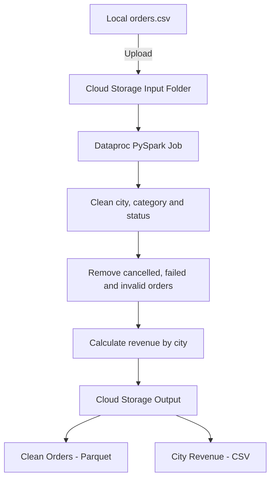
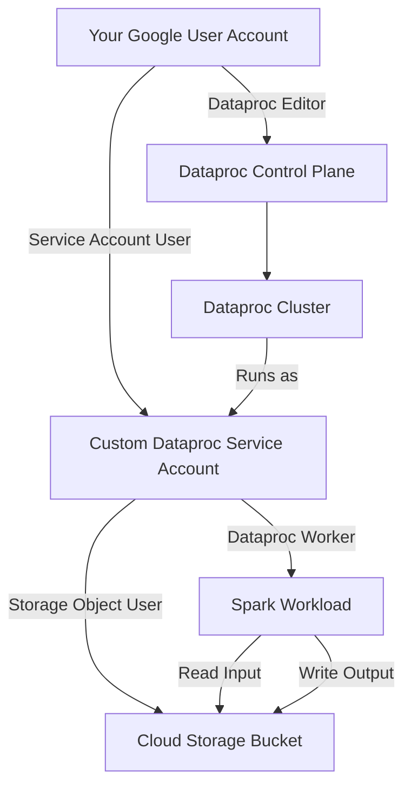
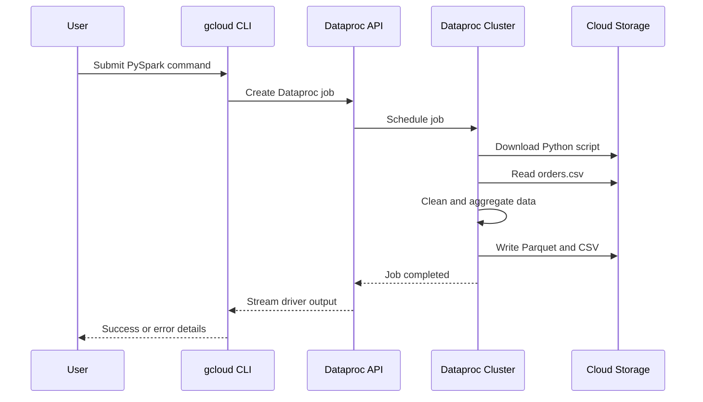
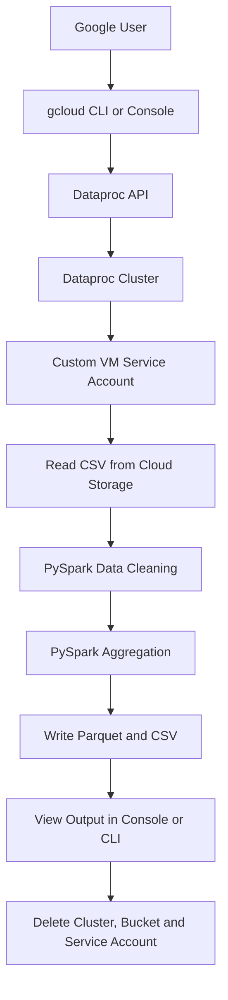

# GCP Dataproc PySpark End-to-End Beginner Guide

## Google Cloud Console, gcloud CLI, Cloud Storage, IAM and Dataproc Job Submission

This beginner-friendly lab combines the following Google Cloud topics into one simple end-to-end demonstration:

- Google Cloud Console
- Google Cloud CLI and Cloud Shell
- Google Cloud projects and billing
- Cloud Storage buckets
- IAM users, roles and service accounts
- Dataproc cluster creation
- PySpark job submission using `gcloud`
- Spark transformations
- Output verification
- Monitoring and troubleshooting
- Resource cleanup

> **Naming note:** Google Cloud may display Dataproc under **Managed Service for Apache Spark** in some Console pages. The CLI commands still use `gcloud dataproc`.

---

# 1. What We Will Build

We will process a small food-delivery CSV file.



## End-to-End Data Flow

```text
orders.csv
    |
    | Upload
    v
Cloud Storage
gs://bucket/input/orders.csv
    |
    | Read
    v
Dataproc PySpark Job
    |
    |-- Clean city, category and status
    |-- Remove cancelled and failed orders
    |-- Remove null and negative amounts
    |-- Calculate revenue by city
    v
Cloud Storage
gs://bucket/output/
    |-- clean_orders_parquet/
    `-- city_revenue_csv/
```

## IAM Execution Flow



---

# 2. Prerequisites

Before starting, you need:

1. A Google account.
2. A Google Cloud project.
3. Billing enabled for the project.
4. Permission to create:
   - Service accounts
   - IAM bindings
   - Cloud Storage buckets
   - Dataproc clusters
5. Access to Google Cloud Shell or a locally installed Google Cloud CLI.

> Dataproc clusters create billable Compute Engine resources. Delete all resources after completing the lab.

---

# 3. Create a Google Cloud Project

## Using Google Cloud Console

1. Sign in to Google Cloud Console.
2. Click the project selector near the top of the page.
3. Click **New Project**.
4. Enter a project name.

Example:

```text
Project name: Dataproc Beginner Lab
Project ID: ragav-dataproc-lab-2026
```

5. Click **Create**.
6. Select the newly created project.
7. Open **Billing**.
8. Confirm that a billing account is linked.

> Remember the **Project ID**. CLI commands use the project ID, not the project display name.

---

# 4. Choose a CLI Environment

## Recommended: Google Cloud Shell

Cloud Shell is the easiest option for a beginner because:

- `gcloud` is already installed.
- Authentication is already connected to your Google account.
- It runs inside the browser.
- Linux commands such as `cat`, `mkdir` and `export` are available.

In Google Cloud Console, click the **Activate Cloud Shell** icon:

```text
>_
```

All main commands in this guide are written for Cloud Shell Bash.

## Optional: Install Google Cloud CLI Locally

Install Google Cloud CLI for Windows, macOS or Linux.

Initialize it:

```bash
gcloud init
```

Verify the installation:

```bash
gcloud version
gcloud auth list
gcloud config list
```

For normal `gcloud` commands, `gcloud init` or `gcloud auth login` is sufficient.

The following command is mainly used when locally running application code with Google Cloud client libraries:

```bash
gcloud auth application-default login
```

---

# 5. Configure Project Variables

Replace `replace-with-your-project-id` with your real project ID.

```bash
export PROJECT_ID="replace-with-your-project-id"
export REGION="asia-south1"
export CLUSTER_NAME="dataproc-beginner-cluster"
export SERVICE_ACCOUNT_NAME="dataproc-data-sa"
```

Set the active project and default region:

```bash
gcloud config set project "$PROJECT_ID"
gcloud config set dataproc/region "$REGION"
gcloud config set compute/region "$REGION"
```

Create the remaining variables:

```bash
export USER_EMAIL="$(gcloud config get-value account)"
export SERVICE_ACCOUNT_EMAIL="${SERVICE_ACCOUNT_NAME}@${PROJECT_ID}.iam.gserviceaccount.com"
export BUCKET_NAME="${PROJECT_ID}-dataproc-demo-$(date +%s)"
```

Display the configured values:

```bash
echo "Project:         $PROJECT_ID"
echo "Region:          $REGION"
echo "User:            $USER_EMAIL"
echo "Service account: $SERVICE_ACCOUNT_EMAIL"
echo "Bucket:          $BUCKET_NAME"
echo "Cluster:         $CLUSTER_NAME"
```

## Why Use Variables?

Without variables:

```bash
gcloud dataproc clusters delete dataproc-beginner-cluster \
  --region=asia-south1
```

With variables:

```bash
gcloud dataproc clusters delete "$CLUSTER_NAME" \
  --region="$REGION"
```

Variables make commands:

- Easier to reuse
- Easier to modify
- Less error-prone
- Suitable for automation scripts

---

# 6. Verify the Active Configuration

Check the authenticated account:

```bash
gcloud auth list
```

Check the complete configuration:

```bash
gcloud config list
```

Check only the active project:

```bash
gcloud config get-value project
```

Expected output:

```text
your-project-id
```

Do not continue if the wrong project is displayed.

---

# 7. Enable Required Google Cloud APIs

Run:

```bash
gcloud services enable \
  serviceusage.googleapis.com \
  cloudresourcemanager.googleapis.com \
  iam.googleapis.com \
  compute.googleapis.com \
  storage.googleapis.com \
  dataproc.googleapis.com
```

## API Purposes

| API | Purpose |
|---|---|
| Service Usage API | Enables and manages APIs |
| Cloud Resource Manager API | Project and IAM operations |
| IAM API | Service-account management |
| Compute Engine API | Dataproc virtual machines |
| Cloud Storage API | Input, code and output storage |
| Dataproc API | Cluster and Spark-job management |

Verify the enabled APIs:

```bash
gcloud services list --enabled \
  --filter="name:(dataproc.googleapis.com OR compute.googleapis.com OR storage.googleapis.com)"
```

---

# 8. IAM Concepts for Data Workloads

## What Is IAM?

IAM means **Identity and Access Management**.

IAM answers three important questions:

1. **Who** is requesting access?
2. **What resource** are they trying to access?
3. **What actions** are they allowed to perform?

## IAM Formula

```text
Principal + Role + Resource = Access
```

Example:

```text
dataproc-data-sa service account
        +
Storage Object User role
        +
Demo Cloud Storage bucket
        =
Can read and write objects in the demo bucket
```

---

# 9. Identities Used in This Lab

## Identity 1: Your User Account

Example:

```text
your-name@gmail.com
```

Your user account:

- Creates resources
- Grants permissions
- Creates the Dataproc cluster
- Submits the Spark job
- Deletes resources

## Identity 2: Custom Dataproc VM Service Account

```text
dataproc-data-sa@PROJECT_ID.iam.gserviceaccount.com
```

The Dataproc virtual machine uses this identity while running Spark.

It:

- Runs the Spark workload
- Reads input data
- Writes output data
- Communicates with Dataproc services

## Identity 3: Dataproc Service Agent

```text
service-PROJECT_NUMBER@dataproc-accounts.iam.gserviceaccount.com
```

This is created and managed by Google.

It performs Dataproc control-plane tasks, such as managing Compute Engine resources.

> Do not assign the Dataproc Service Agent role to normal users or to the custom workload service account.

---

# 10. Roles Required for the Lab

| Principal | Role | Scope | Purpose |
|---|---|---|---|
| Your user | Dataproc Editor | Project | Create clusters and submit jobs |
| Your user | Service Account User | Custom service account | Attach the service account to the cluster |
| Your user | Storage Object User | Demo bucket | Upload, read and delete lab files |
| Dataproc service account | Dataproc Worker | Project | Required cluster workload permissions |
| Dataproc service account | Storage Object User | Demo bucket | Read input and write output |

## Important Role Difference

### Dataproc Editor

Assigned to the human user.

Allows operations such as:

- Create clusters
- Delete clusters
- Submit jobs
- View jobs

### Dataproc Worker

Assigned to the cluster VM service account.

Allows the service account to run as a Dataproc worker.

### Service Account User

Assigned to the human user on the custom service account.

Allows:

```text
iam.serviceAccounts.actAs
```

This means the user can create a resource that runs as the selected service account.

### Storage Object User

Assigned at bucket scope.

Allows:

- Create objects
- Read objects
- Update objects
- Delete objects

---

# 11. Create the Dataproc Service Account

```bash
gcloud iam service-accounts create "$SERVICE_ACCOUNT_NAME" \
  --display-name="Dataproc data workload service account" \
  --description="Runs the beginner Dataproc PySpark workload"
```

Verify:

```bash
gcloud iam service-accounts describe "$SERVICE_ACCOUNT_EMAIL"
```

---

# 12. Grant Dataproc Worker to the Service Account

```bash
gcloud projects add-iam-policy-binding "$PROJECT_ID" \
  --member="serviceAccount:${SERVICE_ACCOUNT_EMAIL}" \
  --role="roles/dataproc.worker"
```

This gives the service account the baseline permissions required to run on a Dataproc cluster.

---

# 13. Grant Service Account User to Your User

```bash
gcloud iam service-accounts add-iam-policy-binding \
  "$SERVICE_ACCOUNT_EMAIL" \
  --member="user:${USER_EMAIL}" \
  --role="roles/iam.serviceAccountUser"
```

This role is granted:

```text
To: Your Google user account
On: The custom Dataproc service account
```

Without this permission, cluster creation may fail with:

```text
iam.serviceAccounts.actAs denied
```

---

# 14. Grant Dataproc Editor to Your User

```bash
gcloud projects add-iam-policy-binding "$PROJECT_ID" \
  --member="user:${USER_EMAIL}" \
  --role="roles/dataproc.editor"
```

> In a company-managed project, an IAM administrator may need to run the permission commands.

---

# 15. Understand Cloud Storage Buckets

A Cloud Storage bucket:

- Stores objects such as CSV, JSON, Python, Parquet and log files
- Has a globally unique name
- Has a location
- Has access-control policies
- Is object storage, not a normal Windows or Linux filesystem

Our bucket structure will be:

```text
gs://BUCKET_NAME/
|-- input/
|   `-- orders.csv
|-- code/
|   `-- food_delivery_etl.py
`-- output/
    `-- run-001/
```

The folders shown above are logical object-name prefixes.

---

# 16. Create the Cloud Storage Bucket Using CLI

```bash
gcloud storage buckets create "gs://${BUCKET_NAME}" \
  --project="$PROJECT_ID" \
  --location="$REGION" \
  --default-storage-class=STANDARD \
  --uniform-bucket-level-access \
  --public-access-prevention \
  --soft-delete-duration=0
```

## Option Explanation

| Option | Purpose |
|---|---|
| `--project` | Project that owns the bucket |
| `--location` | Bucket region |
| `--default-storage-class` | Default object storage class |
| `--uniform-bucket-level-access` | Uses IAM instead of per-object ACLs |
| `--public-access-prevention` | Prevents accidental public access |
| `--soft-delete-duration=0` | Disables soft delete for this disposable lab |

> For production systems, review data-recovery requirements before disabling soft delete.

Verify the bucket:

```bash
gcloud storage buckets describe "gs://${BUCKET_NAME}"
```

---

# 17. Create a Bucket Using Google Cloud Console

To create the same type of bucket through Console:

1. Open **Cloud Storage**.
2. Select **Buckets**.
3. Click **Create**.
4. Enter a globally unique bucket name.
5. Select **Region**.
6. Select `asia-south1`.
7. Choose **Standard** storage.
8. Select **Uniform** access control.
9. Enable public-access prevention.
10. Click **Create**.

> Use either CLI or Console for the same bucket name. Do not try to create the same bucket twice.

---

# 18. Grant Bucket Access

Grant access to the Dataproc service account:

```bash
gcloud storage buckets add-iam-policy-binding \
  "gs://${BUCKET_NAME}" \
  --member="serviceAccount:${SERVICE_ACCOUNT_EMAIL}" \
  --role="roles/storage.objectUser"
```

Grant object access to your user:

```bash
gcloud storage buckets add-iam-policy-binding \
  "gs://${BUCKET_NAME}" \
  --member="user:${USER_EMAIL}" \
  --role="roles/storage.objectUser"
```

## Verify Through Console

1. Open **Cloud Storage**.
2. Open the bucket.
3. Select **Permissions**.
4. Confirm:
   - Your user account
   - The Dataproc service account
5. Confirm the **Storage Object User** role.

---

# 19. Create the Local Working Directory

```bash
mkdir -p ~/dataproc-beginner-lab
cd ~/dataproc-beginner-lab
```

Verify:

```bash
pwd
```

Expected path:

```text
/home/YOUR_CLOUD_SHELL_USERNAME/dataproc-beginner-lab
```

---

# 20. Create the Sample CSV Dataset

Create `orders.csv`:

```bash
cat > orders.csv <<'CSV'
order_id,order_date,city,category,order_amount,status
1001,2026-07-01,Chennai,Meals,450.00,COMPLETED
1002,2026-07-01,Bengaluru,Groceries,900.00,COMPLETED
1003,2026-07-01,Chennai,Meals,250.00,CANCELLED
1004,2026-07-02,Hyderabad,Pharmacy,700.00,COMPLETED
1005,2026-07-02, Bengaluru ,Meals,350.00,completed
1006,2026-07-02,Mumbai,Groceries,-50.00,COMPLETED
1007,2026-07-03,Mumbai,Meals,1250.00,COMPLETED
1008,2026-07-03,Hyderabad,Groceries,820.00,FAILED
1009,2026-07-03,Pune,Pharmacy,500.00,COMPLETED
1010,2026-07-04,Pune,Meals,,COMPLETED
1011,2026-07-04,Chennai,Groceries,640.00,COMPLETED
1012,2026-07-04,Bengaluru,Pharmacy,300.00,COMPLETED
1013,2026-07-05,Mumbai,Meals,780.00,COMPLETED
1014,2026-07-05,Hyderabad,Meals,420.00,COMPLETED
1015,2026-07-05,Pune,Groceries,950.00,COMPLETED
CSV
```

View the file:

```bash
cat orders.csv
```

## Data Quality Problems Included

The sample intentionally contains:

- `completed` in lowercase
- Extra spaces around `Bengaluru`
- A negative amount
- A blank amount
- Cancelled orders
- Failed orders

These issues help demonstrate a simple Spark cleaning process.

---

# 21. Create the PySpark Program

Create `food_delivery_etl.py`:

```bash
cat > food_delivery_etl.py <<'PY'
"""Simple Cloud Storage to Dataproc PySpark ETL demonstration."""

from __future__ import annotations

import sys

from pyspark.sql import SparkSession
from pyspark.sql import functions as F
from pyspark.sql.types import (
    DoubleType,
    IntegerType,
    StringType,
    StructField,
    StructType,
)


def main() -> None:
    """Read orders, clean them, aggregate revenue, and save the result."""

    if len(sys.argv) != 3:
        raise SystemExit(
            "Usage: food_delivery_etl.py <input_csv_path> <output_root_path>"
        )

    input_path = sys.argv[1]
    output_root = sys.argv[2]

    spark = (
        SparkSession.builder
        .appName("GCP-Dataproc-Beginner-ETL")
        .getOrCreate()
    )

    spark.sparkContext.setLogLevel("WARN")

    schema = StructType(
        [
            StructField("order_id", IntegerType(), False),
            StructField("order_date", StringType(), True),
            StructField("city", StringType(), True),
            StructField("category", StringType(), True),
            StructField("order_amount", DoubleType(), True),
            StructField("status", StringType(), True),
        ]
    )

    print(f"Reading input from: {input_path}")

    raw_df = (
        spark.read
        .option("header", True)
        .schema(schema)
        .csv(input_path)
    )

    clean_df = (
        raw_df
        .withColumn(
            "city",
            F.initcap(F.trim(F.col("city")))
        )
        .withColumn(
            "category",
            F.initcap(F.trim(F.col("category")))
        )
        .withColumn(
            "status",
            F.upper(F.trim(F.col("status")))
        )
        .filter(F.col("status") == "COMPLETED")
        .filter(F.col("order_amount").isNotNull())
        .filter(F.col("order_amount") > 0)
    )

    city_revenue_df = (
        clean_df
        .groupBy("city")
        .agg(
            F.count("*").alias("completed_orders"),
            F.round(
                F.sum("order_amount"),
                2
            ).alias("total_revenue"),
            F.round(
                F.avg("order_amount"),
                2
            ).alias("average_order_value"),
        )
        .orderBy(F.col("total_revenue").desc())
    )

    raw_count = raw_df.count()
    clean_count = clean_df.count()

    print(f"Raw rows:   {raw_count}")
    print(f"Clean rows: {clean_count}")

    print("City revenue result:")
    city_revenue_df.show(truncate=False)

    clean_orders_output = f"{output_root}/clean_orders_parquet"
    city_revenue_output = f"{output_root}/city_revenue_csv"

    (
        clean_df.write
        .mode("overwrite")
        .parquet(clean_orders_output)
    )

    (
        city_revenue_df
        .coalesce(1)
        .write
        .mode("overwrite")
        .option("header", True)
        .csv(city_revenue_output)
    )

    print(f"Clean Parquet output: {clean_orders_output}")
    print(f"Revenue CSV output:   {city_revenue_output}")
    print("ETL job completed successfully.")

    spark.stop()


if __name__ == "__main__":
    main()
PY
```

View the file:

```bash
sed -n '1,240p' food_delivery_etl.py
```

---

# 22. Understand the PySpark Code

## Read Command-Line Arguments

```python
input_path = sys.argv[1]
output_root = sys.argv[2]
```

These values are supplied after the standalone `--` in the Dataproc submit command.

## Create SparkSession

```python
spark = (
    SparkSession.builder
    .appName("GCP-Dataproc-Beginner-ETL")
    .getOrCreate()
)
```

The `SparkSession` is the main entry point for DataFrame and Spark SQL operations.

## Define the Schema

```python
schema = StructType(...)
```

A manually defined schema:

- Avoids repeated schema inference
- Ensures the amount is numeric
- Defines predictable column types
- Makes the program easier to validate

## Read CSV from Cloud Storage

```python
raw_df = (
    spark.read
    .option("header", True)
    .schema(schema)
    .csv(input_path)
)
```

The same Spark code can read a `gs://` Cloud Storage path because Dataproc is configured with the Cloud Storage connector.

## Clean Text Columns

```python
F.trim(F.col("city"))
```

Removes spaces at the beginning and end.

```python
F.initcap(...)
```

Converts names to title case.

```python
F.upper(...)
```

Converts the status to uppercase.

## Filter Valid Orders

```python
.filter(F.col("status") == "COMPLETED")
.filter(F.col("order_amount").isNotNull())
.filter(F.col("order_amount") > 0)
```

The program retains only:

- Completed orders
- Non-null amounts
- Positive amounts

## Aggregate Revenue

```python
.groupBy("city")
.agg(
    F.count("*").alias("completed_orders"),
    F.sum("order_amount").alias("total_revenue"),
    F.avg("order_amount").alias("average_order_value"),
)
```

This calculates metrics for every city.

## Save to Parquet

```python
clean_df.write.mode("overwrite").parquet(clean_orders_output)
```

Parquet is suitable for analytics because it is:

- Columnar
- Compressed
- Schema-aware
- Efficient for Spark queries

## Save to CSV

```python
city_revenue_df.coalesce(1)
```

This produces one CSV part file for the small demonstration.

> Do not automatically use `coalesce(1)` for large production datasets. It can create a bottleneck by sending the final output through one partition.

---

# 23. Upload Input and Code to Cloud Storage

Upload the CSV:

```bash
gcloud storage cp \
  orders.csv \
  "gs://${BUCKET_NAME}/input/orders.csv"
```

Upload the Python script:

```bash
gcloud storage cp \
  food_delivery_etl.py \
  "gs://${BUCKET_NAME}/code/food_delivery_etl.py"
```

List all uploaded objects:

```bash
gcloud storage ls --recursive "gs://${BUCKET_NAME}"
```

Expected:

```text
gs://YOUR_BUCKET/code/food_delivery_etl.py
gs://YOUR_BUCKET/input/orders.csv
```

You can also view these objects in:

```text
Google Cloud Console
    -> Cloud Storage
    -> Buckets
    -> Your bucket
```

---

# 24. Dataproc Cluster Basics

A normal cluster may contain:

```text
1 master node
+
1 or more worker nodes
```

For this beginner lab, we use a single-node cluster:

```text
One Compute Engine VM
    |
    |-- Dataproc master services
    `-- Dataproc worker services
```

## Why Use Single Node?

- Lower cost for a tiny lab
- Easier for a beginner
- Faster to understand
- No distributed-capacity requirement for 15 rows

> A single-node cluster is for learning and small tests, not for demonstrating production scalability.

---

# 25. Create the Dataproc Cluster

```bash
gcloud dataproc clusters create "$CLUSTER_NAME" \
  --region="$REGION" \
  --single-node \
  --master-machine-type="e2-standard-2" \
  --master-boot-disk-type="pd-standard" \
  --master-boot-disk-size="50GB" \
  --service-account="$SERVICE_ACCOUNT_EMAIL" \
  --scopes="https://www.googleapis.com/auth/cloud-platform" \
  --bucket="$BUCKET_NAME" \
  --temp-bucket="$BUCKET_NAME" \
  --enable-component-gateway \
  --delete-max-idle="30m" \
  --labels="purpose=beginner-demo"
```

## Cluster Option Explanation

| Option | Meaning |
|---|---|
| `--region` | Dataproc region |
| `--single-node` | Creates one VM containing master and worker services |
| `--master-machine-type` | CPU and memory configuration |
| `--master-boot-disk-type` | Boot-disk type |
| `--master-boot-disk-size` | Boot-disk capacity |
| `--service-account` | Identity used by cluster VMs |
| `--scopes` | Makes Google Cloud APIs available, subject to IAM |
| `--bucket` | Dataproc staging and driver-output bucket |
| `--temp-bucket` | Temporary data bucket |
| `--enable-component-gateway` | Enables supported Spark and Hadoop web interfaces |
| `--delete-max-idle` | Deletes cluster after an idle period |
| `--labels` | Adds searchable resource metadata |

---

# 26. Check Cluster Status

List clusters:

```bash
gcloud dataproc clusters list \
  --region="$REGION"
```

Display only the status:

```bash
gcloud dataproc clusters describe "$CLUSTER_NAME" \
  --region="$REGION" \
  --format="value(status.state)"
```

Expected:

```text
RUNNING
```

Display important details:

```bash
gcloud dataproc clusters describe "$CLUSTER_NAME" \
  --region="$REGION" \
  --format="yaml(
    clusterName,
    status.state,
    config.gceClusterConfig.serviceAccount,
    config.masterConfig.machineTypeUri
  )"
```

---

# 27. View the Cluster in Google Cloud Console

1. Search for **Managed Service for Apache Spark** or **Dataproc**.
2. Open **Clusters**.
3. Select `dataproc-beginner-cluster`.
4. Review:
   - Configuration
   - Virtual machine instances
   - Service account
   - Jobs
   - Web interfaces
   - Logs

---

# 28. Understand the PySpark Submit Command

General syntax:

```text
gcloud dataproc jobs submit pyspark PYTHON_FILE
    --cluster=CLUSTER
    --region=REGION
    --
    SCRIPT_ARGUMENT_1
    SCRIPT_ARGUMENT_2
```

The standalone `--` separates:

```text
gcloud and Dataproc options
```

from:

```text
Arguments passed to your Python program
```

Example:

```text
food_delivery_etl.py
    sys.argv[1] = input Cloud Storage path
    sys.argv[2] = output Cloud Storage root path
```

---

# 29. Submit the PySpark Job

```bash
gcloud dataproc jobs submit pyspark \
  "gs://${BUCKET_NAME}/code/food_delivery_etl.py" \
  --cluster="$CLUSTER_NAME" \
  --region="$REGION" \
  -- \
  "gs://${BUCKET_NAME}/input/orders.csv" \
  "gs://${BUCKET_NAME}/output/run-001"
```

## Submission Flow



A successful command normally ends with:

```text
Job finished successfully.
```

---

# 30. Expected Spark Result

## Expected Counts

```text
Raw rows:   15
Clean rows: 11
```

Four rows are excluded because they contain:

- Cancelled status
- Failed status
- Negative amount
- Missing amount

## Expected City Aggregation

| City | Completed Orders | Total Revenue | Average Order Value |
|---|---:|---:|---:|
| Mumbai | 2 | 2030.00 | 1015.00 |
| Bengaluru | 3 | 1550.00 | 516.67 |
| Pune | 2 | 1450.00 | 725.00 |
| Hyderabad | 2 | 1120.00 | 560.00 |
| Chennai | 2 | 1090.00 | 545.00 |

Expected driver output:

```text
+---------+----------------+-------------+-------------------+
|city     |completed_orders|total_revenue|average_order_value|
+---------+----------------+-------------+-------------------+
|Mumbai   |2               |2030.0       |1015.0             |
|Bengaluru|3               |1550.0       |516.67             |
|Pune     |2               |1450.0       |725.0              |
|Hyderabad|2               |1120.0       |560.0              |
|Chennai  |2               |1090.0       |545.0              |
+---------+----------------+-------------+-------------------+
```

---

# 31. Monitor Jobs Using CLI

List all jobs:

```bash
gcloud dataproc jobs list \
  --region="$REGION"
```

List successful jobs:

```bash
gcloud dataproc jobs list \
  --region="$REGION" \
  --filter="status.state=DONE"
```

List failed jobs:

```bash
gcloud dataproc jobs list \
  --region="$REGION" \
  --filter="status.state=ERROR"
```

Describe a specific job:

```bash
gcloud dataproc jobs describe "JOB_ID" \
  --region="$REGION"
```

Continue waiting for or retrieving driver output:

```bash
gcloud dataproc jobs wait "JOB_ID" \
  --project="$PROJECT_ID" \
  --region="$REGION"
```

Replace `JOB_ID` with the actual job identifier.

---

# 32. Monitor Jobs Using Console

1. Open **Managed Service for Apache Spark**.
2. Select **Jobs**.
3. Select the job ID.
4. Review:
   - Job state
   - Driver output
   - Cluster name
   - Start time
   - Completion time
   - Job arguments
   - Error messages

Common job states include:

| State | Meaning |
|---|---|
| `PENDING` | Job is waiting |
| `SETUP_DONE` | Job setup completed |
| `RUNNING` | Job is executing |
| `DONE` | Job completed successfully |
| `ERROR` | Job failed |
| `CANCELLED` | Job was cancelled |

---

# 33. View Cloud Storage Output

List all generated files:

```bash
gcloud storage ls --recursive \
  "gs://${BUCKET_NAME}/output/run-001"
```

Expected structure:

```text
output/run-001/
|-- clean_orders_parquet/
|   |-- _SUCCESS
|   `-- part-00000-....snappy.parquet
`-- city_revenue_csv/
    |-- _SUCCESS
    `-- part-00000-....csv
```

## Why Does Spark Create Part Files?

Spark processes data using partitions.

Each output partition generally produces a file:

```text
Spark partition 0 -> part-00000
Spark partition 1 -> part-00001
Spark partition 2 -> part-00002
```

The `_SUCCESS` file indicates that the write operation completed successfully.

---

# 34. Display the Result CSV

```bash
gcloud storage cat \
  "gs://${BUCKET_NAME}/output/run-001/city_revenue_csv/part-*.csv"
```

Expected:

```text
city,completed_orders,total_revenue,average_order_value
Mumbai,2,2030.0,1015.0
Bengaluru,3,1550.0,516.67
Pune,2,1450.0,725.0
Hyderabad,2,1120.0,560.0
Chennai,2,1090.0,545.0
```

---

# 35. Download the Output into Cloud Shell

```bash
mkdir -p downloaded-output
```

```bash
gcloud storage cp --recursive \
  "gs://${BUCKET_NAME}/output/run-001" \
  downloaded-output/
```

View downloaded files:

```bash
find downloaded-output -type f
```

You can then use the Cloud Shell file browser to download files to your computer.

---

# 36. Submit the Same Job Through Google Cloud Console

The cluster must already be running.

1. Open **Managed Service for Apache Spark**.
2. Select **Jobs**.
3. Click **Submit job**.
4. Select the cluster:

```text
dataproc-beginner-cluster
```

5. Select job type:

```text
PySpark
```

6. Enter the main Python file:

```text
gs://YOUR_BUCKET/code/food_delivery_etl.py
```

7. Add argument 1:

```text
gs://YOUR_BUCKET/input/orders.csv
```

8. Add argument 2:

```text
gs://YOUR_BUCKET/output/run-002
```

9. Click **Submit**.
10. Open the job ID to view the driver output.

Use `run-002` so the Console execution does not overwrite the CLI demonstration output.

---

# 37. Console and CLI Comparison

| Task | Google Cloud Console | gcloud CLI |
|---|---|---|
| Select project | Project selector | `gcloud config set project` |
| Enable API | APIs and Services | `gcloud services enable` |
| Create bucket | Cloud Storage → Buckets | `gcloud storage buckets create` |
| Upload file | Bucket → Upload | `gcloud storage cp` |
| Create service account | IAM and Admin → Service Accounts | `gcloud iam service-accounts create` |
| Grant project role | IAM and Admin → IAM | `gcloud projects add-iam-policy-binding` |
| Create cluster | Managed Spark → Clusters | `gcloud dataproc clusters create` |
| Submit job | Managed Spark → Jobs | `gcloud dataproc jobs submit pyspark` |
| View output | Cloud Storage browser | `gcloud storage ls` and `cat` |
| Delete cluster | Cluster → Delete | `gcloud dataproc clusters delete` |

## Use Console When

- Learning the service
- Inspecting resources visually
- Reviewing job logs
- Performing an occasional manual operation
- Investigating a failure

## Use CLI When

- Repeating a process
- Automating deployments
- Writing scripts
- Maintaining a consistent configuration
- Working with CI/CD pipelines

---

# 38. View IAM Roles in Console

## Project-Level Roles

1. Open **IAM and Admin**.
2. Select **IAM**.
3. Locate your user account.
4. Confirm the **Dataproc Editor** role.
5. Locate the custom Dataproc service account.
6. Confirm the **Dataproc Worker** role.

To view Google-managed identities, enable:

```text
Include Google-provided role grants
```

## Service-Account-Level Permission

1. Open **IAM and Admin**.
2. Select **Service Accounts**.
3. Open `dataproc-data-sa`.
4. Open **Permissions**.
5. Confirm that your user has:

```text
Service Account User
```

---

# 39. Common Errors and Solutions

## Error 1: API Is Disabled

Example:

```text
Dataproc API has not been used in project or is disabled
```

Fix:

```bash
gcloud services enable \
  compute.googleapis.com \
  dataproc.googleapis.com
```

---

## Error 2: `iam.serviceAccounts.actAs` Denied

Example:

```text
Permission iam.serviceAccounts.actAs denied
```

Cause:

```text
Your user cannot attach the custom service account.
```

Fix:

```bash
gcloud iam service-accounts add-iam-policy-binding \
  "$SERVICE_ACCOUNT_EMAIL" \
  --member="user:${USER_EMAIL}" \
  --role="roles/iam.serviceAccountUser"
```

---

## Error 3: Dataproc Worker Role Missing

Example:

```text
The VM service account does not have required permissions
```

Fix:

```bash
gcloud projects add-iam-policy-binding "$PROJECT_ID" \
  --member="serviceAccount:${SERVICE_ACCOUNT_EMAIL}" \
  --role="roles/dataproc.worker"
```

---

## Error 4: Cloud Storage 403

Examples:

```text
403 Access denied
storage.objects.get denied
storage.objects.create denied
```

Grant access:

```bash
gcloud storage buckets add-iam-policy-binding \
  "gs://${BUCKET_NAME}" \
  --member="serviceAccount:${SERVICE_ACCOUNT_EMAIL}" \
  --role="roles/storage.objectUser"
```

Verify the service account used by the cluster:

```bash
gcloud dataproc clusters describe "$CLUSTER_NAME" \
  --region="$REGION" \
  --format="value(config.gceClusterConfig.serviceAccount)"
```

Expected:

```text
dataproc-data-sa@YOUR_PROJECT_ID.iam.gserviceaccount.com
```

---

## Error 5: Cluster Not Found

Example:

```text
Cluster not found
```

The region may be incorrect.

Check:

```bash
gcloud dataproc clusters list \
  --region="$REGION"
```

Use the same region for:

- Cluster creation
- Job submission
- Cluster description
- Job listing
- Cluster deletion

---

## Error 6: Bucket Name Already Exists

Cloud Storage bucket names are globally unique.

Generate another name:

```bash
export BUCKET_NAME="${PROJECT_ID}-dataproc-demo-$(date +%s)"
```

Create the new bucket:

```bash
gcloud storage buckets create "gs://${BUCKET_NAME}" \
  --project="$PROJECT_ID" \
  --location="$REGION"
```

---

## Error 7: Resource Exhausted or Quota Exceeded

Examples:

```text
RESOURCE_EXHAUSTED
Quota exceeded
Machine type unavailable
```

Try a specific zone:

```bash
gcloud dataproc clusters create "$CLUSTER_NAME" \
  --region="$REGION" \
  --zone="asia-south1-a" \
  --single-node \
  --master-machine-type="e2-standard-2"
```

Check quotas:

```text
Google Cloud Console
    -> IAM and Admin
    -> Quotas and System Limits
```

---

## Error 8: Default Network Not Found

Check networks:

```bash
gcloud compute networks list
```

Check subnets:

```bash
gcloud compute networks subnets list \
  --regions="$REGION"
```

Create the cluster with an existing subnet:

```bash
gcloud dataproc clusters create "$CLUSTER_NAME" \
  --region="$REGION" \
  --subnet="YOUR_SUBNET_NAME" \
  --single-node
```

In a company environment, ask the network administrator which VPC and subnet should be used.

---

## Error 9: Output Already Exists

Spark may fail when the output location exists and the script does not use overwrite mode.

This guide uses:

```python
.mode("overwrite")
```

Another solution is to use a new output path:

```text
gs://YOUR_BUCKET/output/run-002
gs://YOUR_BUCKET/output/run-003
```

---

## Error 10: No Single Output CSV File

Spark normally creates distributed part files:

```text
part-00000
part-00001
part-00002
_SUCCESS
```

For this tiny demonstration, the script uses:

```python
city_revenue_df.coalesce(1)
```

For production data, retaining multiple output partitions is usually better.

---

# 40. Cleanup

Cleanup is mandatory because running clusters and stored data may generate charges.

## Delete the Dataproc Cluster

```bash
gcloud dataproc clusters delete "$CLUSTER_NAME" \
  --region="$REGION" \
  --quiet
```

Verify:

```bash
gcloud dataproc clusters list \
  --region="$REGION"
```

---

## Delete the Bucket and Its Contents

```bash
gcloud storage rm --recursive \
  "gs://${BUCKET_NAME}/"
```

Verify:

```bash
gcloud storage buckets list \
  --filter="name:${BUCKET_NAME}"
```

---

## Delete the Custom Service Account

```bash
gcloud iam service-accounts delete \
  "$SERVICE_ACCOUNT_EMAIL" \
  --quiet
```

---

## Optional: Delete the Entire Project

Only do this if the project was created exclusively for the lab:

```bash
gcloud projects delete "$PROJECT_ID"
```

Deleting the project removes all resources belonging to that project.

---

# 41. Complete Command Sequence

The following section summarizes the main commands.

> Replace the project ID before running.

```bash
# ------------------------------------------------------------
# 1. VARIABLES
# ------------------------------------------------------------

export PROJECT_ID="replace-with-your-project-id"
export REGION="asia-south1"
export CLUSTER_NAME="dataproc-beginner-cluster"
export SERVICE_ACCOUNT_NAME="dataproc-data-sa"

gcloud config set project "$PROJECT_ID"
gcloud config set dataproc/region "$REGION"
gcloud config set compute/region "$REGION"

export USER_EMAIL="$(gcloud config get-value account)"
export SERVICE_ACCOUNT_EMAIL="${SERVICE_ACCOUNT_NAME}@${PROJECT_ID}.iam.gserviceaccount.com"
export BUCKET_NAME="${PROJECT_ID}-dataproc-demo-$(date +%s)"

# ------------------------------------------------------------
# 2. ENABLE APIS
# ------------------------------------------------------------

gcloud services enable \
  serviceusage.googleapis.com \
  cloudresourcemanager.googleapis.com \
  iam.googleapis.com \
  compute.googleapis.com \
  storage.googleapis.com \
  dataproc.googleapis.com

# ------------------------------------------------------------
# 3. CREATE SERVICE ACCOUNT
# ------------------------------------------------------------

gcloud iam service-accounts create "$SERVICE_ACCOUNT_NAME" \
  --display-name="Dataproc data workload service account"

# ------------------------------------------------------------
# 4. IAM ROLES
# ------------------------------------------------------------

gcloud projects add-iam-policy-binding "$PROJECT_ID" \
  --member="serviceAccount:${SERVICE_ACCOUNT_EMAIL}" \
  --role="roles/dataproc.worker"

gcloud iam service-accounts add-iam-policy-binding \
  "$SERVICE_ACCOUNT_EMAIL" \
  --member="user:${USER_EMAIL}" \
  --role="roles/iam.serviceAccountUser"

gcloud projects add-iam-policy-binding "$PROJECT_ID" \
  --member="user:${USER_EMAIL}" \
  --role="roles/dataproc.editor"

# ------------------------------------------------------------
# 5. CREATE BUCKET
# ------------------------------------------------------------

gcloud storage buckets create "gs://${BUCKET_NAME}" \
  --project="$PROJECT_ID" \
  --location="$REGION" \
  --default-storage-class=STANDARD \
  --uniform-bucket-level-access \
  --public-access-prevention \
  --soft-delete-duration=0

# ------------------------------------------------------------
# 6. BUCKET IAM
# ------------------------------------------------------------

gcloud storage buckets add-iam-policy-binding \
  "gs://${BUCKET_NAME}" \
  --member="serviceAccount:${SERVICE_ACCOUNT_EMAIL}" \
  --role="roles/storage.objectUser"

gcloud storage buckets add-iam-policy-binding \
  "gs://${BUCKET_NAME}" \
  --member="user:${USER_EMAIL}" \
  --role="roles/storage.objectUser"

# ------------------------------------------------------------
# 7. UPLOAD FILES
# ------------------------------------------------------------

gcloud storage cp \
  orders.csv \
  "gs://${BUCKET_NAME}/input/orders.csv"

gcloud storage cp \
  food_delivery_etl.py \
  "gs://${BUCKET_NAME}/code/food_delivery_etl.py"

# ------------------------------------------------------------
# 8. CREATE CLUSTER
# ------------------------------------------------------------

gcloud dataproc clusters create "$CLUSTER_NAME" \
  --region="$REGION" \
  --single-node \
  --master-machine-type="e2-standard-2" \
  --master-boot-disk-type="pd-standard" \
  --master-boot-disk-size="50GB" \
  --service-account="$SERVICE_ACCOUNT_EMAIL" \
  --scopes="https://www.googleapis.com/auth/cloud-platform" \
  --bucket="$BUCKET_NAME" \
  --temp-bucket="$BUCKET_NAME" \
  --enable-component-gateway \
  --delete-max-idle="30m" \
  --labels="purpose=beginner-demo"

# ------------------------------------------------------------
# 9. SUBMIT PYSPARK JOB
# ------------------------------------------------------------

gcloud dataproc jobs submit pyspark \
  "gs://${BUCKET_NAME}/code/food_delivery_etl.py" \
  --cluster="$CLUSTER_NAME" \
  --region="$REGION" \
  -- \
  "gs://${BUCKET_NAME}/input/orders.csv" \
  "gs://${BUCKET_NAME}/output/run-001"

# ------------------------------------------------------------
# 10. VIEW OUTPUT
# ------------------------------------------------------------

gcloud storage ls --recursive \
  "gs://${BUCKET_NAME}/output/run-001"

gcloud storage cat \
  "gs://${BUCKET_NAME}/output/run-001/city_revenue_csv/part-*.csv"

# ------------------------------------------------------------
# 11. CLEANUP
# ------------------------------------------------------------

gcloud dataproc clusters delete "$CLUSTER_NAME" \
  --region="$REGION" \
  --quiet

gcloud storage rm --recursive \
  "gs://${BUCKET_NAME}/"

gcloud iam service-accounts delete \
  "$SERVICE_ACCOUNT_EMAIL" \
  --quiet
```

---

# 42. Learning Summary

After completing this demonstration, you should understand the following concepts.

## Google Cloud Console

A graphical interface for:

- Creating resources
- Viewing configuration
- Inspecting job status
- Reading logs
- Managing permissions

## Google Cloud CLI

A command-line interface for:

- Creating resources
- Automating operations
- Submitting workloads
- Repeating deployment steps
- Supporting CI/CD

## Cloud Storage Bucket

Object storage used for:

- Input data
- Python code
- Spark output
- Temporary files
- Driver output

## IAM Role

A collection of permissions assigned to a principal.

## Service Account

A non-human identity used by:

- Virtual machines
- Applications
- Data pipelines
- Automated workloads

## Dataproc Cluster

Managed Compute Engine virtual machines configured with Spark and related services.

## Dataproc Job

A Spark, PySpark, Hadoop or related workload submitted for execution.

---

# 43. Final End-to-End Flow



```text
User
  |
  v
gcloud command or Google Cloud Console
  |
  v
Dataproc API
  |
  v
Dataproc cluster
  |
  v
PySpark transformation
  |
  v
Cloud Storage output
  |
  v
Console and CLI monitoring
  |
  v
Resource cleanup
```

---

# 44. Official Documentation

- [Google Cloud CLI initialization](https://cloud.google.com/sdk/docs/initializing)
- [Enable and disable Google Cloud services](https://cloud.google.com/service-usage/docs/enable-disable)
- [Dataproc IAM roles](https://cloud.google.com/dataproc/docs/concepts/iam/iam)
- [Dataproc service accounts](https://cloud.google.com/dataproc/docs/concepts/configuring-clusters/service-accounts)
- [Create a Dataproc cluster with gcloud](https://cloud.google.com/sdk/gcloud/reference/dataproc/clusters/create)
- [Submit a PySpark job](https://cloud.google.com/sdk/gcloud/reference/dataproc/jobs/submit/pyspark)
- [Submit Dataproc jobs](https://cloud.google.com/dataproc/docs/guides/submit-job)
- [Create Cloud Storage buckets](https://cloud.google.com/storage/docs/creating-buckets)
- [Cloud Storage IAM roles](https://cloud.google.com/storage/docs/access-control/iam-roles)
- [Delete Cloud Storage objects and buckets](https://cloud.google.com/sdk/gcloud/reference/storage/rm)

---

# 45. Practice Exercises

After completing the main lab, try the following.

## Exercise 1: Revenue by Category

Modify the PySpark program to calculate:

```text
category
completed_orders
total_revenue
average_order_value
```

## Exercise 2: Daily Revenue

Convert `order_date` to a date column and calculate revenue for every date.

## Exercise 3: Add a Delivery Fee

Add a `delivery_fee` column and calculate:

```text
gross_revenue = order_amount + delivery_fee
```

## Exercise 4: Save JSON Output

Save the city summary in JSON format:

```python
city_revenue_df.write.mode("overwrite").json(output_path)
```

## Exercise 5: Use Multiple Workers

Create a standard cluster with two worker nodes and compare:

- Cluster cost
- Spark UI
- Number of executors
- Number of output part files

## Exercise 6: Restrict Storage Permissions

Create separate input and output buckets.

Grant:

- Read-only access on the input bucket
- Object-user access on the output bucket

This demonstrates more precise least-privilege IAM design.
