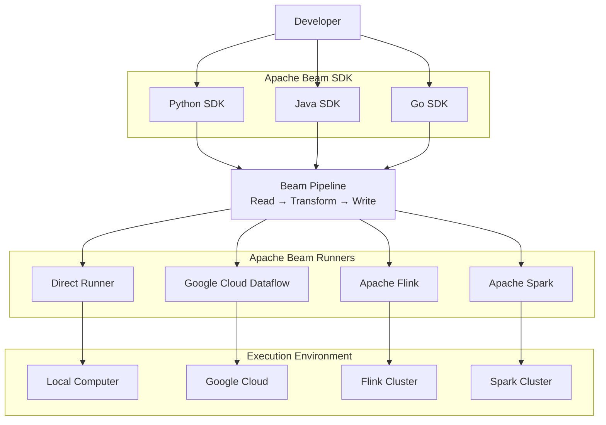
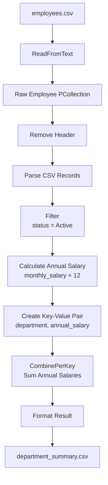
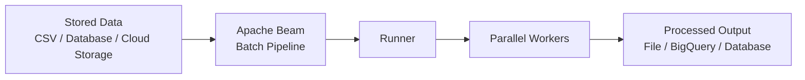
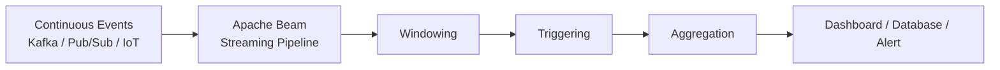
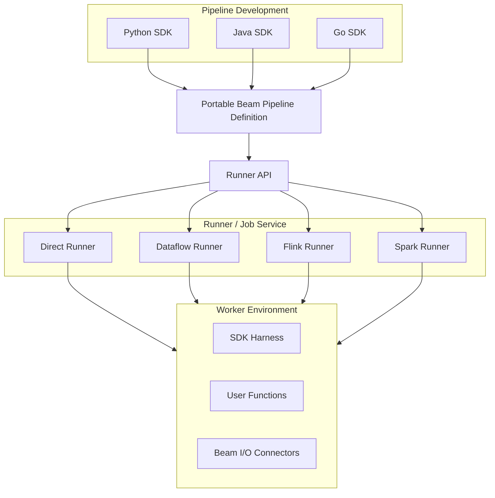
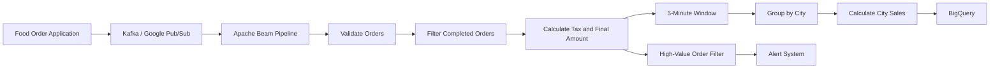
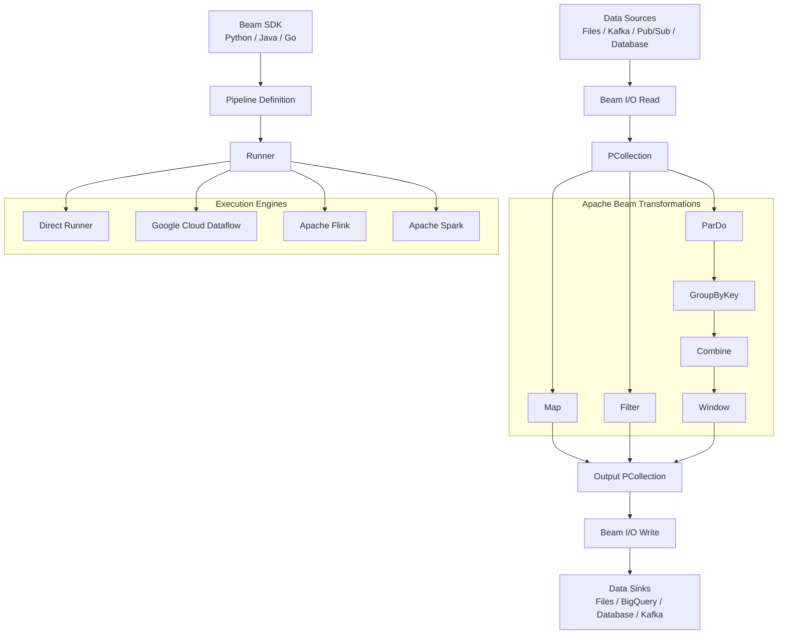

# Apache Beam Architecture Overview

## 1. What Is Apache Beam?

**Apache Beam** is an open-source, unified programming model used to build both:

- **Batch data-processing pipelines** — processing a fixed amount of stored data.
- **Streaming data-processing pipelines** — continuously processing incoming data.

You write the data-processing logic once using an Apache Beam SDK and then select a **Runner** to execute it on a processing engine such as:

- Direct Runner
- Google Cloud Dataflow
- Apache Flink
- Apache Spark

The Beam SDK describes **what processing should happen**, while the selected Runner decides **how and where to execute it**.

---

## 2. Apache Beam in One Simple Sentence

> Apache Beam allows us to write one data-processing pipeline and execute it using different distributed processing engines.

```text
Write pipeline using Python
           ↓
Test locally using Direct Runner
           ↓
Execute in production using Google Cloud Dataflow
```

---

## 3. Simple Apache Beam Architecture Diagram



### Architecture Explanation

1. The developer writes a pipeline using a Beam SDK.
2. The pipeline contains input, transformation and output operations.
3. A Runner converts the Beam pipeline into a job that its processing engine understands.
4. The selected environment executes the job.
5. The processed result is written to the destination.

---

# 4. Main Components of Apache Beam

```text
Pipeline
   |
   +-- PipelineOptions
   |
   +-- Input Source
   |
   +-- PCollection
   |
   +-- PTransform
   |
   +-- Runner
   |
   +-- Output Sink
```

## 4.1 Pipeline

A **Pipeline** is the complete data-processing workflow.

It defines:

- Where data comes from
- What transformations must be performed
- Where the result must be stored

```text
Read employee data
        ↓
Filter active employees
        ↓
Calculate annual salary
        ↓
Group employees by department
        ↓
Write the result
```

```python
import apache_beam as beam

pipeline = beam.Pipeline()
```

## 4.2 PipelineOptions

`PipelineOptions` contains the configuration required to execute the pipeline.

```python
from apache_beam.options.pipeline_options import PipelineOptions

options = PipelineOptions(
    runner="DirectRunner"
)
```

For Google Cloud Dataflow:

```python
options = PipelineOptions(
    runner="DataflowRunner",
    project="my-gcp-project",
    region="us-central1",
    temp_location="gs://my-bucket/temp",
    staging_location="gs://my-bucket/staging"
)
```

## 4.3 Input Source

Common sources include:

- CSV files
- Text files
- JSON files
- Google Cloud Storage
- Google Pub/Sub
- BigQuery
- Kafka
- Databases

```python
lines = pipeline | beam.io.ReadFromText("employees.csv")
```

## 4.4 PCollection

A **PCollection** is the distributed dataset used inside a Beam pipeline.

```text
Input PCollection
       ↓
Transformation
       ↓
Output PCollection
```

```python
employees = pipeline | beam.io.ReadFromText("employees.csv")
```

## 4.5 PTransform

A **PTransform** is an operation performed on a `PCollection`.

| Transform | Purpose |
|---|---|
| `Map` | Transform each record |
| `FlatMap` | Convert one record into zero, one or many records |
| `Filter` | Keep only matching records |
| `ParDo` | Perform custom processing |
| `GroupByKey` | Group values using a key |
| `CombinePerKey` | Aggregate values for each key |
| `Count` | Count records |
| `Distinct` | Remove duplicate values |
| `Flatten` | Combine multiple PCollections |

```python
active_employees = employees | beam.Filter(
    lambda employee: employee["status"] == "Active"
)
```

## 4.6 Runner

A **Runner** executes the pipeline.

```text
Apache Beam = Defines the processing
Runner       = Executes the processing
```

| Runner | Execution location | Typical use |
|---|---|---|
| Direct Runner | Local computer | Development and testing |
| Dataflow Runner | Google Cloud | Managed cloud processing |
| Flink Runner | Flink cluster | Batch and streaming |
| Spark Runner | Spark cluster | Distributed data processing |

```bash
python employee_pipeline.py --runner DirectRunner
```

## 4.7 Output Sink

The **Output Sink** is the final destination where processed data is written.

```python
results | beam.io.WriteToText("output/department_summary")
```

---

# 5. Apache Beam Pipeline Architecture

```mermaid
flowchart LR
    A["Input Source<br/>CSV / Kafka / Pub/Sub / Database"]
    B["Read Transform"]
    C["PCollection 1<br/>Raw Data"]
    D["Filter Transform"]
    E["PCollection 2<br/>Filtered Data"]
    F["Map / ParDo Transform"]
    G["PCollection 3<br/>Processed Data"]
    H["Group / Aggregate"]
    I["PCollection 4<br/>Summary Data"]
    J["Write Transform"]
    K["Output Sink<br/>File / BigQuery / Database"]

    A --> B --> C --> D --> E --> F --> G --> H --> I --> J --> K
```



```text
Source
  ↓
Read
  ↓
PCollection
  ↓
PTransform
  ↓
PCollection
  ↓
Write
  ↓
Sink
```

---

# 6. Simple Employee Processing Example

Input file:

```csv
employee_id,name,department,monthly_salary,status
101,John,IT,5000,Active
102,Mary,HR,4000,Inactive
103,David,IT,6000,Active
104,Susan,Finance,5500,Active
105,Robert,HR,4500,Active
```

Requirements:

1. Read employee records.
2. Remove the header.
3. Parse each row.
4. Filter active employees.
5. Calculate annual salary.
6. Group employees by department.
7. Calculate department totals.
8. Write the result.



---

# 7. Complete Python Program

Save as `employee_pipeline.py`.

```python
import apache_beam as beam
from apache_beam.options.pipeline_options import PipelineOptions


def parse_employee(line):
    values = line.split(",")

    return {
        "employee_id": int(values[0]),
        "name": values[1].strip(),
        "department": values[2].strip(),
        "monthly_salary": float(values[3]),
        "status": values[4].strip()
    }


def add_annual_salary(employee):
    return {
        **employee,
        "annual_salary": employee["monthly_salary"] * 12
    }


def format_result(item):
    department, total_salary = item
    return f"{department},{total_salary:.2f}"


def run():
    options = PipelineOptions(
        runner="DirectRunner"
    )

    with beam.Pipeline(options=options) as pipeline:

        employees = (
            pipeline
            | "Read Employee File" >> beam.io.ReadFromText(
                "employees.csv",
                skip_header_lines=1
            )
            | "Parse Employee Records" >> beam.Map(parse_employee)
        )

        active_employees = (
            employees
            | "Filter Active Employees" >> beam.Filter(
                lambda employee: employee["status"].lower() == "active"
            )
        )

        employees_with_annual_salary = (
            active_employees
            | "Calculate Annual Salary" >> beam.Map(add_annual_salary)
        )

        department_salary_pairs = (
            employees_with_annual_salary
            | "Create Department Salary Pairs" >> beam.Map(
                lambda employee: (
                    employee["department"],
                    employee["annual_salary"]
                )
            )
        )

        department_totals = (
            department_salary_pairs
            | "Calculate Department Totals" >> beam.CombinePerKey(sum)
        )

        formatted_results = (
            department_totals
            | "Format Output" >> beam.Map(format_result)
        )

        formatted_results | "Write Output" >> beam.io.WriteToText(
            "output/department_summary",
            file_name_suffix=".csv",
            header="department,total_annual_salary"
        )


if __name__ == "__main__":
    run()
```

---

# 8. Expected Output

```csv
department,total_annual_salary
IT,132000.00
Finance,66000.00
HR,54000.00
```

---

# 9. Batch Processing Architecture



Batch processing works with a finite dataset, such as:

- Yesterday's sales file
- Monthly employee data
- Historical log files
- Stored transaction records

---

# 10. Streaming Processing Architecture



Streaming processing handles continuously arriving events such as:

- Kafka messages
- Pub/Sub messages
- IoT sensor readings
- Website activity
- Banking transactions

---

# 11. Important Streaming Concepts

## Window

A Window divides an infinite stream into smaller time groups.

```text
10:00–10:05
10:05–10:10
10:10–10:15
```

```python
from apache_beam.transforms.window import FixedWindows

windowed_orders = orders | beam.WindowInto(
    FixedWindows(300)
)
```

## Trigger

A Trigger decides when the result of a window should be produced.

## Watermark

A Watermark estimates how far event-time processing has progressed.

## Event Time

The time at which the event actually occurred.

## Processing Time

The time at which the system processed the event.

---

# 12. Apache Beam Portability Architecture



---

# 13. Real-World Food Order Example



Processing steps:

1. Receive orders from Kafka or Pub/Sub.
2. Validate incoming records.
3. Remove cancelled orders.
4. Calculate tax and final amount.
5. Group records into five-minute windows.
6. Calculate sales by city.
7. Store summaries in BigQuery.
8. Send high-value orders to an alert system.

---

# 14. Apache Beam vs Runner

| Apache Beam | Runner |
|---|---|
| Provides the programming model | Executes the pipeline |
| Defines transformations | Distributes transformations |
| Creates PCollections | Divides data into bundles |
| Provides APIs | Manages workers |
| Provides I/O connectors | Manages runtime execution |
| Describes what to do | Decides how to do it |

---

# 15. Simple Analogy

Think of Apache Beam as a recipe.

```text
Apache Beam Pipeline = Recipe
Runner               = Kitchen
Workers              = Cooks
PCollection           = Ingredients
PTransform            = Cooking operation
Output Sink           = Served food
```

The same recipe can be executed in different kitchens.

Similarly, the same Beam pipeline can be executed using different compatible Runners.

---

# 16. Important Terms Summary

| Term | Simple meaning |
|---|---|
| Pipeline | Complete data-processing workflow |
| PipelineOptions | Pipeline execution configuration |
| PCollection | Distributed dataset |
| PTransform | Operation applied to data |
| Map | Transform every record |
| Filter | Keep matching records |
| ParDo | Perform custom parallel processing |
| GroupByKey | Group values using a key |
| CombinePerKey | Aggregate values for each key |
| Runner | Executes the Beam pipeline |
| Source | Location from which data is read |
| Sink | Destination where data is written |
| Window | Groups streaming events using time |
| Trigger | Decides when window results are produced |
| Watermark | Estimates event-time progress |
| DoFn | Custom function used with `ParDo` |

---

# 17. Final Architecture Summary



---

# 18. Final Understanding

Apache Beam works using the following sequence:

```text
1. Select a Beam SDK.
2. Create a Pipeline.
3. Configure PipelineOptions.
4. Read data from a Source.
5. Represent data as a PCollection.
6. Apply one or more PTransforms.
7. Produce new PCollections.
8. Select a Runner.
9. Execute the pipeline.
10. Write the result to a Sink.
```

The easiest way to remember Apache Beam is:

```text
Read → Transform → Write
```

Its architecture can be summarized as:

```text
Beam SDK
   ↓
Pipeline
   ↓
PCollections and PTransforms
   ↓
Runner
   ↓
Distributed execution environment
   ↓
Output destination
```
