<h1 style="color:#0B57D0;">Google Cloud Pub/Sub: Publisher, Topic, Subscription and Subscriber</h1>

> <span style="color:#5F6368;"><b>Detailed fresher-friendly tutorial based on the supplied classroom document and the complete Cloud Shell practice session.</b></span>

---

## <span style="color:#188038;">1. Learning Objectives</span>

By the end of this tutorial, you will be able to:

- Explain **Publisher, Topic, Message, Subscription, Subscriber, Acknowledgement, Push and Pull**.
- Create Pub/Sub topics and subscriptions using **Google Cloud Shell**.
- Publish messages to a topic.
- Pull messages from a subscription.
- Understand why a message is delivered repeatedly when it is not acknowledged.
- Understand why two subscriptions connected to one topic each receive their own copy.
- Diagnose command errors such as spelling mistakes, invalid resource names, and duplicate resource creation.
- List all subscriptions connected to a topic.
- Explain Pub/Sub using real-world analogies and interview-ready terminology.

---

## <span style="color:#188038;">2. What Is Google Cloud Pub/Sub?</span>

**Google Cloud Pub/Sub** is a fully managed, asynchronous messaging service in Google Cloud.

It allows one application to send an event or message without directly connecting to the application that will process it.

The sending application is called the **Publisher**.  
The publisher sends the message to a **Topic**.  
A **Subscription** is attached to that topic.  
A **Subscriber** reads messages through the subscription.

> <span style="color:#0B57D0;"><b>Simple definition:</b></span>  
> Pub/Sub is a messaging system that separates message producers from message consumers, so both sides can work independently.

### Why is this useful?

Without Pub/Sub, the sender may need to know:

- Which receiver is available
- The receiver's network address
- Whether the receiver is temporarily offline
- How to retry a failed request
- How many receivers need the same event

Pub/Sub removes this direct dependency.

> <span style="color:#B06000;"><b>Trainer analogy – YouTube:</b></span>  
> A YouTube creator publishes a new video. The creator does not personally contact every viewer. Subscribers who follow the channel receive the update independently.  
> In this analogy:
>
> - YouTube creator = Publisher  
> - YouTube channel = Topic  
> - Subscription to the channel = Pub/Sub Subscription  
> - Viewer = Subscriber  
> - New-video notification = Message  

---

## <span style="color:#188038;">3. Core Concepts and Terminology</span>

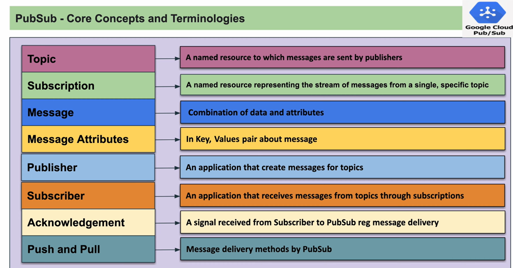

The supplied classroom document defines the main Pub/Sub terms as follows.

### 3.1 Topic

A **Topic** is a named resource to which publishers send messages.

Example:

```text
my-demo-topic
```

A topic acts like a central communication channel.

> <span style="color:#B06000;"><b>Analogy:</b></span>  
> A topic is like a television channel. Programs are transmitted through the channel, while viewers access them through their own connection.

### 3.2 Subscription

A **Subscription** is a named resource that represents a stream of messages from one specific topic.

Examples from your lab:

```text
my-demo-subscription
my-demo-subscription1
```

A subscriber does not normally pull messages directly from the topic. It pulls them from a subscription.

### 3.3 Message

A **Message** is the combination of data and optional attributes.

Your lab messages were:

```text
My First Message from Gcloud
My Second Message from Gcloud
My third Message from Gcloud
```

### 3.4 Message Attributes

Message attributes are key-value pairs that provide extra information about a message.

Example:

```text
event_type=order_created
source=mobile_app
priority=high
```

The actual event data may be in the message body, while metadata is kept in attributes.

### 3.5 Publisher

A **Publisher** is an application or command that creates messages and sends them to a topic.

In your practical session, this command acted as the publisher:

```bash
gcloud pubsub topics publish my-demo-topic \
  --message="My First Message from Gcloud"
```

### 3.6 Subscriber

A **Subscriber** is an application or process that receives messages from a topic through a subscription.

In your lab, the following command acted as the subscriber:

```bash
gcloud pubsub subscriptions pull my-demo-subscription
```

### 3.7 Acknowledgement

An **Acknowledgement**, commonly called an **ACK**, is a signal sent by the subscriber to Pub/Sub confirming that the message was successfully received and processed.

When Pub/Sub receives the ACK, it removes that message from the subscription's outstanding delivery queue.

### 3.8 Push and Pull

Pub/Sub supports different delivery approaches:

- **Pull:** The subscriber asks Pub/Sub for available messages.
- **Push:** Pub/Sub sends messages to a configured HTTPS endpoint.

Your Cloud Shell practice used the **pull** model.

---

## <span style="color:#188038;">4. Publisher–Subscriber Relationships</span>

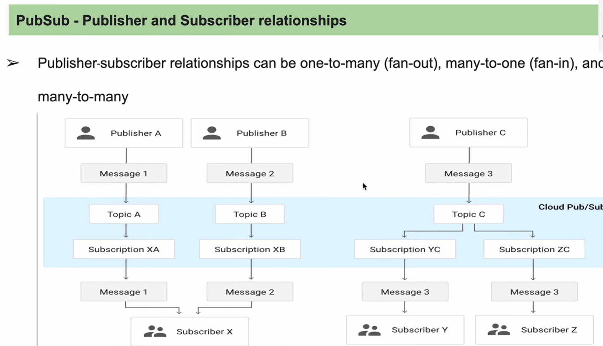

The supplied material shows that Pub/Sub can support:

- **One-to-many**, also called fan-out
- **Many-to-one**, also called fan-in
- **Many-to-many**

### 4.1 One Publisher to Many Subscribers

A single publisher sends an event to a topic. Multiple subscriptions can receive separate copies.

Example:

```text
Order application publishes "Order Created"
        |
        v
    orders-topic
      /      \
     v        v
billing-sub  inventory-sub
```

Billing and inventory can process the same event independently.

### 4.2 Many Publishers to One Topic

Several systems can publish related events to the same topic.

Example:

- Mobile application
- Website
- Call-centre application

All can publish order events to `orders-topic`.

### 4.3 Many Publishers to Many Subscribers

Multiple publishers can write to topics, and multiple subscribers can consume through independent subscriptions.

This creates a loosely coupled event-driven architecture.

---

## <span style="color:#188038;">5. Core Pub/Sub Components</span>

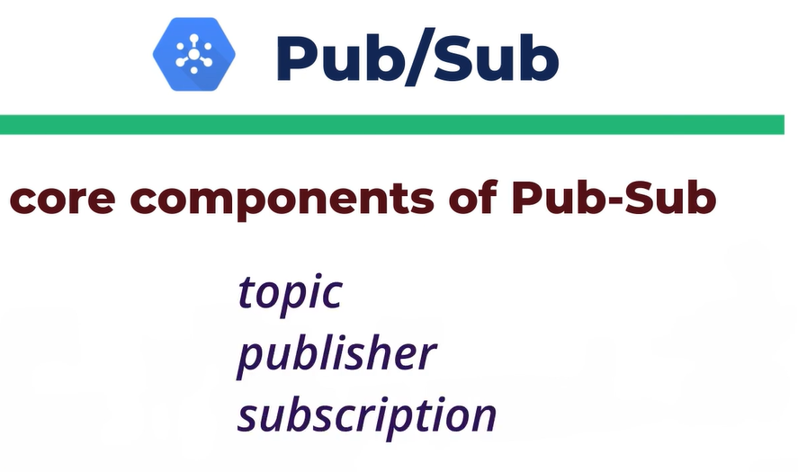

The core components highlighted in the attached document are:

1. **Topic**
2. **Publisher**
3. **Subscription**

For a complete runtime flow, we also include:

4. **Message**
5. **Subscriber**
6. **Acknowledgement**

---

## <span style="color:#188038;">6. Basic Message Flow</span>

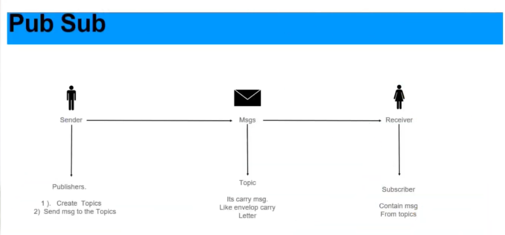

The flow is:

```text
Publisher
   |
   | 1. Publishes a message
   v
Topic
   |
   | 2. Pub/Sub stores and routes the message
   v
Subscription
   |
   | 3. Subscriber pulls or receives the message
   v
Subscriber
   |
   | 4. Subscriber acknowledges successful processing
   v
ACK returned to Pub/Sub
```

> <span style="color:#B06000;"><b>Important:</b></span>  
> The topic receives the published message, but the subscription maintains the subscriber-facing delivery state.

---

## <span style="color:#188038;">7. Real-World Analogy from the Attached Material</span>

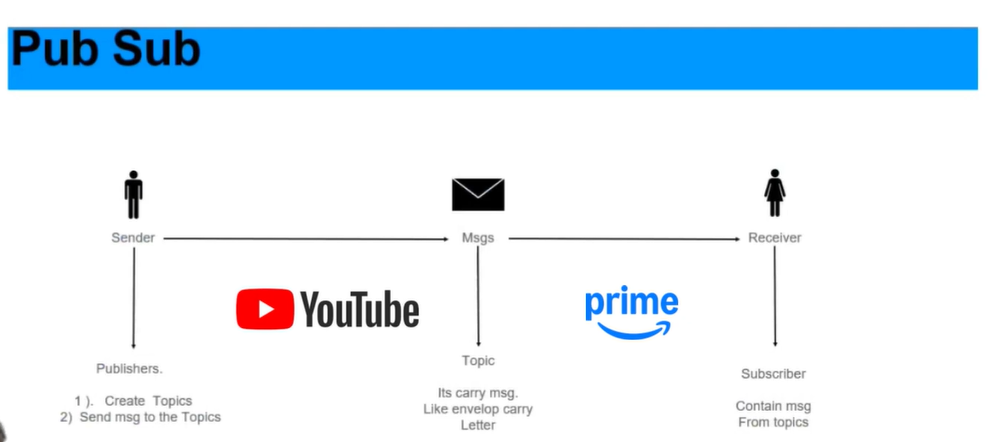

The attached image compares a sender, message channel, and receiver using familiar services.

A useful classroom interpretation is:

- A content creator or service acts as the **publisher**.
- The platform/channel acts like the **topic**.
- A registered subscription acts like the **subscription**.
- The person consuming the content acts like the **subscriber**.
- The content or notification is the **message**.

> <span style="color:#D93025;"><b>Do not confuse these:</b></span>  
> A Pub/Sub **subscription** is not simply a user profile. It is a cloud resource that retains delivery state for messages belonging to one topic.

---

## <span style="color:#188038;">8. Pub/Sub Use Cases</span>

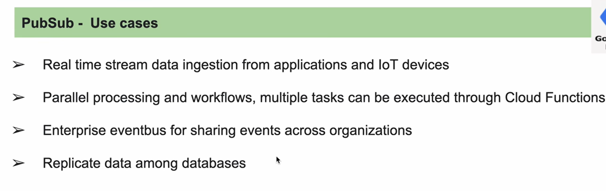

The attached notes identify the following use cases.

### 8.1 Real-Time Stream Data Ingestion

Applications and Internet of Things devices can continuously publish events.

Examples:

- Sensor readings
- User clicks
- Payment events
- GPS updates
- Application logs

### 8.2 Parallel Processing and Workflows

Multiple subscriptions can connect to one topic.

The same event can independently trigger:

- Data validation
- Cloud Functions or Cloud Run processing
- Notification delivery
- Audit logging
- Analytics pipelines

### 8.3 Enterprise Event Bus

Pub/Sub can act as a shared event backbone across different business systems and teams.

Example:

```text
CRM publishes CustomerUpdated
        |
        v
 customer-events-topic
   |        |         |
   v        v         v
Billing   Support   Analytics
```

### 8.4 Database Replication

Changes from one database or system can be published and consumed by downstream systems.

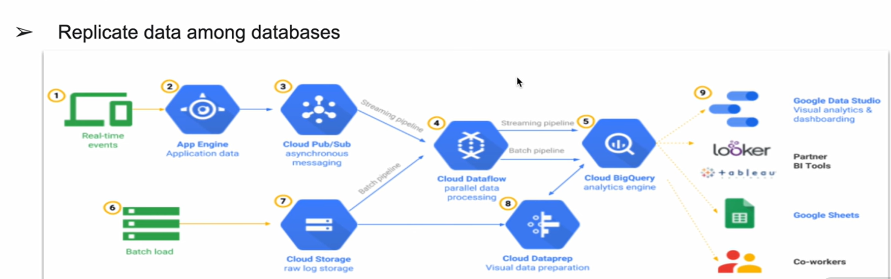

---

## <span style="color:#188038;">9. Pub/Sub IAM Permissions</span>

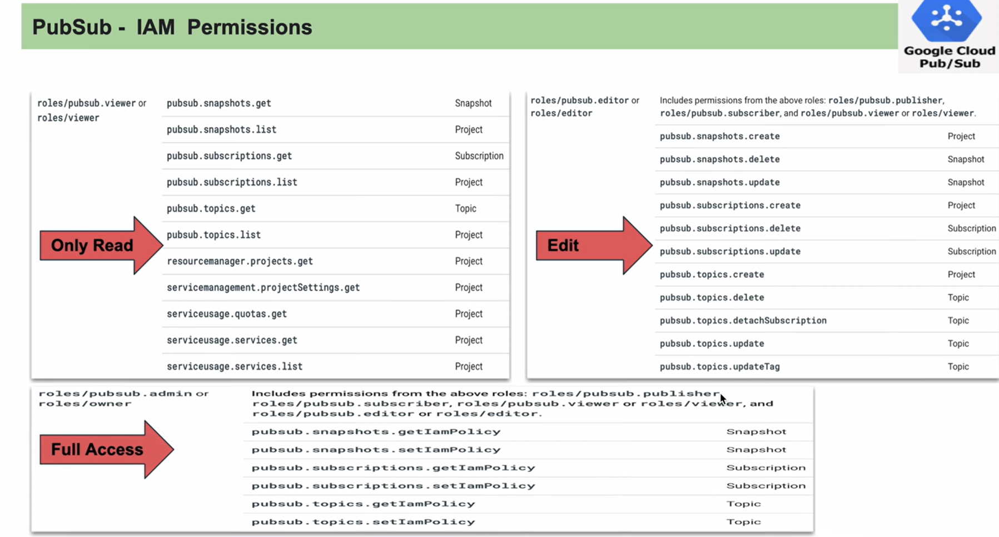

Access to Pub/Sub operations is controlled through IAM.

The supplied image groups permissions broadly into:

- **Read-only access**
- **Edit access**
- **Full access**

Typical roles include:

### 9.1 Pub/Sub Viewer

Useful for viewing topics, subscriptions, schemas, and related metadata.

### 9.2 Pub/Sub Publisher

Allows a principal to publish messages to topics.

### 9.3 Pub/Sub Subscriber

Allows a principal to consume messages and acknowledge them.

### 9.4 Pub/Sub Editor

Allows management of Pub/Sub resources, with broader permissions than publisher or subscriber roles.

### 9.5 Pub/Sub Admin

Provides administrative access over Pub/Sub resources.

> <span style="color:#B06000;"><b>Best practice:</b></span>  
> Apply least privilege. A publishing application should normally receive publisher permissions, not full administrator access.

---

## <span style="color:#188038;">10. Lab Architecture</span>

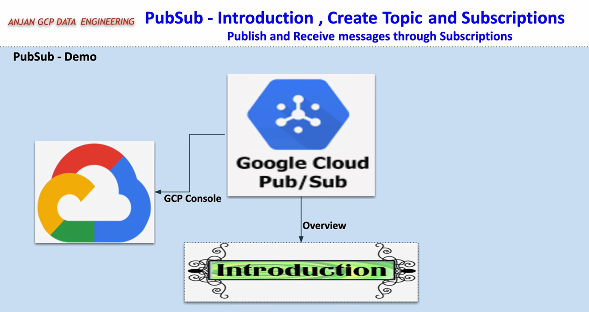

In your lab:

```text
Cloud Shell gcloud command
        |
        | publishes messages
        v
my-demo-topic
     |                         |
     v                         v
my-demo-subscription     my-demo-subscription1
     |                         |
     v                         v
Pull consumer A          Pull consumer B
```

Each subscription receives its own independent copy of each published message.

---

# <span style="color:#0B57D0;">11. Complete Cloud Shell Implementation</span>

## <span style="color:#188038;">11.1 Confirm the Active Project</span>

Your Cloud Shell session displayed:

```text
Your Cloud Platform project in this session is set to bigquery-optimization-lab.
```

Therefore, all topic and subscription resources were created under:

```text
projects/bigquery-optimization-lab
```

To explicitly set the project:

```bash
gcloud config set project bigquery-optimization-lab
```

To verify:

```bash
gcloud config get-value project
```

> <span style="color:#B06000;"><b>Trainer note:</b></span>  
> Always confirm the project before creating resources. A correct command executed in the wrong project is still an operational mistake.

---

## <span style="color:#188038;">11.2 Create the First Topic</span>

You entered:

```bash
gcloud pubsub topics create my-demo-topic-from-gcloud
```

Then pressed `Ctrl+C`, and Cloud Shell displayed:


```text
Resource already exists in the project
```

### Key lesson

> <span style="color:#D93025;"><b>Important:</b></span>  
> Cancelling the terminal command does not always mean the cloud operation was cancelled. The resource may already have been created.

Verify with:

```bash
gcloud pubsub topics list
```

Or describe that exact topic:

```bash
gcloud pubsub topics describe my-demo-topic-from-gcloud
```

---

## <span style="color:#188038;">11.3 Create the Main Demo Topic</span>

You successfully ran:

```bash
gcloud pubsub topics create my-demo-topic
```

Output:

```text
Created topic [projects/bigquery-optimization-lab/topics/my-demo-topic].
```

### Command breakdown

```text
gcloud                  Google Cloud CLI
pubsub                  Pub/Sub service group
topics                  Topic resource group
create                  Create operation
my-demo-topic           Topic name
```

---

## <span style="color:#188038;">11.4 Create the First Subscription</span>

You ran:

```bash
gcloud pubsub subscriptions create my-demo-subscription \
  --topic=my-demo-topic
```

Output:

```text
Created subscription [
  projects/bigquery-optimization-lab/subscriptions/my-demo-subscription
].
```

### Command breakdown

- `subscriptions create` creates a subscription.
- `my-demo-subscription` is the subscription name.
- `--topic=my-demo-topic` connects it to the existing topic.

The attached document also contains the equivalent command pattern:

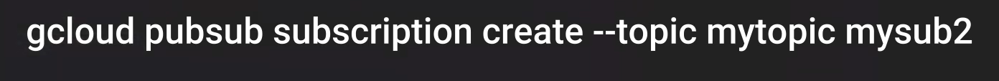

---

## <span style="color:#188038;">11.5 Create the Second Subscription</span>

You ran:

```bash
gcloud pubsub subscriptions create my-demo-subscription1 \
  --topic=my-demo-topic
```

Now one topic had two independent subscriptions:

```text
my-demo-topic
   |
   +--> my-demo-subscription
   |
   +--> my-demo-subscription1
```

> <span style="color:#0B57D0;"><b>Critical concept:</b></span>  
> Pub/Sub creates a separate delivery stream for each subscription. One published message is available independently in both subscriptions.

---


> <span style="color:#D93025;"><b>Common mistake:</b></span>  
> Resource names must match exactly. `my=demo-subscription` and `my-demo-subscription` are completely different strings.

---

## <span style="color:#188038;">11.7 Pulling Before Publishing</span>

You ran:

```bash
gcloud pubsub subscriptions pull my-demo-subscription
```

Output:

```text
Listed 0 items.
```

### Why?

The subscription existed, but no messages had been published after the subscription became available.

This is not an error. It simply means the pull request found no currently available messages.

---


```bash
gcloud pubsub topics publish my-demo-topic \
  --message="My First Message from Gcloud"
```

> <span style="color:#B06000;"><b>Diagnostic tip:</b></span>  
> `command not found` usually means the command name is misspelled or the executable is not installed/on the PATH. It is different from a Google Cloud API error.

---

## <span style="color:#188038;">11.9 Publish Three Messages</span>

You published:

```bash
gcloud pubsub topics publish my-demo-topic \
  --message="My First Message from Gcloud"
```

```bash
gcloud pubsub topics publish my-demo-topic \
  --message="My Second Message from Gcloud"
```

```bash
gcloud pubsub topics publish my-demo-topic \
  --message="My third Message from Gcloud"
```

Each publish returned a unique `messageId`.

Example:

```text
messageIds:
- '20881234175085408'
```

### What is the message ID?

The message ID is generated by Pub/Sub and identifies a published message within the service.

It is useful for:

- Logging
- Troubleshooting
- Detecting redelivery
- Correlating publisher and subscriber observations

---

# <span style="color:#0B57D0;">12. Why the Same Messages Appeared Repeatedly</span>

You pulled messages without `--auto-ack`:

```bash
gcloud pubsub subscriptions pull my-demo-subscription
```

The output returned:

- Message data
- Message ID
- ACK ID

But it did not show `ACK_STATUS: SUCCESS`.

### What happened internally?

1. Pub/Sub delivered a message.
2. It temporarily marked that message as outstanding.
3. Your pull command displayed it.
4. No acknowledgement was sent.
5. After the acknowledgement deadline, Pub/Sub made it eligible for delivery again.
6. A later pull returned the same message ID with a different ACK ID.

This explains why messages such as:

```text
My First Message from Gcloud
My Second Message from Gcloud
```

appeared multiple times.

> <span style="color:#D93025;"><b>Very important:</b></span>  
> Pulling a message is not the same as completing it. The message must be acknowledged after successful processing.

### Why did the ACK ID change?

An ACK ID belongs to a particular delivery attempt. When the same message is redelivered, Pub/Sub can provide a new ACK ID.

The message ID remains the same because it is the same published message.

---

## <span style="color:#188038;">12.1 Pull and Automatically Acknowledge</span>

You then ran:

```bash
gcloud pubsub subscriptions pull my-demo-subscription --auto-ack
```

The output included:

```text
ACK_STATUS: SUCCESS
```

You acknowledged all three messages:

```text
My Second Message from Gcloud
My First Message from Gcloud
My third Message from Gcloud
```

Afterwards:

```bash
gcloud pubsub subscriptions pull my-demo-subscription --auto-ack
```

returned:

```text
Listed 0 items.
```

This means the subscription had no currently available unacknowledged messages.

---

# <span style="color:#0B57D0;">13. Why the Second Subscription Still Contained All Messages</span>

After the first subscription was emptied, you pulled from:

```bash
gcloud pubsub subscriptions pull my-demo-subscription1
```

It still returned the published messages.

### Explanation

Each subscription maintains its own independent message delivery state.

Acknowledging a message in:

```text
my-demo-subscription
```

does not acknowledge the corresponding copy in:

```text
my-demo-subscription1
```

This is called **fan-out**.

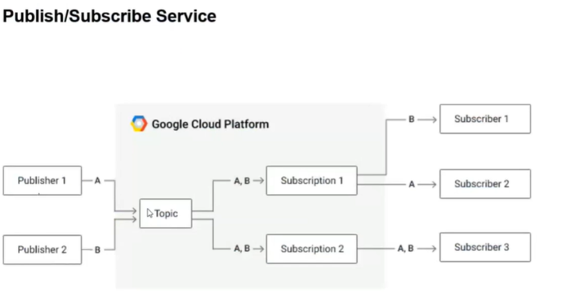

### Fan-out example

```text
                 my-demo-topic
                   /        \
                  /          \
                 v            v
my-demo-subscription    my-demo-subscription1
        |                         |
        v                         v
   Consumer A                Consumer B
```

Both consumers can process the same business event independently.

---

## <span style="color:#188038;">13.1 Acknowledge Messages in Subscription 2</span>

You later used:

```bash
gcloud pubsub subscriptions pull my-demo-subscription1 --auto-ack
```

until all three messages showed:

```text
ACK_STATUS: SUCCESS
```

At that point, the second subscription's copies were also processed.

---

# <span style="color:#0B57D0;">14. List Subscriptions Attached to a Topic</span>

You first typed:

```bash
gcloud pubsub topics list-subscriptions my-demo-toppic
```

The topic name contained an extra `p`:

```text
my-demo-toppic
```

Pub/Sub returned:

```text
NOT_FOUND: Resource not found
```

The correct command was:

```bash
gcloud pubsub topics list-subscriptions my-demo-topic
```

Output:

```text
projects/bigquery-optimization-lab/subscriptions/my-demo-subscription1
projects/bigquery-optimization-lab/subscriptions/my-demo-subscription
```

This verified that both subscriptions belonged to `my-demo-topic`.

---

# <span style="color:#0B57D0;">15. Complete Correct Command Sequence</span>

```bash
# 1. Set the project
gcloud config set project bigquery-optimization-lab

# 2. Create a topic
gcloud pubsub topics create my-demo-topic

# 3. Create subscription 1
gcloud pubsub subscriptions create my-demo-subscription \
  --topic=my-demo-topic

# 4. Create subscription 2
gcloud pubsub subscriptions create my-demo-subscription1 \
  --topic=my-demo-topic

# 5. Publish messages
gcloud pubsub topics publish my-demo-topic \
  --message="My First Message from Gcloud"

gcloud pubsub topics publish my-demo-topic \
  --message="My Second Message from Gcloud"

gcloud pubsub topics publish my-demo-topic \
  --message="My third Message from Gcloud"

# 6. Pull and acknowledge from subscription 1
gcloud pubsub subscriptions pull my-demo-subscription --auto-ack

# Repeat until no messages remain
gcloud pubsub subscriptions pull my-demo-subscription --auto-ack

# 7. Pull and acknowledge independently from subscription 2
gcloud pubsub subscriptions pull my-demo-subscription1 --auto-ack

# 8. List subscriptions connected to the topic
gcloud pubsub topics list-subscriptions my-demo-topic
```

---

# <span style="color:#0B57D0;">16. Pull vs Push Subscription</span>

## <span style="color:#188038;">16.1 Pull Subscription</span>

The subscriber actively requests messages.

```text
Subscriber ---> Pub/Sub: Give me available messages
Pub/Sub -----> Subscriber: Here are the messages
Subscriber ---> Pub/Sub: ACK
```

Advantages:

- Subscriber controls processing speed.
- Easy for worker services.
- Suitable for Cloud Shell demonstrations.
- Subscriber can manage batching and concurrency.

## <span style="color:#188038;">16.2 Push Subscription</span>

Pub/Sub sends messages to a configured HTTPS endpoint.

```text
Pub/Sub ---> HTTPS endpoint: Message
Endpoint ---> Pub/Sub: Successful HTTP response
```

Advantages:

- No continuous polling required.
- Useful for webhooks and HTTP services.
- Common with Cloud Run or externally hosted HTTPS services.

---

# <span style="color:#0B57D0;">17. Message Delivery Semantics</span>

Pub/Sub is designed for **at-least-once delivery** in the normal delivery model.

This means a subscriber must be prepared to receive the same message more than once.

### Subscriber best practice: idempotency

An idempotent consumer can process a duplicate without producing an incorrect repeated result.

Example:

Bad behaviour:

```text
Message redelivered -> account credited twice
```

Safer behaviour:

```text
Check event/message identifier
If already processed -> skip duplicate business action
```

---

# <span style="color:#0B57D0;">18. All Errors from Your Practice Session</span>

| Error or observation | Cause | Correct action |
|---|---|---|
| `Command killed by keyboard interrupt` | `Ctrl+C` was pressed | Verify whether the cloud resource was still created |
| `Resource already exists` | Topic creation completed during the first request | List or describe the topic instead of recreating |
| `my=demo-subscription` | `=` typed instead of `-` | Use `my-demo-subscription` |
| `Listed 0 items` before publishing | No message was available | Publish a message first |
| `gclous: command not found` | Misspelled `gcloud` | Use `gcloud` |
| Messages appeared repeatedly | Messages were pulled but not acknowledged | Use `--auto-ack` for the CLI demo |
| Subscription 2 still had messages | Each subscription has an independent copy | Acknowledge messages separately in each subscription |
| `my-demo-toppic` not found | Misspelled topic name | Use `my-demo-topic` |

---

# <span style="color:#0B57D0;">19. Verification Commands</span>

## List topics

```bash
gcloud pubsub topics list
```

## Describe a topic

```bash
gcloud pubsub topics describe my-demo-topic
```

## List subscriptions

```bash
gcloud pubsub subscriptions list
```

## Describe a subscription

```bash
gcloud pubsub subscriptions describe my-demo-subscription
```

## List subscriptions for one topic

```bash
gcloud pubsub topics list-subscriptions my-demo-topic
```

## Pull and acknowledge messages

```bash
gcloud pubsub subscriptions pull my-demo-subscription --auto-ack
```

---

# <span style="color:#0B57D0;">20. Cleanup Commands</span>

Delete subscriptions first:

```bash
gcloud pubsub subscriptions delete my-demo-subscription
gcloud pubsub subscriptions delete my-demo-subscription1
```

Delete the topic:

```bash
gcloud pubsub topics delete my-demo-topic
```

Delete the accidentally created topic if it is no longer needed:

```bash
gcloud pubsub topics delete my-demo-topic-from-gcloud
```

> <span style="color:#B06000;"><b>Best practice:</b></span>  
> Clean up training resources after the lab to avoid confusion and unnecessary retained resources.

---

# <span style="color:#0B57D0;">21. Practical Mini Exercise</span>

Create a simple order event flow.

### Requirement

1. Create topic `order-events-topic`.
2. Create subscription `billing-sub`.
3. Create subscription `inventory-sub`.
4. Publish three order messages.
5. Pull and acknowledge all messages from `billing-sub`.
6. Verify that `inventory-sub` still has its own copies.
7. List all subscriptions attached to the topic.

### Commands

```bash
gcloud pubsub topics create order-events-topic

gcloud pubsub subscriptions create billing-sub \
  --topic=order-events-topic

gcloud pubsub subscriptions create inventory-sub \
  --topic=order-events-topic

gcloud pubsub topics publish order-events-topic \
  --message='{"order_id":"ORD-101","status":"CREATED"}'

gcloud pubsub topics publish order-events-topic \
  --message='{"order_id":"ORD-102","status":"CREATED"}'

gcloud pubsub topics publish order-events-topic \
  --message='{"order_id":"ORD-103","status":"CREATED"}'
```

---

# <span style="color:#0B57D0;">22. Interview Questions and Answers</span>

### Q1. What is a topic in Google Cloud Pub/Sub?

A topic is a named Pub/Sub resource to which publishers send messages.

### Q2. What is a subscription?

A subscription is a named resource representing an independent stream of messages from one topic.

### Q3. Does a subscriber read directly from a topic?

Normally, no. The subscriber consumes messages through a subscription attached to that topic.

### Q4. Why did the same message appear multiple times?

Because it was pulled but not acknowledged. Pub/Sub later made it eligible for redelivery.

### Q5. What does `--auto-ack` do?

It automatically acknowledges messages returned by the CLI pull command.

### Q6. If one topic has two subscriptions, will both receive the message?

Yes. Each subscription receives and tracks its own copy.

### Q7. If a message is acknowledged in one subscription, is it removed from another subscription?

No. Acknowledgement state is maintained independently for each subscription.

### Q8. What is fan-out?

Fan-out is a one-to-many pattern where one published event is distributed to multiple independent subscriptions.

### Q9. What is the difference between message ID and ACK ID?

The message ID identifies the published message. The ACK ID identifies a specific delivery attempt and is used to acknowledge that attempt.

### Q10. What is the difference between pull and push?

In pull delivery, the subscriber requests messages. In push delivery, Pub/Sub sends messages to a configured HTTPS endpoint.

### Q11. What does `Listed 0 items` mean?

The pull request found no currently available messages in that subscription.

### Q12. Why should consumers be idempotent?

Because at-least-once delivery can produce duplicate delivery attempts.

---

# <span style="color:#0B57D0;">23. Command Cheat Sheet</span>

```bash
# Create topic
gcloud pubsub topics create TOPIC_NAME

# Create subscription
gcloud pubsub subscriptions create SUBSCRIPTION_NAME \
  --topic=TOPIC_NAME

# Publish
gcloud pubsub topics publish TOPIC_NAME \
  --message="MESSAGE_TEXT"

# Pull without acknowledgement
gcloud pubsub subscriptions pull SUBSCRIPTION_NAME

# Pull with automatic acknowledgement
gcloud pubsub subscriptions pull SUBSCRIPTION_NAME --auto-ack

# List topics
gcloud pubsub topics list

# List subscriptions
gcloud pubsub subscriptions list

# List subscriptions attached to one topic
gcloud pubsub topics list-subscriptions TOPIC_NAME

# Delete subscription
gcloud pubsub subscriptions delete SUBSCRIPTION_NAME

# Delete topic
gcloud pubsub topics delete TOPIC_NAME
```

---

# <span style="color:#0B57D0;">24. Final Summary</span>

Google Cloud Pub/Sub separates message producers from message consumers.

The complete flow is:

```text
Publisher -> Topic -> Subscription -> Subscriber -> ACK
```

Your lab demonstrated four especially important behaviours:

1. A cloud resource can still be created even when the local command is interrupted.
2. Pulling without acknowledgement can cause redelivery.
3. `--auto-ack` confirms successful processing in the CLI demonstration.
4. Multiple subscriptions attached to one topic each receive and track their own message copies.

These behaviours are not errors in Pub/Sub. They are central to how reliable asynchronous messaging works.
