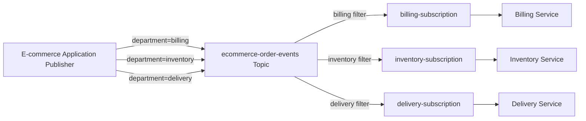

# Google Cloud Pub/Sub Message Filtering and Subscriber-Specific Delivery

> **Continuation of the Publisher–Topic–Subscription tutorial**

## 1. Learning Objective

In the previous practical, one topic had two subscriptions:

```text
my-demo-topic
   |
   +--> my-demo-subscription
   |
   +--> my-demo-subscription1
```

Because neither subscription had a filter, both subscriptions received every message.

In this continuation, we will learn how to:

- Publish different message types to one topic.
- Add routing information using message attributes.
- Create filtered subscriptions.
- Deliver messages only to the intended subscriber.
- Test using Google Cloud CLI and Google Cloud Console.

## 2. Real-World Use Case: Online Shopping Order Processing

Assume an e-commerce application publishes all order events to one topic:

```text
ecommerce-order-events
```

Three departments need different events:

| Department | Subscription | Required messages |
| --- | --- | --- |
| Billing | `billing-subscription` | Payment events |
| Inventory | `inventory-subscription` | Stock events |
| Delivery | `delivery-subscription` | Shipping events |

The publisher adds a message attribute named `department`:

```text
department=billing
department=inventory
department=delivery
```

Each subscription uses a filter such as:

```text
attributes.department = "billing"
```

## 3. Architecture



> **Important:** The publisher still publishes to the topic, not directly to a subscriber. Subscriber-specific delivery is achieved with message attributes plus subscription filters.

## 4. Critical Rule: Filters Work on Attributes

Pub/Sub subscription filters work on message attributes, not on fields inside the message body.

This message body alone is not enough:

```json
{
  "order_id": "ORD-1001",
  "department": "billing",
  "amount": 2500
}
```

For the filter to match, publish `department` as an attribute:

```bash
--attribute=department=billing
```

The message can contain both:

```json
{
  "order_id": "ORD-1001",
  "amount": 2500,
  "status": "PAYMENT_COMPLETED"
}
```

and attributes:

```text
department=billing
event_type=payment_completed
priority=high
```

## 5. Google Cloud CLI Implementation

### 5.1 Confirm the project

```bash
gcloud config get-value project
```

Set it when required:

```bash
gcloud config set project bigquery-optimization-lab
```

### 5.2 Create the topic

```bash
gcloud pubsub topics create ecommerce-order-events
```

Verify:

```bash
gcloud pubsub topics describe ecommerce-order-events
```

### 5.3 Create the billing filtered subscription

```bash
gcloud pubsub subscriptions create billing-subscription \
  --topic=ecommerce-order-events \
  --message-filter='attributes.department = "billing"'
```

### 5.4 Create the inventory filtered subscription

```bash
gcloud pubsub subscriptions create inventory-subscription \
  --topic=ecommerce-order-events \
  --message-filter='attributes.department = "inventory"'
```

### 5.5 Create the delivery filtered subscription

```bash
gcloud pubsub subscriptions create delivery-subscription \
  --topic=ecommerce-order-events \
  --message-filter='attributes.department = "delivery"'
```

### 5.6 Verify filters

```bash
gcloud pubsub subscriptions describe billing-subscription
```

Look for:

```yaml
filter: attributes.department = "billing"
```

List subscriptions attached to the topic:

```bash
gcloud pubsub topics list-subscriptions ecommerce-order-events
```

## 6. Publish Messages with Attributes

### 6.1 Billing message

```bash
gcloud pubsub topics publish ecommerce-order-events \
  --message='{"order_id":"ORD-1001","amount":2500,"status":"PAYMENT_COMPLETED"}' \
  --attribute=department=billing,event_type=payment_completed,priority=high
```

### 6.2 Inventory message

```bash
gcloud pubsub topics publish ecommerce-order-events \
  --message='{"order_id":"ORD-1001","product_id":"PRD-501","quantity":2,"status":"STOCK_RESERVED"}' \
  --attribute=department=inventory,event_type=stock_reserved,priority=normal
```

### 6.3 Delivery message

```bash
gcloud pubsub topics publish ecommerce-order-events \
  --message='{"order_id":"ORD-1001","tracking_id":"TRK-90001","status":"DISPATCHED"}' \
  --attribute=department=delivery,event_type=package_dispatched,priority=normal
```

### 6.4 Another billing message

```bash
gcloud pubsub topics publish ecommerce-order-events \
  --message='{"order_id":"ORD-1002","amount":1800,"status":"PAYMENT_FAILED"}' \
  --attribute=department=billing,event_type=payment_failed,priority=high
```

## 7. Pull and Verify

### Billing subscriber

```bash
gcloud pubsub subscriptions pull billing-subscription --auto-ack --limit=10
```

Expected billing messages:

- `ORD-1001 - PAYMENT_COMPLETED`
- `ORD-1002 - PAYMENT_FAILED`

### Inventory subscriber

```bash
gcloud pubsub subscriptions pull inventory-subscription --auto-ack --limit=10
```

Expected:

- `ORD-1001 - STOCK_RESERVED`

### Delivery subscriber

```bash
gcloud pubsub subscriptions pull delivery-subscription --auto-ack --limit=10
```

Expected:

- `ORD-1001 - DISPATCHED`

| Published message | Attribute | Billing | Inventory | Delivery |
| --- | --- | ---: | ---: | ---: |
| Payment completed | `department=billing` | Yes | No | No |
| Stock reserved | `department=inventory` | No | Yes | No |
| Package dispatched | `department=delivery` | No | No | Yes |
| Payment failed | `department=billing` | Yes | No | No |

## 8. What Happens to Nonmatching Messages?

For a billing subscription with:

```text
attributes.department = "billing"
```

an inventory message does not match. Pub/Sub automatically acknowledges the nonmatching message for that subscription, so it is not delivered there and does not remain in that subscription's backlog. Other subscriptions evaluate the same published message independently.

## 9. Google Cloud Console GUI Steps

### 9.1 Enable the Pub/Sub API

1. Open Google Cloud Console.
2. Select `bigquery-optimization-lab`.
3. Go to **APIs & Services → Library**.
4. Search for **Cloud Pub/Sub API**.
5. Click **Enable** if necessary.

### 9.2 Create the topic

1. Go to **Pub/Sub → Topics**.
2. Click **Create topic**.
3. Enter Topic ID: `ecommerce-order-events`.
4. Keep the defaults for this lab.
5. Click **Create**.

### 9.3 Create the billing subscription

1. Go to **Pub/Sub → Subscriptions**.
2. Click **Create subscription**.
3. Enter Subscription ID: `billing-subscription`.
4. Select topic: `ecommerce-order-events`.
5. Keep Delivery type as **Pull**.
6. Locate **Subscription filter**.
7. Enter:

```text
attributes.department = "billing"
```

Click **Create**.

### 9.4 Create the inventory subscription

Use:

```text
Subscription ID: inventory-subscription
Filter: attributes.department = "inventory"
```

### 9.5 Create the delivery subscription

Use:

```text
Subscription ID: delivery-subscription
Filter: attributes.department = "delivery"
```

### 9.6 Publish a billing message in Console

1. Go to **Pub/Sub → Topics**.
2. Click `ecommerce-order-events`.
3. Open the **Messages** section.
4. Click **Publish message**.
5. Enter this message body:

```json
{
  "order_id": "ORD-2001",
  "amount": 3200,
  "status": "PAYMENT_COMPLETED"
}
```

Under **Message attributes**, add:

| Key | Value |
| --- | --- |
| `department` | `billing` |
| `event_type` | `payment_completed` |
| `priority` | `high` |

Click **Publish**.

### 9.7 Publish an inventory message

Message body:

```json
{
  "order_id": "ORD-2001",
  "product_id": "PRD-700",
  "quantity": 1,
  "status": "STOCK_RESERVED"
}
```

Attributes:

| Key | Value |
| --- | --- |
| `department` | `inventory` |
| `event_type` | `stock_reserved` |
| `priority` | `normal` |

### 9.8 Publish a delivery message

Message body:

```json
{
  "order_id": "ORD-2001",
  "tracking_id": "TRK-20001",
  "status": "DISPATCHED"
}
```

Attributes:

| Key | Value |
| --- | --- |
| `department` | `delivery` |
| `event_type` | `package_dispatched` |
| `priority` | `normal` |

### 9.9 Pull messages in Console

For each subscription:

1. Go to **Pub/Sub → Subscriptions**.
2. Open the subscription.
3. Open its **Messages** section.
4. Click **Pull**.
5. Acknowledge messages when the interface provides that option.
6. Verify that only messages matching the subscription filter appear.

## 10. Advanced Filter Examples

### Match one attribute

```text
attributes.department = "billing"
```

### Match two conditions

```text
attributes.department = "billing" AND attributes.priority = "high"
```

```bash
gcloud pubsub subscriptions create urgent-billing-subscription \
  --topic=ecommerce-order-events \
  --message-filter='attributes.department = "billing" AND attributes.priority = "high"'
```

### Match either value

```text
attributes.department = "billing" OR attributes.department = "inventory"
```

### Exclude test events

```text
attributes.department = "billing" AND NOT attributes.environment = "test"
```

### Check whether an attribute exists

```text
attributes:department
```

### Prefix matching

```text
hasPrefix(attributes.event_type, "payment_")
```

This can match `payment_completed`, `payment_failed`, and `payment_refunded`.

## 11. Can We Send Directly to One Subscriber?

A publisher does not publish directly to a subscriber. It publishes to a topic.

```text
Publisher → Topic → Filtered Subscription → Subscriber
```

To target one subscriber logically:

```bash
gcloud pubsub subscriptions create ravi-application-sub \
  --topic=ecommerce-order-events \
  --message-filter='attributes.target_subscriber = "ravi-application"'
```

Publish:

```bash
gcloud pubsub topics publish ecommerce-order-events \
  --message='{"notification":"Your report is ready"}' \
  --attribute=target_subscriber=ravi-application,event_type=report_ready
```

Pull:

```bash
gcloud pubsub subscriptions pull ravi-application-sub --auto-ack --limit=10
```

> **Security warning:** Filtering is routing, not security. Use IAM to control which identity can consume each subscription.

## 12. Filter Immutability

A subscription filter cannot be modified after creation. To change it in a simple lab:

1. Delete the old subscription.
2. Create a new subscription with the correct filter.

```bash
gcloud pubsub subscriptions delete billing-subscription
```

```bash
gcloud pubsub subscriptions create finance-subscription \
  --topic=ecommerce-order-events \
  --message-filter='attributes.department = "finance"'
```

## 13. Common Errors

| Problem | Cause | Fix |
| --- | --- | --- |
| Subscription receives nothing | Attribute value does not match | Check exact key, value, and letter case |
| Filter field exists only in JSON body | Filters do not inspect message data | Publish the value with `--attribute` |
| Wrong key used | `team` is not `department` | Match the filter's attribute key exactly |
| Incorrect shell quotes | Filter argument is parsed incorrectly | Use single quotes outside and double quotes around values |
| Trying to edit filter | Filters are immutable | Create a replacement subscription |
| Old subscription receives everything | It was created without a filter | Create a new filtered subscription |

## 14. Cleanup

```bash
gcloud pubsub subscriptions delete billing-subscription
gcloud pubsub subscriptions delete inventory-subscription
gcloud pubsub subscriptions delete delivery-subscription
gcloud pubsub subscriptions delete urgent-billing-subscription
gcloud pubsub subscriptions delete ravi-application-sub
gcloud pubsub topics delete ecommerce-order-events
```

## 15. Interview Questions

### Q1. How do you filter Pub/Sub messages?

Create a subscription with a filter expression that evaluates message attributes.

### Q2. Can a filter inspect JSON message data?

No. Pub/Sub subscription filters operate on message attributes.

### Q3. How can one topic deliver different events to different subscribers?

Create multiple subscriptions on the same topic, each with its own attribute filter.

### Q4. What happens to a nonmatching message?

Pub/Sub automatically acknowledges it for that filtered subscription.

### Q5. Does nonmatching in one subscription affect another subscription?

No. Every subscription evaluates the message independently.

### Q6. Can the filter be changed after creation?

No. Create a replacement subscription with the desired filter.

### Q7. Is filtering a security mechanism?

No. Use IAM to protect topic publishing and subscription consumption.

## 16. Final Summary

The recommended pattern is:

```text
Publisher
   |
   | Publishes message plus routing attributes
   v
Shared Topic
   |
   | Each subscription evaluates its filter
   v
Matching Subscription
   |
   v
Intended Subscriber
```

Use attributes for routing, filtered subscriptions for selective delivery, acknowledgements for successful processing, and IAM for security.
