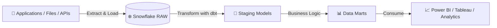
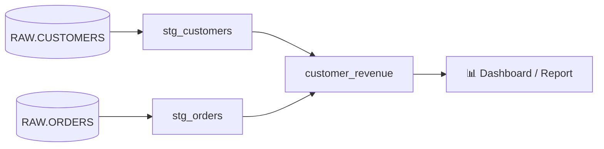
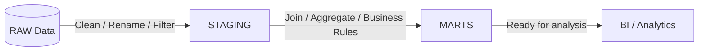
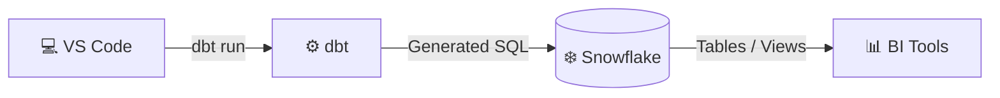

<div align="center">

# 🟦 dbt — Fresher Friendly Introduction

### <span style="color:#22c55e">From Raw Data to Trusted Business Data</span>

**High-Level Notes | Snowflake + dbt**

</div>

---

> 💡 **Simple definition**  
> **dbt (Data Build Tool)** is a SQL-based transformation tool that helps us convert **raw warehouse data** into **clean, tested, reusable business data models**.

---

## 🟦 1. What is dbt?

dbt is mainly used **after data is already available inside a data warehouse** such as:

- ❄️ Snowflake
- 🔷 BigQuery
- 🧱 Databricks
- 🔴 Redshift

dbt helps us organize SQL transformations as **models**, manage dependencies between them, test the data, document the logic, and understand data lineage.

### 🧠 Remember

**dbt = SQL + Automation + Testing + Documentation + Lineage**

---

## 🟩 2. Where does dbt fit?



### Quick path

**Source Data** ➜ **Snowflake RAW** ➜ **dbt Staging** ➜ **dbt Marts** ➜ **Reports**

---

## 🟨 3. Without dbt

Without dbt, developers may write many SQL scripts manually.

### Typical problems

| Area | Without dbt |
|---|---|
| SQL organization | Large or scattered scripts |
| Execution order | Developer must remember |
| Dependencies | Managed manually |
| Testing | Manual validation |
| Documentation | Separate effort |
| Data lineage | Difficult to understand |
| Reusability | Limited |
| Team collaboration | Harder to maintain |

### Example path

**RAW_CUSTOMERS** ➜ manually run SQL ➜ **STG_CUSTOMERS**

**RAW_ORDERS** ➜ manually run SQL ➜ **STG_ORDERS**

Then the developer must remember:

**STG_CUSTOMERS + STG_ORDERS** ➜ run another SQL ➜ **CUSTOMER_REVENUE**

> ⚠️ As the number of SQL files grows, maintaining the correct execution order becomes difficult.

---

## 🟩 4. With dbt

With dbt, SQL transformations are separated into small, understandable **models**.

```text
models/
│
├── staging/
│   ├── stg_customers.sql
│   └── stg_orders.sql
│
└── marts/
    └── customer_revenue.sql
```

### Transformation path



dbt can automatically understand this dependency using `ref()`.

---

## 🟪 5. The important `ref()` concept

Instead of hard-coding another dbt model like:

```sql
FROM DBT_TRAINING_DB.ANALYTICS.STG_CUSTOMERS
```

we normally use:

```sql
FROM {{ ref('stg_customers') }}
```

### Why is `ref()` useful?

`ref()` tells dbt:

> “This model depends on another dbt model.”

That helps dbt build the correct execution order and lineage.

### Dependency path

**stg_customers** ─┐  
　　　　　　　　├──➜ **customer_revenue**  
**stg_orders** ────┘

---

## 🟧 6. Real-World Example — E-Commerce

Assume Snowflake contains raw tables:

- `RAW.CUSTOMERS`
- `RAW.ORDERS`
- `RAW.PRODUCTS`
- `RAW.PAYMENTS`

The raw data may contain:

- duplicate records
- null values
- cancelled orders
- unnecessary columns
- inconsistent formats

dbt can transform the data in layers.



### Example business requirement

The business wants:

| Customer | Total Orders | Total Revenue |
|---|---:|---:|
| Ravi | 2 | 3000 |
| John | 0 | 0 |

dbt can create a reusable model such as:

```text
customer_revenue.sql
```

The BI team can then directly query the final model rather than repeatedly writing complex joins and aggregations.

---

## 🟦 7. What is a dbt Model?

A dbt model is normally a `.sql` file containing a transformation query.

Example:

```text
stg_customers.sql
```

may create:

```text
STG_CUSTOMERS
```

And:

```text
customer_revenue.sql
```

may create:

```text
CUSTOMER_REVENUE
```

Depending on configuration, a model can be materialized as:

- Table
- View
- Incremental model
- Ephemeral model

---

## 🟩 8. Basic dbt Workflow

```mermaid
flowchart LR
    A[1️⃣ Raw Data] --> B[2️⃣ Write SQL Models]
    B --> C[3️⃣ Add ref()]
    C --> D[4️⃣ dbt run]
    D --> E[5️⃣ dbt resolves dependencies]
    E --> F[6️⃣ Snowflake executes SQL]
    F --> G[7️⃣ Tables / Views created]
    G --> H[8️⃣ Test & Report]
```

### Common commands

```bash
dbt debug
```

Checks the project and connection.

```bash
dbt run
```

Builds dbt models.

```bash
dbt test
```

Runs data quality tests.

```bash
dbt seed
```

Loads small CSV reference data into the warehouse.

---

## 🟥 9. Important: dbt is not the database

dbt does **not** replace Snowflake.

### Responsibility path

**VS Code** ➜ where we write dbt project files  
**dbt** ➜ generates and manages transformation SQL  
**Snowflake** ➜ stores data and executes SQL  
**Power BI / Tableau** ➜ consumes final analytics data



---

## 🟨 10. ETL vs ELT and dbt

Traditional ETL:

**Extract** ➜ **Transform** ➜ **Load**

Modern cloud platforms commonly use ELT:

**Extract** ➜ **Load** ➜ **Transform**

dbt mainly helps with the **Transform** part:

**E** ➜ **L** ➜ **T**  
　　　　　　⬆️  
　　　　　 **dbt**

### Example modern pipeline

**Application / Files** ➜ **ADF / Airflow / Fivetran** ➜ **Snowflake RAW** ➜ **dbt** ➜ **Analytics Models** ➜ **Power BI**

---

## 🟪 11. Why is dbt Helpful?

| dbt Feature | Benefit |
|---|---|
| Models | Break large SQL logic into smaller files |
| `ref()` | Manage model dependencies |
| Tests | Validate data quality |
| Documentation | Explain models and columns |
| Lineage | Understand upstream and downstream flow |
| Seeds | Load small reference CSV data |
| Snapshots | Track historical changes |
| Macros | Reuse SQL logic |
| Git friendly | Supports version control and teamwork |

---

## 🟩 12. Easy Analogy

Think of a restaurant:

**Raw Ingredients** ➜ **Kitchen** ➜ **Prepared Food** ➜ **Customer**

In analytics:

**Raw Data** ➜ **dbt** ➜ **Clean Business Data** ➜ **Reports**

> 🍳 **dbt is like the kitchen of the analytics platform.**  
> The raw ingredients already exist; dbt cleans, combines, and prepares them into something useful.

---

## 🟦 13. Final Summary

| Question | Short Answer |
|---|---|
| What is dbt? | SQL-based transformation tool |
| What does it mainly do? | Converts raw warehouse data into analytics-ready data |
| Main language | SQL + Jinja |
| Where does transformation execute? | Inside the data warehouse |
| Example warehouse | Snowflake |
| Important function | `ref()` |
| Main command | `dbt run` |
| Common architecture | RAW ➜ STAGING ➜ MARTS |
| Main benefit | Organized, tested, reusable transformations |

---

<div align="center">

## 🌟 One-Line Definition

### <span style="color:#16a34a">dbt helps teams transform raw warehouse data into clean, reliable, reusable business data using SQL.</span>

**RAW ➜ STAGING ➜ MARTS ➜ REPORTS**

</div>
