<div align="center">

# ❄️ <span style="color:#29B5E8;">SNOWFLAKE DATA LOADING</span>
## 🌈 <span style="color:#7C3AED;">FILE FORMATS — COMPLETE HANDS-ON NOTEBOOK GUIDE</span>

**CSV • JSON • PARQUET • AVRO • ORC • XML**

</div>

---

<table>
<tr>
<td style="background-color:#E8F7FF;padding:16px;border-left:6px solid #29B5E8;">
<b>🎯 Learning Goal</b><br>
Understand <b>why Snowflake needs file formats</b>, how to choose the correct format, how <b>Stage → File Format → COPY INTO → Table</b> works, and execute CSV, JSON, and Parquet loading demonstrations step by step.
</td>
</tr>
</table>

---

# 🟦 1. REAL-WORLD SCENARIO

<table>
<tr>
<td style="background-color:#F3E8FF;padding:16px;border-left:6px solid #8B5CF6;">
<b>🏢 Scenario: Global Customer Analytics Platform</b><br><br>
A company receives data from multiple systems. Each system exports data differently. Snowflake therefore needs to know <b>how each file is structured before loading it</b>.
</td>
</tr>
</table>

| Source System | Example Data | Typical Format |
|---|---|---|
| CRM | Customer master data | CSV |
| REST API | Customer events | JSON |
| Data Lake | Historical analytics | Parquet |
| Kafka/Event pipeline | Schema-oriented events | Avro |
| Hadoop/Hive | Analytical datasets | ORC |
| Legacy application | Enterprise messages | XML |

### 🟨 Why is this important?

The following records contain similar information but are stored differently.

**CSV**

```text
101|John|Chennai|5000
```

**JSON**

```json
{
  "id": 101,
  "name": "John",
  "city": "Chennai",
  "sales": 5000
}
```

**Parquet**

```text
Binary + Columnar + Embedded Schema
```

<table>
<tr>
<td style="background-color:#FFF7D6;padding:16px;border-left:6px solid #F59E0B;">
<b>💡 Key Idea</b><br>
A Snowflake <b>FILE FORMAT</b> tells Snowflake <b>how to interpret the bytes and records inside a staged file</b>.
</td>
</tr>
</table>

---

# 🟪 2. ADVANCED ARCHITECTURE — HOW LOADING WORKS

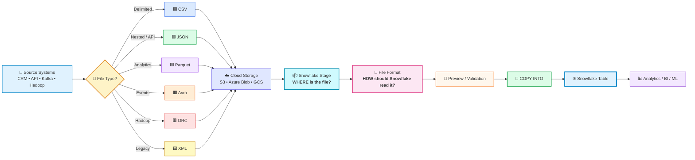

---

# 🟩 3. THE MOST IMPORTANT MENTAL MODEL

<table>
<tr>
<td style="background-color:#E0F2FE;padding:18px;border-left:7px solid #0284C7;">
<b>📦 STAGE = WHERE?</b><br>
Where is the file stored?
</td>
<td style="background-color:#FCE7F3;padding:18px;border-left:7px solid #DB2777;">
<b>📝 FILE FORMAT = HOW?</b><br>
How should Snowflake interpret the file?
</td>
<td style="background-color:#DCFCE7;padding:18px;border-left:7px solid #16A34A;">
<b>🚚 COPY INTO = LOAD!</b><br>
Move staged records into a table.
</td>
</tr>
</table>

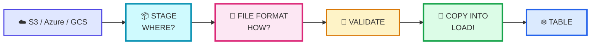

---

# 🟧 4. WHICH FILE FORMAT SHOULD I CHOOSE?

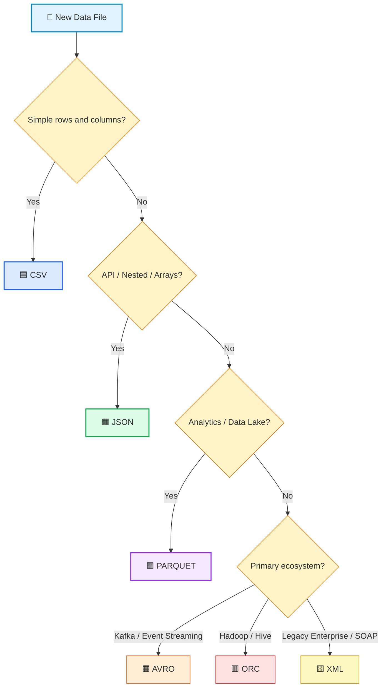

| Requirement | Recommended |
|---|---|
| Spreadsheet-like rows and columns | **CSV** |
| REST API response | **JSON** |
| Nested application events | **JSON** |
| Spark/Data Lake analytics | **Parquet** |
| Kafka/schema-based events | **Avro** |
| Existing Hadoop/Hive workloads | **ORC** |
| Legacy enterprise integration | **XML** |

---

# 🟦 5. SUPPORTED FILE FORMAT OVERVIEW

```text
FILE FORMAT
│
├── 🟦 CSV
├── 🟩 JSON
├── 🟪 PARQUET
├── 🟧 AVRO
├── 🟥 ORC
└── 🟨 XML
```

| Feature | CSV | JSON | Parquet | Avro | ORC | XML |
|---|---:|---:|---:|---:|---:|---:|
| Human readable | ✅ | ✅ | ❌ | ❌ | ❌ | ✅ |
| Nested data | ❌ | ✅ | ✅ | ✅ | ✅ | ✅ |
| Binary | ❌ | ❌ | ✅ | ✅ | ✅ | ❌ |
| Columnar | ❌ | ❌ | ✅ | ❌ | ✅ | ❌ |
| API friendly | ❌ | ⭐ | ❌ | ❌ | ❌ | ⚠️ |
| Data Lake friendly | ⚠️ | ⚠️ | ⭐ | ✅ | ✅ | ❌ |
| Kafka/event use | ❌ | ✅ | ❌ | ⭐ | ❌ | ❌ |
| Easy manual debugging | ⭐ | ⭐ | ❌ | ❌ | ❌ | ✅ |

---

# 🧪 6. NOTEBOOK LAB — ENVIRONMENT SETUP

<table>
<tr>
<td style="background-color:#E8F7FF;padding:14px;border-left:6px solid #29B5E8;">
<b>▶ Notebook Cell 1</b><br>
Create the database, schema, and compute warehouse used for the complete demonstration.
</td>
</tr>
</table>

```sql
USE ROLE ACCOUNTADMIN;

CREATE OR REPLACE DATABASE FILE_FORMAT_DEMO_DB;

CREATE OR REPLACE SCHEMA FILE_FORMAT_DEMO_DB.LOADING_DEMO;

CREATE OR REPLACE WAREHOUSE FILE_FORMAT_DEMO_WH
    WAREHOUSE_SIZE = 'XSMALL'
    AUTO_SUSPEND = 300
    AUTO_RESUME = TRUE
    INITIALLY_SUSPENDED = TRUE;

USE WAREHOUSE FILE_FORMAT_DEMO_WH;
USE DATABASE FILE_FORMAT_DEMO_DB;
USE SCHEMA LOADING_DEMO;
```

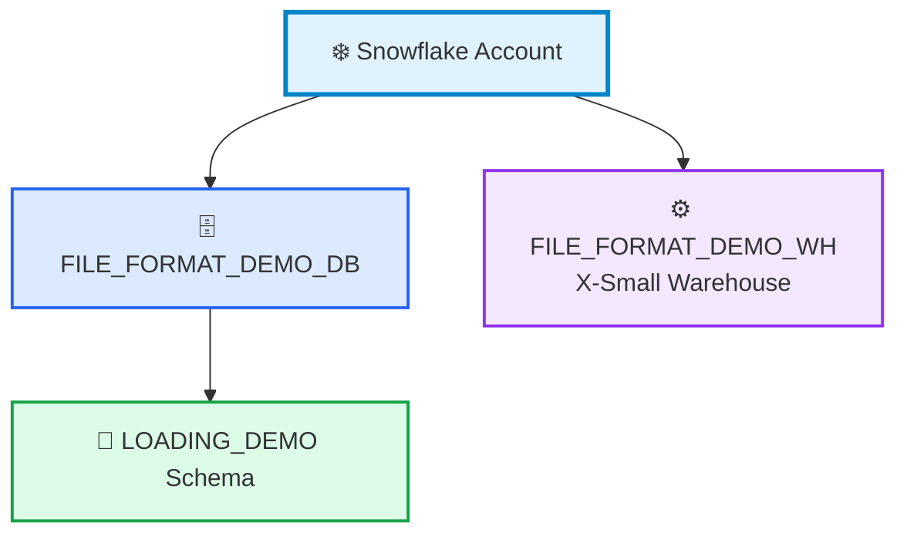

---

# 🟦 7. CSV — WHEN AND WHY?

<table>
<tr>
<td style="background-color:#DBEAFE;padding:16px;border-left:6px solid #2563EB;">
<b>✅ Choose CSV when</b><br>
The source is simple tabular data: customers, employees, orders, products, lookup tables, exported spreadsheets, or relational database extracts.
</td>
</tr>
</table>

Example:

```text
ID|LAST_NAME|FIRST_NAME|COMPANY|CITY
1|Smith|John|ABC Ltd|Chennai
2|Jones|Mary|XYZ Ltd|Bangalore
```

---

# 🧪 8. CREATE CSV TARGET TABLE

<table>
<tr>
<td style="background-color:#E8F7FF;padding:14px;border-left:6px solid #29B5E8;">
<b>▶ Notebook Cell 2</b>
</td>
</tr>
</table>

```sql
CREATE OR REPLACE TABLE CONTACTS_CSV
(
    ID INTEGER,
    LAST_NAME STRING,
    FIRST_NAME STRING,
    COMPANY STRING,
    EMAIL STRING,
    WORKPHONE STRING,
    CELLPHONE STRING,
    STREETADDRESS STRING,
    CITY STRING,
    POSTALCODE STRING
);

DESCRIBE TABLE CONTACTS_CSV;
```

---

# 🧪 9. CREATE CSV FILE FORMAT

<table>
<tr>
<td style="background-color:#E8F7FF;padding:14px;border-left:6px solid #29B5E8;">
<b>▶ Notebook Cell 3</b>
</td>
</tr>
</table>

```sql
CREATE OR REPLACE FILE FORMAT CONTACTS_CSV_FORMAT
    TYPE = 'CSV'
    FIELD_DELIMITER = '|'
    SKIP_HEADER = 1
    TRIM_SPACE = TRUE
    EMPTY_FIELD_AS_NULL = TRUE;
```

### 🎨 CSV option breakdown

<table>
<tr>
<td style="background-color:#DBEAFE;padding:12px;"><b>TYPE = CSV</b><br>Read the source as delimited text.</td>
<td style="background-color:#DCFCE7;padding:12px;"><b>FIELD_DELIMITER='|'</b><br>Pipe separates columns.</td>
</tr>
<tr>
<td style="background-color:#FEF3C7;padding:12px;"><b>SKIP_HEADER=1</b><br>Ignore the first header line.</td>
<td style="background-color:#FCE7F3;padding:12px;"><b>TRIM_SPACE=TRUE</b><br>Remove surrounding spaces.</td>
</tr>
<tr>
<td style="background-color:#F3E8FF;padding:12px;"><b>EMPTY_FIELD_AS_NULL=TRUE</b><br>Empty values become NULL.</td>
<td style="background-color:#FFEDD5;padding:12px;"><b>Named format</b><br>Reusable across multiple loads.</td>
</tr>
</table>

Inspect it:

```sql
DESCRIBE FILE FORMAT CONTACTS_CSV_FORMAT;

SHOW FILE FORMATS;
```

---

# 🟪 10. CREATE THE EXTERNAL STAGE

<table>
<tr>
<td style="background-color:#F3E8FF;padding:16px;border-left:6px solid #9333EA;">
<b>🌐 Public Dataset</b><br>
This lab uses Snowflake's public tutorial bucket:<br><br>
<code>s3://snowflake-docs/tutorials/dataloading/</code>
</td>
</tr>
</table>

<table>
<tr>
<td style="background-color:#E8F7FF;padding:14px;border-left:6px solid #29B5E8;">
<b>▶ Notebook Cell 4</b>
</td>
</tr>
</table>

```sql
CREATE OR REPLACE STAGE CONTACTS_PUBLIC_STAGE
    URL = 's3://snowflake-docs'
    FILE_FORMAT = CONTACTS_CSV_FORMAT;
```

---

# 🧪 11. LIST THE AVAILABLE FILES

<table>
<tr>
<td style="background-color:#E8F7FF;padding:14px;border-left:6px solid #29B5E8;">
<b>▶ Notebook Cell 5</b>
</td>
</tr>
</table>

```sql
LIST @CONTACTS_PUBLIC_STAGE/tutorials/dataloading/;
```

Look for files such as:

```text
contacts1.csv
contacts2.csv
contacts3.csv
contacts4.csv
contacts5.csv
contacts.json
```

---

# 🟧 12. ADVANCED SAFE-LOAD PIPELINE

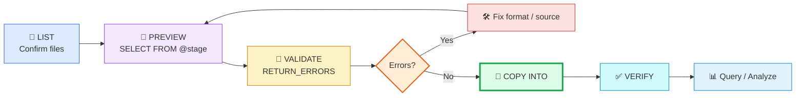

<table>
<tr>
<td style="background-color:#FFF7D6;padding:16px;border-left:6px solid #F59E0B;">
<b>⭐ Best Practice</b><br>
Do not immediately run <code>COPY INTO</code>. First list, preview, and validate the staged data.
</td>
</tr>
</table>

---

# 🧪 13. PREVIEW CSV BEFORE LOADING

<table>
<tr>
<td style="background-color:#E8F7FF;padding:14px;border-left:6px solid #29B5E8;">
<b>▶ Notebook Cell 6</b>
</td>
</tr>
</table>

```sql
SELECT
    $1 AS ID,
    $2 AS LAST_NAME,
    $3 AS FIRST_NAME,
    $4 AS COMPANY,
    $5 AS EMAIL,
    $6 AS WORKPHONE,
    $7 AS CELLPHONE,
    $8 AS STREETADDRESS,
    $9 AS CITY,
    $10 AS POSTALCODE
FROM @CONTACTS_PUBLIC_STAGE/tutorials/dataloading/contacts1.csv;
```

### 🟨 What do `$1`, `$2`, `$3` mean?

```text
101|Smith|John|ABC Ltd|john@test.com
 │     │     │      │          │
$1    $2    $3     $4         $5
```

---

# 🧪 14. PREVIEW FILE METADATA

```sql
SELECT
    METADATA$FILENAME AS SOURCE_FILE,
    METADATA$FILE_ROW_NUMBER AS FILE_ROW_NUMBER,
    $1 AS ID,
    $2 AS LAST_NAME,
    $3 AS FIRST_NAME,
    $9 AS CITY
FROM @CONTACTS_PUBLIC_STAGE/tutorials/dataloading/contacts1.csv;
```

<table>
<tr>
<td style="background-color:#DCFCE7;padding:16px;border-left:6px solid #16A34A;">
<b>✅ Why metadata is useful</b><br>
Auditing • Data lineage • Troubleshooting • Bad-record tracing • Source-file identification
</td>
</tr>
</table>

---

# 🧪 15. VALIDATE BEFORE LOADING

<table>
<tr>
<td style="background-color:#E8F7FF;padding:14px;border-left:6px solid #29B5E8;">
<b>▶ Notebook Cell 7</b>
</td>
</tr>
</table>

```sql
COPY INTO CONTACTS_CSV
FROM @CONTACTS_PUBLIC_STAGE/tutorials/dataloading/contacts1.csv
FILE_FORMAT = (
    FORMAT_NAME = CONTACTS_CSV_FORMAT
)
VALIDATION_MODE = 'RETURN_ERRORS';
```

<table>
<tr>
<td style="background-color:#FFF7D6;padding:14px;border-left:6px solid #F59E0B;">
<b>🧠 Interpretation</b><br>
If the query returns no loading errors, the file is ready for the actual COPY operation.
</td>
</tr>
</table>

---

# 🧪 16. LOAD CSV INTO SNOWFLAKE

```sql
COPY INTO CONTACTS_CSV
FROM @CONTACTS_PUBLIC_STAGE/tutorials/dataloading/contacts1.csv
FILE_FORMAT = (
    FORMAT_NAME = CONTACTS_CSV_FORMAT
)
ON_ERROR = 'ABORT_STATEMENT';
```

Verify:

```sql
SELECT *
FROM CONTACTS_CSV;

SELECT COUNT(*) AS TOTAL_RECORDS
FROM CONTACTS_CSV;
```

---

# 🟩 17. LOAD MULTIPLE CSV FILES

```sql
COPY INTO CONTACTS_CSV
FROM @CONTACTS_PUBLIC_STAGE/tutorials/dataloading/
FILE_FORMAT = (
    FORMAT_NAME = CONTACTS_CSV_FORMAT
)
PATTERN = '.*contacts[1-5][.]csv'
ON_ERROR = 'CONTINUE';
```

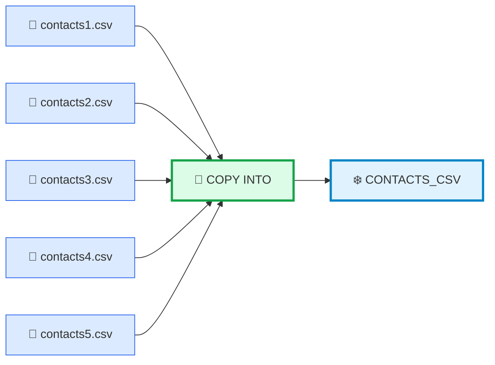

---

# 🟥 18. DUPLICATE LOAD PROTECTION

Normal repeated `COPY INTO` normally uses Snowflake load metadata to avoid loading the same file repeatedly.

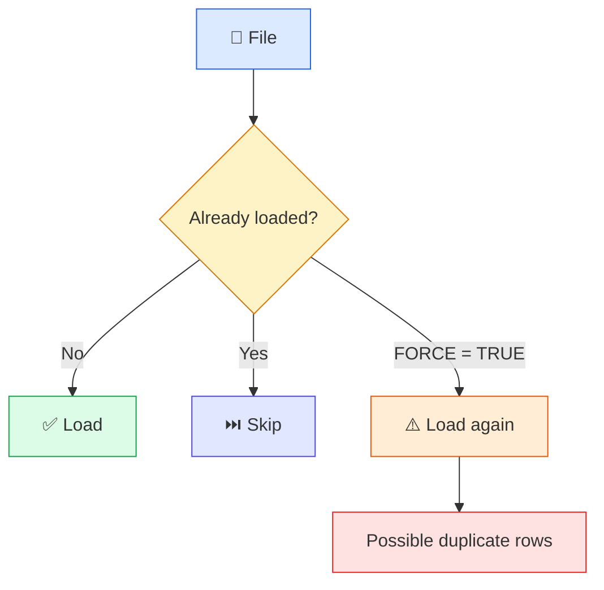

---

# 🟩 19. JSON — WHEN AND WHY?

<table>
<tr>
<td style="background-color:#DCFCE7;padding:16px;border-left:6px solid #16A34A;">
<b>✅ Choose JSON when</b><br>
The source is a REST API, application event stream, IoT payload, web/mobile event, log record, or nested structure containing objects and arrays.
</td>
</tr>
</table>

Example:

```json
{
  "id": 101,
  "name": "John",
  "address": {
    "city": "Chennai",
    "state": "Tamil Nadu"
  },
  "orders": [
    {"id": 1, "amount": 500},
    {"id": 2, "amount": 700}
  ]
}
```

---

# 🟣 20. JSON ARCHITECTURE

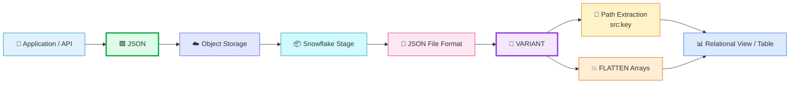

---

# 🧪 21. CREATE JSON TABLE

```sql
CREATE OR REPLACE TABLE RAW_JSON_DATA
(
    SRC VARIANT
);
```

<table>
<tr>
<td style="background-color:#F3E8FF;padding:16px;border-left:6px solid #9333EA;">
<b>🧬 Why VARIANT?</b><br>
VARIANT can hold semi-structured objects such as JSON while allowing Snowflake SQL to navigate individual attributes later.
</td>
</tr>
</table>

---

# 🧪 22. CREATE JSON FILE FORMAT

```sql
CREATE OR REPLACE FILE FORMAT APP_JSON_FORMAT
    TYPE = 'JSON';
```

---

# 🧪 23. CREATE PUBLIC JSON STAGE

Public Snowflake sample:

```text
s3://snowflake-docs/tutorials/json
```

```sql
CREATE OR REPLACE STAGE APP_JSON_STAGE
    URL = 's3://snowflake-docs/tutorials/json'
    FILE_FORMAT = APP_JSON_FORMAT;
```

---

# 🧪 24. LIST AND PREVIEW JSON

```sql
LIST @APP_JSON_STAGE;
```

```sql
LIST @APP_JSON_STAGE/server/2.6/2016/07/15/15;
```

Preview:

```sql
SELECT
    $1
FROM @APP_JSON_STAGE/server/2.6/2016/07/15/15
LIMIT 10;
```

Access a property:

```sql
SELECT
    $1:device_type AS DEVICE_TYPE,
    $1
FROM @APP_JSON_STAGE/server/2.6/2016/07/15/15
LIMIT 10;
```

---

# 🧪 25. LOAD JSON

```sql
COPY INTO RAW_JSON_DATA
FROM @APP_JSON_STAGE/server/2.6/2016/07/15/15
FILE_FORMAT = (
    FORMAT_NAME = APP_JSON_FORMAT
);
```

Verify:

```sql
SELECT *
FROM RAW_JSON_DATA
LIMIT 20;
```

Extract values:

```sql
SELECT
    SRC:device_type::STRING AS DEVICE_TYPE
FROM RAW_JSON_DATA
LIMIT 20;
```

---

# 🟧 26. JSON `STRIP_OUTER_ARRAY`

Consider:

```json
[
  {"id":101,"name":"John"},
  {"id":102,"name":"Mary"},
  {"id":103,"name":"Sam"}
]
```

Create:

```sql
CREATE OR REPLACE FILE FORMAT JSON_ARRAY_FORMAT
TYPE = JSON
STRIP_OUTER_ARRAY = TRUE;
```

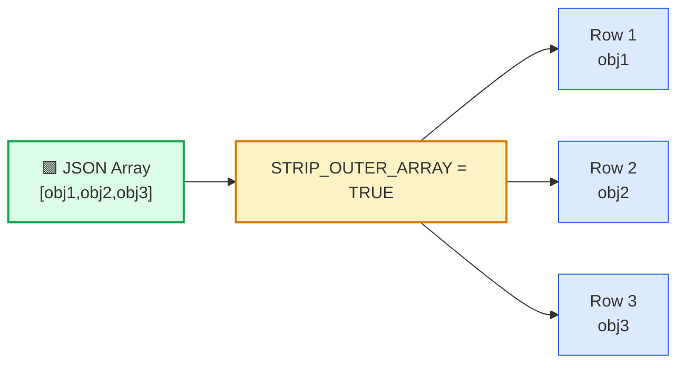

---

# 🟪 27. PARQUET — WHEN AND WHY?

<table>
<tr>
<td style="background-color:#F3E8FF;padding:16px;border-left:6px solid #9333EA;">
<b>✅ Choose Parquet when</b><br>
Working with Spark, data lakes, large analytical datasets, column-heavy queries, or systems where storage efficiency and schema awareness matter.
</td>
</tr>
</table>

### Row versus column mental model

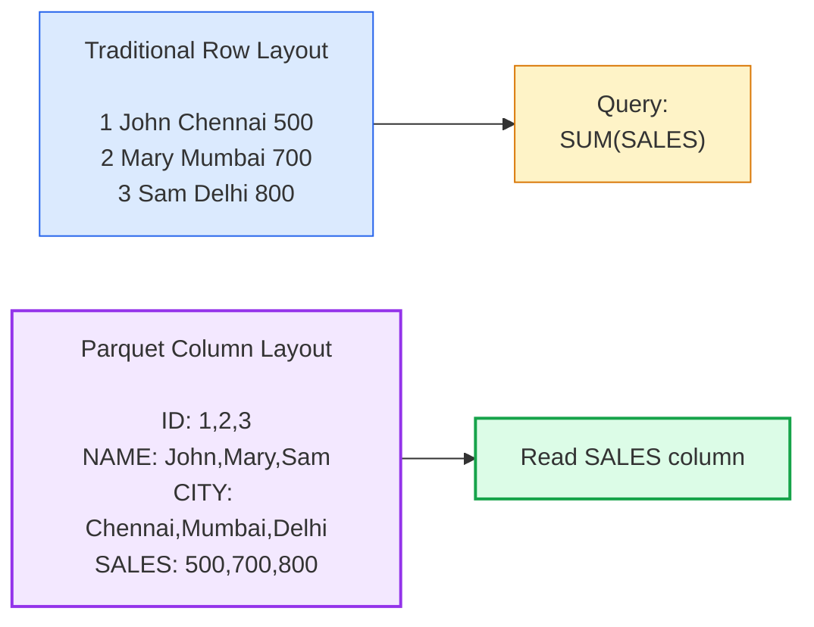

---

# 🧪 28. CREATE PARQUET FORMAT AND INTERNAL STAGE

```sql
CREATE OR REPLACE FILE FORMAT PARQUET_FORMAT
TYPE = PARQUET;
```

```sql
CREATE OR REPLACE STAGE PARQUET_STAGE
FILE_FORMAT = PARQUET_FORMAT;
```

---

# 🟢 29. GENERATE A PARQUET FILE INSIDE SNOWFLAKE

Instead of asking students to download and upload a local Parquet file, reuse the CSV data already loaded.

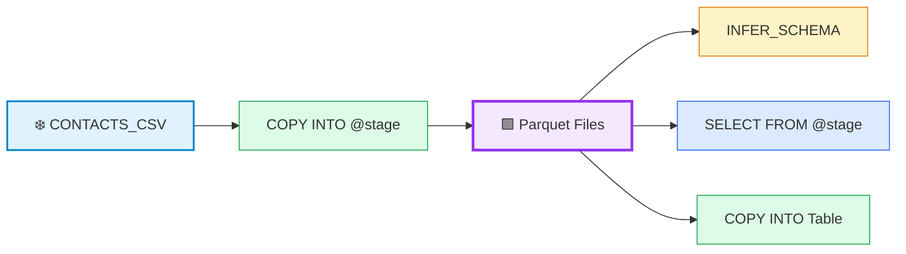

---

# 🧪 30. UNLOAD TABLE DATA TO PARQUET

```sql
COPY INTO @PARQUET_STAGE/contacts/
FROM
(
    SELECT
        ID,
        FIRST_NAME,
        LAST_NAME,
        CITY
    FROM CONTACTS_CSV
)
FILE_FORMAT = (
    TYPE = PARQUET
)
HEADER = TRUE;
```

List generated files:

```sql
LIST @PARQUET_STAGE/contacts/;
```

Preview:

```sql
SELECT
    $1
FROM @PARQUET_STAGE/contacts/
LIMIT 20;
```

---

# 🧪 31. INFER PARQUET SCHEMA

```sql
SELECT *
FROM TABLE(
    INFER_SCHEMA(
        LOCATION => '@PARQUET_STAGE/contacts/',
        FILE_FORMAT => 'PARQUET_FORMAT'
    )
);
```

<table>
<tr>
<td style="background-color:#FFF7D6;padding:16px;border-left:6px solid #F59E0B;">
<b>⭐ Important Difference</b><br><br>
<b>CSV:</b> schema is normally defined externally by us.<br>
<b>Parquet:</b> schema information travels with the file and can be inspected using <code>INFER_SCHEMA</code>.
</td>
</tr>
</table>

---

# 🧪 32. LOAD PARQUET INTO A TABLE

```sql
CREATE OR REPLACE TABLE PARQUET_CONTACTS
(
    ID NUMBER,
    FIRST_NAME STRING,
    LAST_NAME STRING,
    CITY STRING
);
```

Load:

```sql
COPY INTO PARQUET_CONTACTS
FROM @PARQUET_STAGE/contacts/
FILE_FORMAT = (
    FORMAT_NAME = PARQUET_FORMAT
)
MATCH_BY_COLUMN_NAME = CASE_INSENSITIVE;
```

Verify:

```sql
SELECT *
FROM PARQUET_CONTACTS;
```

---

# 🟨 33. `MATCH_BY_COLUMN_NAME`

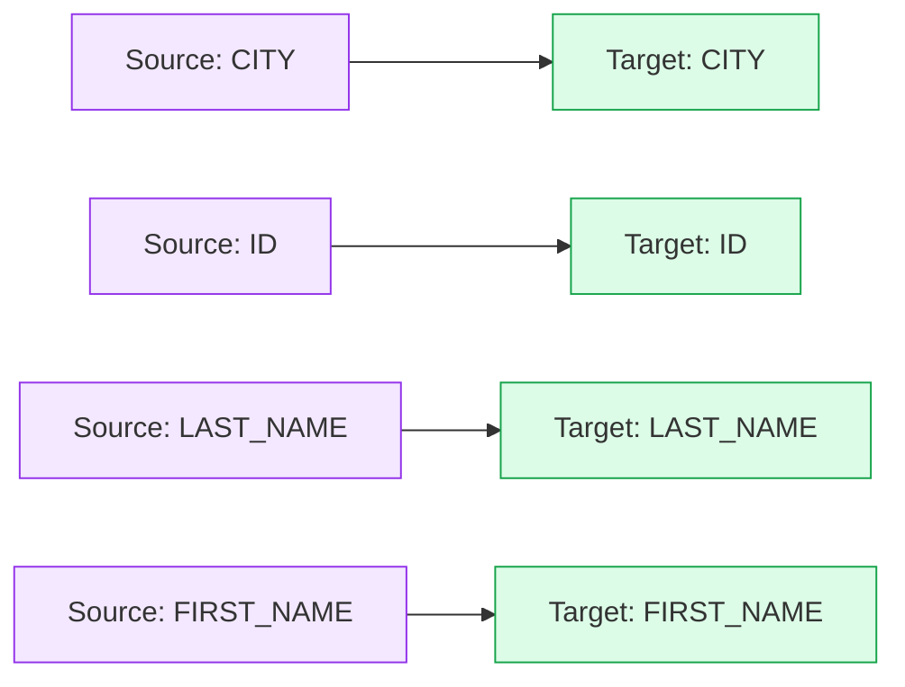

```sql
MATCH_BY_COLUMN_NAME = CASE_INSENSITIVE
```

This tells Snowflake to match source and target columns by name rather than simply relying on position.

---

# 🟧 34. AVRO

<table>
<tr>
<td style="background-color:#FFEDD5;padding:16px;border-left:6px solid #EA580C;">
<b>Typical use</b><br>
Kafka • Event streaming • Schema-oriented messaging • Data integration pipelines
</td>
</tr>
</table>

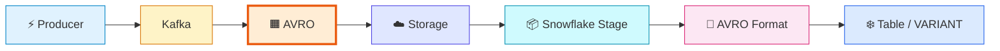

```sql
CREATE OR REPLACE FILE FORMAT AVRO_FORMAT
TYPE = AVRO;
```

---

# 🟥 35. ORC

<table>
<tr>
<td style="background-color:#FEE2E2;padding:16px;border-left:6px solid #DC2626;">
<b>Typical use</b><br>
Existing Hadoop and Hive environments where ORC already exists as the analytical storage format.
</td>
</tr>
</table>

```sql
CREATE OR REPLACE FILE FORMAT ORC_FORMAT
TYPE = ORC;
```

---

# 🟨 36. XML

<table>
<tr>
<td style="background-color:#FEF9C3;padding:16px;border-left:6px solid #CA8A04;">
<b>Typical use</b><br>
Legacy enterprise systems • SOAP services • Financial integrations • Government systems • Older middleware platforms
</td>
</tr>
</table>

Example:

```xml
<customers>
    <customer>
        <id>101</id>
        <name>John</name>
        <city>Chennai</city>
    </customer>
</customers>
```

```sql
CREATE OR REPLACE FILE FORMAT XML_FORMAT
TYPE = XML;
```

---

# 🌈 37. FILE FORMAT QUICK REFERENCE

<table>
<tr>
<td style="background-color:#DBEAFE;padding:16px;"><b>🟦 CSV</b><br>Rows + columns</td>
<td style="background-color:#DCFCE7;padding:16px;"><b>🟩 JSON</b><br>API + nested data</td>
<td style="background-color:#F3E8FF;padding:16px;"><b>🟪 PARQUET</b><br>Analytics + Data Lake</td>
</tr>
<tr>
<td style="background-color:#FFEDD5;padding:16px;"><b>🟧 AVRO</b><br>Kafka + events</td>
<td style="background-color:#FEE2E2;padding:16px;"><b>🟥 ORC</b><br>Hadoop + Hive</td>
<td style="background-color:#FEF9C3;padding:16px;"><b>🟨 XML</b><br>Legacy enterprise</td>
</tr>
</table>

---

# ⭐ 38. IMPORTANT CSV OPTIONS

```sql
CREATE OR REPLACE FILE FORMAT PRODUCTION_CSV_FORMAT
TYPE = CSV
FIELD_DELIMITER = ','
RECORD_DELIMITER = '\n'
SKIP_HEADER = 1
FIELD_OPTIONALLY_ENCLOSED_BY = '"'
TRIM_SPACE = TRUE
EMPTY_FIELD_AS_NULL = TRUE
NULL_IF = ('NULL','null','')
DATE_FORMAT = 'AUTO'
TIMESTAMP_FORMAT = 'AUTO'
COMPRESSION = 'AUTO';
```

### `FIELD_OPTIONALLY_ENCLOSED_BY`

```csv
101,"Kumar, Ragav","Chennai"
```

```text
101 | "Kumar, Ragav" | "Chennai"
       └────────────┘
          ONE FIELD
```

### `NULL_IF`

```sql
NULL_IF = ('NULL','null','')
```

```text
NULL   → SQL NULL
null   → SQL NULL
''     → SQL NULL
```

---

# 🟫 39. INLINE VS NAMED FILE FORMAT

### Inline

```sql
COPY INTO CONTACTS_CSV
FROM @CONTACTS_PUBLIC_STAGE/tutorials/dataloading/contacts1.csv
FILE_FORMAT = (
    TYPE = CSV
    FIELD_DELIMITER = '|'
    SKIP_HEADER = 1
);
```

### Named

```sql
CREATE OR REPLACE FILE FORMAT CONTACTS_CSV_FORMAT
TYPE = CSV
FIELD_DELIMITER = '|'
SKIP_HEADER = 1;
```

Then:

```sql
COPY INTO CONTACTS_CSV
FROM @CONTACTS_PUBLIC_STAGE/tutorials/dataloading/contacts1.csv
FILE_FORMAT = (
    FORMAT_NAME = CONTACTS_CSV_FORMAT
);
```

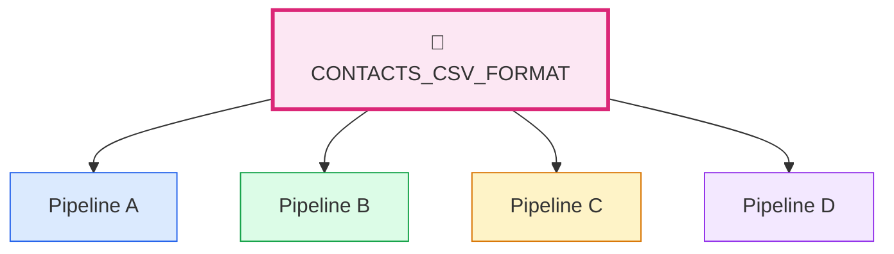

<table>
<tr>
<td style="background-color:#DCFCE7;padding:16px;border-left:6px solid #16A34A;">
<b>✅ Recommendation</b><br>
Use <b>named file formats</b> for reusable, maintainable, production-style pipelines.
</td>
</tr>
</table>

---

# 🟦 40. COMPLETE END-TO-END LOADING ARCHITECTURE

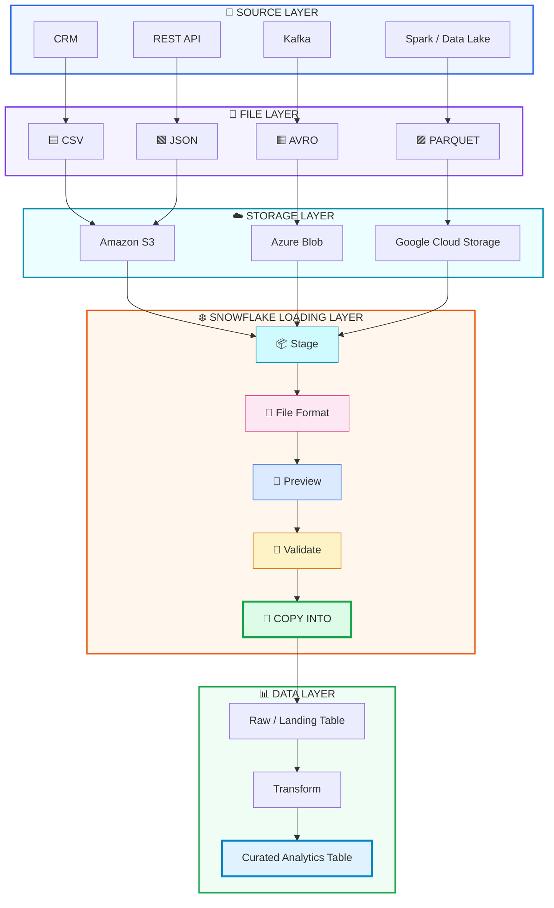

---

# 🧠 41. CLASSROOM EXECUTION ORDER

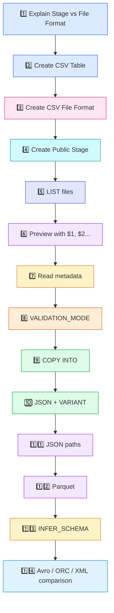

---

# 🏆 42. GOLDEN RULE

<table>
<tr>
<td style="background-color:#E0F2FE;padding:22px;border:3px solid #0284C7;border-radius:12px;">
<h3>❄️ Snowflake Data Loading Formula</h3>

<b>📦 STAGE</b> tells Snowflake <b>WHERE</b> the files are.<br><br>

<b>📝 FILE FORMAT</b> tells Snowflake <b>HOW</b> to interpret those files.<br><br>

<b>🚚 COPY INTO</b> performs the <b>LOAD</b>.<br><br>

<b>❄️ TABLE</b> stores the resulting records.
</td>
</tr>
</table>

---

# 🧹 43. OPTIONAL CLEANUP

```sql
DROP DATABASE IF EXISTS FILE_FORMAT_DEMO_DB;

DROP WAREHOUSE IF EXISTS FILE_FORMAT_DEMO_WH;
```

---

<div align="center">

# 🎉 <span style="color:#16A34A;">END OF LAB</span>

### ❄️ Snowflake File Formats
**CSV → JSON → Parquet → Avro → ORC → XML**

</div>
