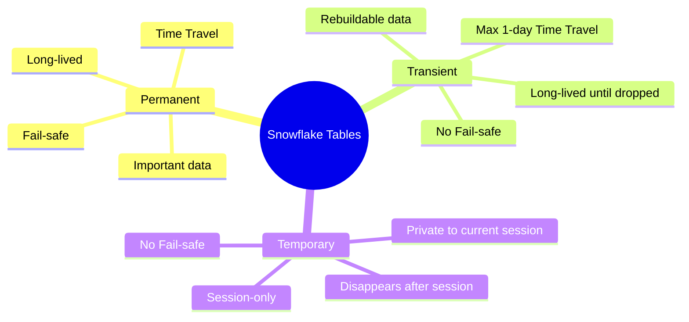
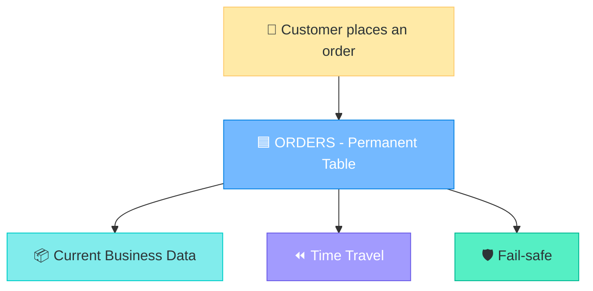
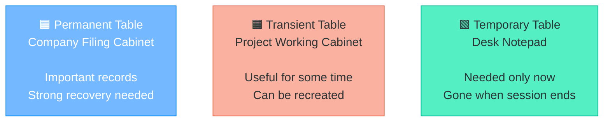
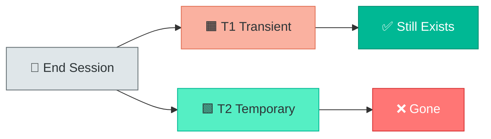
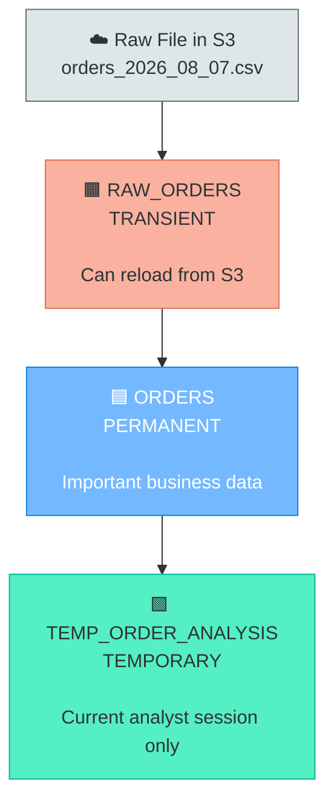
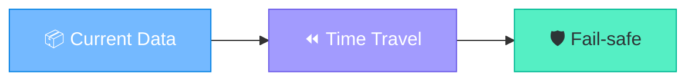
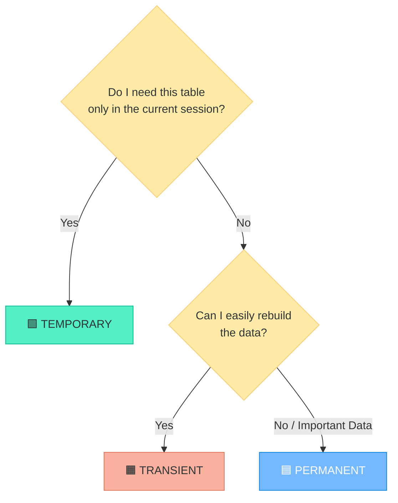

<div align="center">

# <span style="color:#6C5CE7;">❄️ Snowflake Table Types — Permanent vs Transient vs Temporary</span>

### <span style="color:#0984E3;">A Fresher-Friendly Mental Model with Real-World Examples</span>

</div>

---

> <span style="color:#2D3436;"><b>Core idea:</b></span> All three are Snowflake tables. The main difference is <b>how long the data should live</b> and <b>how much recovery protection it needs</b>.

<div align="center">

| Table Type | Easy Mental Model | Best Used For |
|---|---|---|
| 🟦 **Permanent** | **Protect it** | Important business data |
| 🟧 **Transient** | **Rebuild it** | Staging / intermediate data |
| 🟩 **Temporary** | **Use it now** | Session-only calculations |

</div>

---

## <span style="color:#6C5CE7;">🧠 First Mental Model</span>



---

<details open>
<summary><b><span style="color:#0984E3;">🟦 1. Permanent Table — “This data is important”</span></b></summary>

### <span style="color:#00B894;">What is it?</span>

A **Permanent table** is the normal/default table type in Snowflake.

```sql
CREATE TABLE CUSTOMERS (
    CUSTOMER_ID INT,
    NAME STRING,
    EMAIL STRING
);
```

You do not need to write `PERMANENT`. A normal `CREATE TABLE` creates a permanent table.

### <span style="color:#E17055;">When should I use it?</span>

Use it when the data is important and should remain available until somebody explicitly deletes the table.

Examples:

- Customers
- Orders
- Products
- Payments
- Invoices
- Finance transactions
- Audit-sensitive business records

### <span style="color:#6C5CE7;">Visual Understanding</span>



### <span style="color:#D63031;">What if something goes wrong?</span>

If somebody accidentally drops or modifies important data, Snowflake recovery features may help.

```sql
DROP TABLE ORDERS;
```

During the Time Travel retention period, you may be able to recover it using:

```sql
UNDROP TABLE ORDERS;
```

Permanent tables can also have Snowflake **Fail-safe** protection after Time Travel expires.

> 🟦 **Fresher memory:** Permanent = **I care about this data. Protect it.**

</details>

---

<details>
<summary><b><span style="color:#E67E22;">🟧 2. Transient Table — “Keep it, but I can rebuild it”</span></b></summary>

### <span style="color:#00B894;">What is it?</span>

A **Transient table** stays in Snowflake until you explicitly drop it, just like a permanent table.

```sql
CREATE TRANSIENT TABLE STAGING_ORDERS (
    ORDER_ID INT,
    CUSTOMER_ID INT,
    AMOUNT NUMBER
);
```

### <span style="color:#D63031;">Very important fresher misunderstanding</span>

**Transient does NOT mean Snowflake automatically deletes the table after one day.**

The table can remain for days, weeks, or months.

It disappears only when you drop it:

```sql
DROP TABLE STAGING_ORDERS;
```

### <span style="color:#6C5CE7;">Why use it?</span>

Use a transient table when the data is useful but can be recreated from another source.

Example:


If `STAGING_ORDERS` is lost, the pipeline can reload the source data and rebuild it.

### <span style="color:#E17055;">Recovery characteristics</span>

- Can use Time Travel, but retention is limited compared with permanent tables.
- No Fail-safe.
- Suitable when strong long-term recovery is not required.

### <span style="color:#0984E3;">Typical real-world uses</span>

- ETL staging tables
- Intermediate transformations
- Pre-aggregation tables
- Rebuildable data
- Pipeline working tables

> 🟧 **Fresher memory:** Transient = **I want to keep it, but I can rebuild it.**

</details>

---

<details>
<summary><b><span style="color:#00B894;">🟩 3. Temporary Table — “I only need this right now”</span></b></summary>

### <span style="color:#00B894;">What is it?</span>

A **Temporary table** exists only for the current Snowflake session.

```sql
CREATE TEMPORARY TABLE TEMP_SALES (
    PRODUCT_ID INT,
    AMOUNT NUMBER
);
```

Short form:

```sql
CREATE TEMP TABLE TEMP_SALES (
    PRODUCT_ID INT,
    AMOUNT NUMBER
);
```

### <span style="color:#6C5CE7;">Example</span>

An analyst wants to inspect today's high-value orders:

```sql
CREATE TEMP TABLE TODAY_HIGH_VALUE_ORDERS AS
SELECT *
FROM ORDERS
WHERE ORDER_TOTAL > 50000;
```

The analyst can query it during the current session:

```sql
SELECT *
FROM TODAY_HIGH_VALUE_ORDERS;
```

### <span style="color:#E17055;">What happens when the session ends?</span>


Temporary tables are also visible only within the session that created them.

### <span style="color:#0984E3;">Typical real-world uses</span>

- One-time calculations
- Data exploration
- Session-specific intermediate results
- Temporary joins
- Analyst experiments

> 🟩 **Fresher memory:** Temporary = **I need it only right now.**

</details>

---

<details>
<summary><b><span style="color:#8E44AD;">🏢 Office Analogy — The Easiest Way to Remember</span></b></summary>



### 🟦 Permanent = Company Filing Cabinet

You keep important company records safely for the long term.

### 🟧 Transient = Project Working Cabinet

You keep project files while they are useful, but you know you can rebuild them.

### 🟩 Temporary = Desk Notepad

You use it for today's calculation and throw it away when you leave.

</details>

---

<details>
<summary><b><span style="color:#D63031;">🔥 Most Important Difference: Transient vs Temporary</span></b></summary>

This is where freshers usually get confused.

> **Transient survives the session. Temporary does not.**

```sql
CREATE TRANSIENT TABLE T1 (
    ID INT
);

CREATE TEMPORARY TABLE T2 (
    ID INT
);
```

After logging out and starting a new session:



| After Session Ends | Result |
|---|---|
| 🟧 Transient table | ✅ Still exists |
| 🟩 Temporary table | ❌ Disappears |

</details>

---

<details>
<summary><b><span style="color:#0984E3;">🛒 Complete E-Commerce Example</span></b></summary>

Imagine an e-commerce company receives a file every night:

```text
orders_2026_08_07.csv
```

A practical design could be:



### 🟧 Raw/Staging data

```sql
CREATE TRANSIENT TABLE RAW_ORDERS (...);
```

Why?

Because the original file is still available in S3. If the staging table is lost, the pipeline can reload it.

### 🟦 Actual business orders

```sql
CREATE TABLE ORDERS (...);
```

Why permanent?

Because the data represents real business activity:

- Customer purchased something
- Payment occurred
- Order history matters
- Audit may matter
- Recovery matters

### 🟩 Analyst's intermediate calculation

```sql
CREATE TEMP TABLE TODAY_HIGH_VALUE_ORDERS AS
SELECT *
FROM ORDERS
WHERE ORDER_TOTAL > 50000;
```

Why temporary?

Because the analyst only needs it during the current analysis session.

</details>

---

<details>
<summary><b><span style="color:#E67E22;">⚠️ What Happens If Someone Accidentally Drops a Table?</span></b></summary>

### 🟦 Permanent Table

```sql
DROP TABLE ORDERS;
```

During Time Travel retention, you may be able to recover it:

```sql
UNDROP TABLE ORDERS;
```

Permanent tables also provide an additional Fail-safe recovery layer after Time Travel.

---

### 🟧 Transient Table

Transient tables may be recoverable within their Time Travel retention period.

After that:

```text
No Time Travel remaining
+
No Fail-safe
=
Do not rely on Snowflake for long-term recovery
```

This is acceptable when the data can be recreated.

---

### 🟩 Temporary Table

Temporary tables are intended for the current session.

When the session ends, the table is purged and should not be treated as recoverable long-term storage.

</details>

---

<details>
<summary><b><span style="color:#6C5CE7;">💰 Why Not Use Permanent Tables for Everything?</span></b></summary>

Because not every piece of data requires the strongest recovery protection.

Permanent table historical protection can involve storage for:



For data such as:

- ETL intermediate results
- Staging tables
- Temporary calculations
- Reproducible transformations

strong recovery may not be necessary.

So the choice should be based on **business value + recovery need + data lifetime**.

</details>

---

<details open>
<summary><b><span style="color:#00B894;">✅ Comparison Table</span></b></summary>

| Feature | 🟦 Permanent | 🟧 Transient | 🟩 Temporary |
|---|---|---|---|
| Lifetime | Until dropped | Until dropped | Until session ends |
| Default table type | ✅ Yes | ❌ No | ❌ No |
| Survives logout/session end | ✅ Yes | ✅ Yes | ❌ No |
| Other sessions can access | ✅ With permissions | ✅ With permissions | ❌ No |
| Time Travel | ✅ Yes | ✅ Limited | ✅ Limited/session-bound |
| Fail-safe | ✅ Yes | ❌ No | ❌ No |
| Suitable for critical business data | ✅ Yes | ⚠️ Usually not | ❌ No |
| Suitable for staging | Possible | ✅ Excellent | ✅ If session-only |
| Suitable for scratch calculations | Possible | Possible | ✅ Best |
| Typical mental model | Protect it | Rebuild it | Use it now |

</details>

---

<details open>
<summary><b><span style="color:#D63031;">🎯 Fresher Decision Guide</span></b></summary>



### Ask these two questions

1. **Do I need this only during my current session?**  
   → Yes = **Temporary**

2. **If not, can I easily recreate the data?**  
   → Yes = **Transient**  
   → No / important business data = **Permanent**

</details>

---

<details>
<summary><b><span style="color:#0984E3;">💻 SQL Cheat Sheet</span></b></summary>

### 🟦 Permanent

```sql
CREATE TABLE CUSTOMERS (
    CUSTOMER_ID INT,
    NAME STRING
);
```

### 🟧 Transient

```sql
CREATE TRANSIENT TABLE STAGING_CUSTOMERS (
    CUSTOMER_ID INT,
    NAME STRING
);
```

### 🟩 Temporary

```sql
CREATE TEMPORARY TABLE TEMP_CUSTOMERS (
    CUSTOMER_ID INT,
    NAME STRING
);
```

</details>

---

<details>
<summary><b><span style="color:#8E44AD;">🎤 Interview / Knowledge Check Answer</span></b></summary>

> **Permanent tables** are for long-lived important data and provide the strongest recovery protection, including Time Travel and Fail-safe. **Transient tables** also persist until explicitly dropped but are intended for rebuildable or intermediate data and do not have Fail-safe. **Temporary tables** are session-scoped, visible only to the creating session, and disappear when that session ends.

</details>

---

## <span style="color:#D63031;">⭐ Final Memory Trick</span>

<div align="center">

### <span style="color:#0984E3;">🟦 Permanent = PROTECT IT</span>

### <span style="color:#E67E22;">🟧 Transient = REBUILD IT</span>

### <span style="color:#00B894;">🟩 Temporary = USE IT NOW</span>

</div>

---

> 💡 **Fresher tip:** Do not start by memorizing syntax. First decide the **lifetime of the data** and **how badly the business needs recovery**. The correct Snowflake table type becomes much easier to choose.
