<div align="center">

# <span style="color:#2563EB;">❄️ Snowflake Views — Fresher-Friendly Detailed Guide</span>

### <span style="color:#7C3AED;">Standard • Secure • Materialized • Recursive • Temporary • Semantic Views</span>

**Goal:** Understand **what a view is, how it works, why we use it, and when to choose each type**.

</div>

---

> 🟦 **Fresher Memory Line**
>
> **A table stores the data. A normal view stores the SQL. A materialized view stores the computed result. A semantic view stores business meaning.**

---

<details open>
<summary><b>🌟 1. First Understand: What is a View?</b></summary>

## <span style="color:#0EA5E9;">What is a View?</span>

A **view** is a named SQL query that you can use almost like a table.

Suppose we have a base table:

```sql
CREATE OR REPLACE TABLE ORDERS (
    ORDER_ID        NUMBER,
    CUSTOMER_ID     NUMBER,
    ORDER_DATE      DATE,
    STATUS          STRING,
    AMOUNT          NUMBER(10,2)
);
```

Assume it contains:

| ORDER_ID | CUSTOMER_ID | STATUS | AMOUNT |
|---:|---:|---|---:|
| 101 | 1 | COMPLETED | 2500 |
| 102 | 2 | CANCELLED | 900 |
| 103 | 3 | COMPLETED | 4200 |

Every analyst repeatedly writes:

```sql
SELECT ORDER_ID, CUSTOMER_ID, AMOUNT
FROM ORDERS
WHERE STATUS = 'COMPLETED';
```

Instead, create a view once:

```sql
CREATE OR REPLACE VIEW COMPLETED_ORDERS_V AS
SELECT ORDER_ID, CUSTOMER_ID, AMOUNT
FROM ORDERS
WHERE STATUS = 'COMPLETED';
```

Then users simply run:

```sql
SELECT *
FROM COMPLETED_ORDERS_V;
```

### <span style="color:#16A34A;">Mental Model</span>

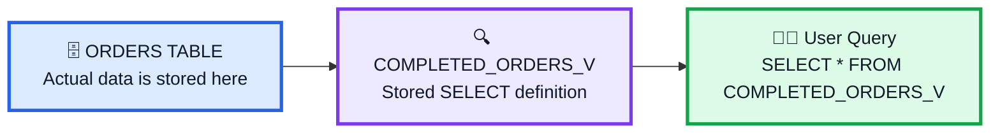

### What is actually stored?

For a normal Snowflake view:

```text
The SELECT statement / definition is stored.
The result rows are NOT permanently stored by the view.
```

When you query the view, Snowflake evaluates the view definition against the underlying objects.

> 🟨 **Important:** A view is an abstraction layer over tables/views. It can simplify SQL, hide columns, filter rows, join objects, and expose a business-friendly interface.

</details>

---

<details>
<summary><b>🎯 2. Why Do We Need Views?</b></summary>

## <span style="color:#F97316;">Why not query tables directly?</span>

Views solve several practical problems.

### 1️⃣ Simplify complicated SQL

Instead of giving users this:

```sql
SELECT
    c.CUSTOMER_ID,
    c.CUSTOMER_NAME,
    COUNT(o.ORDER_ID) AS ORDER_COUNT,
    SUM(o.AMOUNT) AS TOTAL_REVENUE
FROM CUSTOMERS c
JOIN ORDERS o
    ON c.CUSTOMER_ID = o.CUSTOMER_ID
WHERE o.STATUS = 'COMPLETED'
GROUP BY
    c.CUSTOMER_ID,
    c.CUSTOMER_NAME;
```

Create:

```sql
CREATE OR REPLACE VIEW CUSTOMER_REVENUE_V AS
SELECT
    c.CUSTOMER_ID,
    c.CUSTOMER_NAME,
    COUNT(o.ORDER_ID) AS ORDER_COUNT,
    SUM(o.AMOUNT) AS TOTAL_REVENUE
FROM CUSTOMERS c
JOIN ORDERS o
    ON c.CUSTOMER_ID = o.CUSTOMER_ID
WHERE o.STATUS = 'COMPLETED'
GROUP BY
    c.CUSTOMER_ID,
    c.CUSTOMER_NAME;
```

Now users run:

```sql
SELECT *
FROM CUSTOMER_REVENUE_V;
```

---

### 2️⃣ Hide sensitive columns

Base table:

```text
CUSTOMERS
├── CUSTOMER_ID
├── NAME
├── EMAIL
├── PHONE
├── DATE_OF_BIRTH
└── CREDIT_CARD_TOKEN
```

Create a view:

```sql
CREATE OR REPLACE VIEW CUSTOMER_PUBLIC_V AS
SELECT
    CUSTOMER_ID,
    NAME
FROM CUSTOMERS;
```

Users who only need basic customer information can work with the view instead of receiving all columns.

---

### 3️⃣ Give business-friendly names

```sql
CREATE OR REPLACE VIEW SALES_REPORT_V AS
SELECT
    ORDER_DATE AS SALE_DATE,
    AMOUNT     AS SALES_AMOUNT
FROM ORDERS;
```

---

### 4️⃣ Reuse business logic

Define logic once:

```sql
WHERE STATUS = 'COMPLETED'
```

Then many analysts, dashboards, and applications can use the same view.

---

### 5️⃣ Build layers

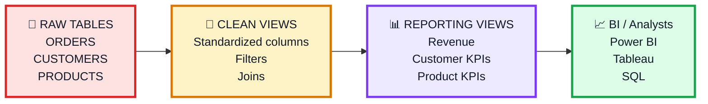

</details>

---

<details open>
<summary><b>🗺️ 3. Snowflake View Types — Big Picture</b></summary>

## <span style="color:#7C3AED;">The View Family</span>

For learning purposes, think of Snowflake views like this:

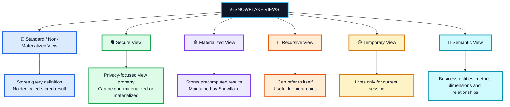

> 🟨 **Very important:**  
> **Secure** is not simply a completely separate storage mechanism. Snowflake allows both **non-materialized views and materialized views to be secure**.

</details>

---

<details open>
<summary><b>🔵 4. Standard / Non-Materialized View</b></summary>

## <span style="color:#2563EB;">The Normal View You Will Use Most Often</span>

A normal view stores the **query definition**, not its own persistent copy of the result rows.

### Syntax

```sql
CREATE OR REPLACE VIEW ACTIVE_ORDERS_V AS
SELECT
    ORDER_ID,
    CUSTOMER_ID,
    ORDER_DATE,
    AMOUNT
FROM ORDERS
WHERE STATUS = 'COMPLETED';
```

Query it:

```sql
SELECT *
FROM ACTIVE_ORDERS_V;
```

### How it works

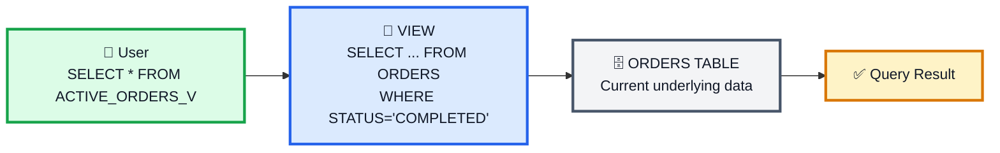

### Important fresher observation

Suppose:

```sql
SELECT *
FROM ACTIVE_ORDERS_V;
```

returns:

```text
101
103
```

Now someone inserts:

```sql
INSERT INTO ORDERS
VALUES (104, 7, CURRENT_DATE(), 'COMPLETED', 3500);
```

Query the view again:

```sql
SELECT *
FROM ACTIVE_ORDERS_V;
```

The new row can appear because the view evaluates against the underlying data.

### When should I use it?

✅ Reusable SQL  
✅ Reporting layer  
✅ Hide columns  
✅ Filter rows  
✅ Join tables  
✅ Rename columns  
✅ Centralize business logic  
✅ No need to physically store precomputed view results

### Example

```sql
CREATE OR REPLACE VIEW HIGH_VALUE_ORDERS_V AS
SELECT
    ORDER_ID,
    CUSTOMER_ID,
    AMOUNT
FROM ORDERS
WHERE AMOUNT >= 3000;
```

### Memory trick

> 🔵 **Standard View = Save the QUERY**

</details>

---

<details>
<summary><b>🛡️ 5. Secure View</b></summary>

## <span style="color:#16A34A;">Use When Privacy of the View Definition / Data Exposure Matters</span>

Create a secure non-materialized view:

```sql
CREATE OR REPLACE SECURE VIEW CUSTOMER_SAFE_V AS
SELECT
    CUSTOMER_ID,
    CUSTOMER_NAME,
    COUNTRY
FROM CUSTOMERS;
```

Snowflake supports secure views to improve data privacy and secure data-sharing scenarios.

### Mental model

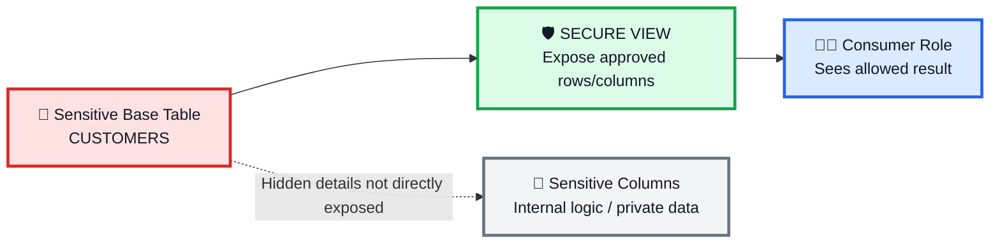

### Standard View vs Secure View

| Question | Standard View | Secure View |
|---|---|---|
| Can simplify SQL? | ✅ | ✅ |
| Can expose subset of data? | ✅ | ✅ |
| Privacy-focused behavior? | Basic | ✅ Stronger |
| Secure sharing scenarios? | Less appropriate | ✅ Designed for it |
| Can a materialized view be secure? | — | ✅ Yes |

### Important concept

A secure view may trade some optimization opportunities for stronger privacy guarantees.

### Fresher example

Company table:

```text
EMPLOYEE_PAYROLL
├── EMP_ID
├── EMP_NAME
├── DEPARTMENT
├── SALARY
├── BANK_ACCOUNT
└── TAX_IDENTIFIER
```

HR needs salary data, but another team should see only:

```text
EMP_ID
EMP_NAME
DEPARTMENT
```

You can expose controlled information through a secure view:

```sql
CREATE OR REPLACE SECURE VIEW EMPLOYEE_DIRECTORY_SECURE_V AS
SELECT
    EMP_ID,
    EMP_NAME,
    DEPARTMENT
FROM EMPLOYEE_PAYROLL;
```

### Check whether a view is secure

```sql
SHOW VIEWS LIKE 'CUSTOMER_SAFE_V';
```

You can also inspect view metadata through Snowflake's Information Schema / Account Usage where appropriate.

### Memory trick

> 🛡️ **Secure View = Save the QUERY + Protect the INTERFACE**

</details>

---

<details open>
<summary><b>🟣 6. Materialized View</b></summary>

## <span style="color:#7C3AED;">A View Whose Results Are Precomputed and Stored</span>

This is the biggest conceptual difference from a standard view.

### Standard View

```text
Store SQL definition → Run/optimize query when needed
```

### Materialized View

```text
Compute result → Store result → Maintain it as source data changes
```

Snowflake describes a materialized view as a **precomputed data set** that is stored for later use.

### Syntax

```sql
CREATE OR REPLACE MATERIALIZED VIEW COMPLETED_ORDER_AMOUNTS_MV AS
SELECT
    ORDER_ID,
    ORDER_DATE,
    AMOUNT
FROM ORDERS
WHERE STATUS = 'COMPLETED';
```

> ⚠️ **Edition note:** Materialized views are an **Enterprise Edition feature** in Snowflake.

### How it works

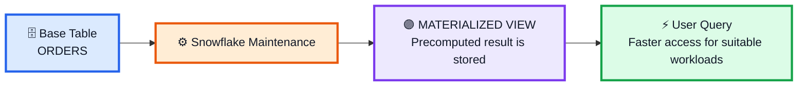

### Why use one?

Imagine a very large table:

```text
ORDERS → 5 billion rows
```

A frequently repeated filter/calculation may be expensive.

A suitable materialized view can reduce repeated work because Snowflake stores and maintains precomputed results.

### But there is a trade-off

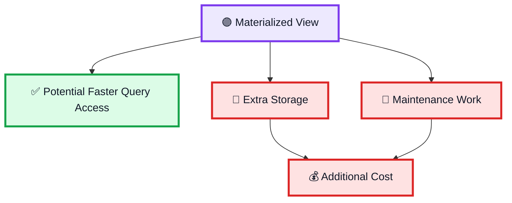

### Choose materialized views when

✅ Source table is large  
✅ Queries repeatedly access a useful subset / expensive derived result  
✅ Query latency matters  
✅ Benefits justify storage + maintenance cost

### Do NOT think

> ❌ “Materialized view is always faster, so I should create one for every query.”

That would increase storage and maintenance costs unnecessarily.

### Memory trick

> 🟣 **Materialized View = Save the RESULT**

</details>

---

<details>
<summary><b>🔁 7. Recursive View</b></summary>

## <span style="color:#EA580C;">Useful for Hierarchical Data</span>

A recursive non-materialized view can refer to itself.

Typical use cases:

- Employee → Manager hierarchy
- Category → Parent category
- Folder → Parent folder
- Organizational structure
- Bill of materials

### Example hierarchy

```text
CEO
│
├── Engineering Manager
│   ├── Developer A
│   └── Developer B
│
└── Sales Manager
    ├── Salesperson A
    └── Salesperson B
```

### Visual mental model

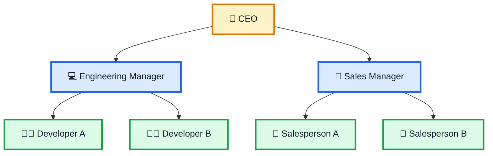

### Sample table

```sql
CREATE OR REPLACE TABLE EMPLOYEES (
    EMP_ID      NUMBER,
    EMP_NAME    STRING,
    MANAGER_ID  NUMBER
);
```

Sample data:

```sql
INSERT INTO EMPLOYEES VALUES
(1, 'CEO', NULL),
(2, 'Engineering Manager', 1),
(3, 'Sales Manager', 1),
(4, 'Developer A', 2),
(5, 'Developer B', 2),
(6, 'Salesperson A', 3);
```

### Recursive view concept

```sql
CREATE OR REPLACE RECURSIVE VIEW EMPLOYEE_HIERARCHY_V
(
    EMP_ID,
    EMP_NAME,
    MANAGER_ID,
    LEVEL_NO
) AS

SELECT
    EMP_ID,
    EMP_NAME,
    MANAGER_ID,
    1
FROM EMPLOYEES
WHERE MANAGER_ID IS NULL

UNION ALL

SELECT
    E.EMP_ID,
    E.EMP_NAME,
    E.MANAGER_ID,
    H.LEVEL_NO + 1
FROM EMPLOYEES E
JOIN EMPLOYEE_HIERARCHY_V H
    ON E.MANAGER_ID = H.EMP_ID;
```

Then:

```sql
SELECT *
FROM EMPLOYEE_HIERARCHY_V
ORDER BY LEVEL_NO, EMP_ID;
```

### Important warning

Recursive logic must eventually stop.

Bad recursive logic can result in non-terminating / excessive recursion behavior.

### Memory trick

> 🔁 **Recursive View = Walk a HIERARCHY**

</details>

---

<details>
<summary><b>🟡 8. Temporary View</b></summary>

## <span style="color:#D97706;">A View Needed Only for Your Current Session</span>

A temporary view exists only for the session in which it was created.

### Syntax

```sql
CREATE OR REPLACE TEMPORARY VIEW TODAY_HIGH_VALUE_ORDERS_V AS
SELECT *
FROM ORDERS
WHERE ORDER_DATE = CURRENT_DATE()
  AND AMOUNT > 5000;
```

Short form:

```sql
CREATE TEMP VIEW TODAY_HIGH_VALUE_ORDERS_V AS
SELECT *
FROM ORDERS
WHERE AMOUNT > 5000;
```

### Lifecycle

```mermaid
flowchart LR
    A["🔑 Login / Session Starts"] --> B["🟡 CREATE TEMP VIEW"]
    B --> C["🔎 Query Temp View"]
    C --> D["🚪 Session Ends"]
    D --> E["🗑️ Temp View Is Dropped"]

    classDef session fill:#DBEAFE,stroke:#2563EB,stroke-width:3px,color:#111827
    classDef temp fill:#FEF3C7,stroke:#D97706,stroke-width:3px,color:#111827
    classDef end fill:#FEE2E2,stroke:#DC2626,stroke-width:3px,color:#111827

    class A session
    class B,C temp
    class D,E end
```

### Use it when

✅ You are experimenting  
✅ You only need the abstraction during the current session  
✅ You don't want a permanent schema object afterward

### Compare

```text
NORMAL VIEW       → remains until dropped
TEMPORARY VIEW    → automatically disappears when session ends
```

### Memory trick

> 🟡 **Temporary View = VIEW for THIS SESSION**

</details>

---

<details>
<summary><b>🧠 9. Semantic View</b></summary>

## <span style="color:#0891B2;">A Business Meaning Layer Above Physical Data</span>

Semantic views are different from the traditional “saved SELECT” mental model.

They let you define **business entities, relationships, facts, dimensions, and metrics** as a schema-level Snowflake object.

### The problem they solve

Database may contain technical names:

```text
ORD_FCT
├── AMT_TTL_PRE_DSC
├── DISC_PCT
├── CUST_SK
└── DT_SK
```

A business person asks:

```text
"What is Net Revenue by Region?"
```

Without a common semantic layer, different teams might calculate “Net Revenue” differently.

A semantic view lets an organization define business meaning centrally.

### Visual model

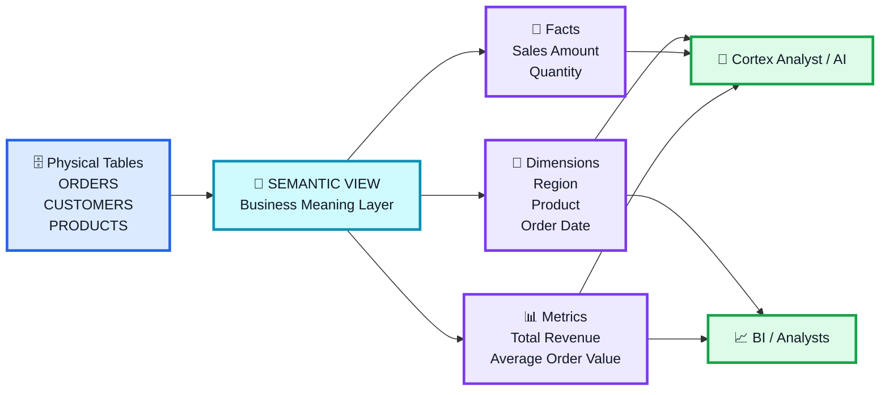

### Key concepts

#### Dimension

A way to describe or group data.

Examples:

```text
Region
Country
Product Category
Order Date
Customer Segment
```

#### Fact

A row-level numeric/business event value.

Examples:

```text
Order Amount
Quantity
Cost
Discount
```

#### Metric

A business calculation usually built through aggregation.

Examples:

```text
Total Revenue
Order Count
Average Order Value
Profit Margin
```

### Fresher mental model

```text
Table column says: AMT_TTL_PRE_DSC
Business says:     Gross Revenue

Semantic View connects those two worlds.
```

### Why is this useful?

✅ Consistent KPI definitions  
✅ Business-friendly vocabulary  
✅ AI / Cortex Analyst use cases  
✅ BI semantic consistency  
✅ Centralized business logic

### Memory trick

> 🧠 **Semantic View = Save the BUSINESS MEANING**

</details>

---

<details>
<summary><b>🔐 10. Important Point: Secure is a Property, Not Just Another Box</b></summary>

## <span style="color:#DC2626;">This is a Common Interview Confusion</span>

Snowflake documentation states that **both non-materialized and materialized views can be defined as secure**.

Think of it like this:

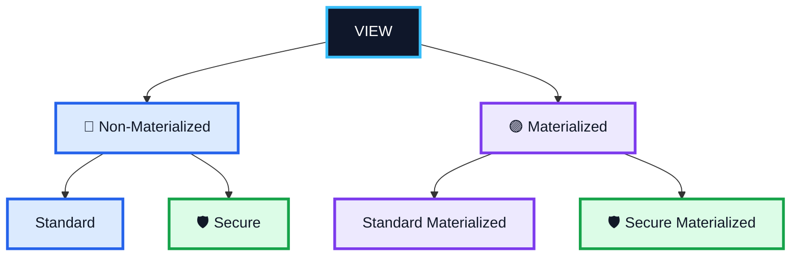

So avoid memorizing:

```text
Standard
Secure
Materialized
```

as though all three are completely unrelated storage categories.

Better understanding:

```text
Non-materialized vs Materialized = How the result is handled
Secure = Privacy/security behavior
Temporary = Lifetime
Recursive = Query behavior
Semantic = Business-semantic modeling
```

</details>

---

<details open>
<summary><b>⚖️ 11. Complete Comparison Table</b></summary>

## <span style="color:#9333EA;">View Comparison</span>

| Feature | Standard View | Secure View | Materialized View | Recursive View | Temporary View | Semantic View |
|---|---|---|---|---|---|---|
| Main purpose | Simplify/reuse query | Privacy | Performance | Hierarchy | Session-only use | Business meaning |
| Stores normal query definition | ✅ | ✅ if non-materialized | Definition + stored result | ✅ | ✅ | Different semantic model |
| Stores precomputed result | ❌ | Only if secure materialized | ✅ | ❌ | ❌ | Not the traditional MV concept |
| Lives after session | ✅ | ✅ | ✅ | ✅ | ❌ | ✅ |
| Can be secure | ✅ | Already secure | ✅ | Secure syntax can apply to views | Can be secure in CREATE VIEW syntax | Separate semantic object model |
| Best fresher example | Completed orders | Safe customer data | Frequently queried large subset | Employee hierarchy | Today's analysis | Revenue definition |
| Special cost concern | Query compute | Potential optimization tradeoff | Storage + maintenance | Recursive query cost | Minimal persistence | Depends on downstream use |
| Special edition note | Normal availability | Normal feature | Enterprise Edition | Non-materialized view feature | Normal view feature | Current Snowflake semantic object |

</details>

---

<details>
<summary><b>🛒 12. One E-Commerce Scenario Using Different Views</b></summary>

## <span style="color:#F97316;">One System — Different Requirements</span>

Assume:

```text
ORDERS
CUSTOMERS
PRODUCTS
```

### Architecture

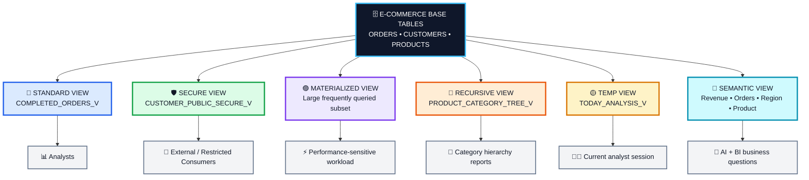

### Requirement 1 — Analysts need completed orders

Use:

```sql
CREATE VIEW COMPLETED_ORDERS_V AS
SELECT *
FROM ORDERS
WHERE STATUS = 'COMPLETED';
```

✅ **Standard view**

---

### Requirement 2 — External consumer must not see private customer columns

Use:

```sql
CREATE SECURE VIEW CUSTOMER_PUBLIC_SECURE_V AS
SELECT
    CUSTOMER_ID,
    CUSTOMER_NAME,
    COUNTRY
FROM CUSTOMERS;
```

✅ **Secure view**

---

### Requirement 3 — Huge table, frequently accessed subset needs faster access

Consider:

```sql
CREATE MATERIALIZED VIEW COMPLETED_ORDER_AMOUNTS_MV AS
SELECT
    ORDER_ID,
    ORDER_DATE,
    AMOUNT
FROM ORDERS
WHERE STATUS = 'COMPLETED';
```

✅ **Materialized view**, if the workload and cost justify it.

---

### Requirement 4 — Product categories have parent/child structure

Example:

```text
Electronics
   ├── Computers
   │      └── Laptops
   └── Mobiles
```

✅ **Recursive view**

---

### Requirement 5 — Analyst needs a view only until logout

```sql
CREATE TEMP VIEW TODAY_ORDERS_V AS
SELECT *
FROM ORDERS
WHERE ORDER_DATE = CURRENT_DATE();
```

✅ **Temporary view**

---

### Requirement 6 — Business users ask “Revenue by Region”

Define:

```text
Metric: Total Revenue
Dimension: Region
Dimension: Order Date
Entity: Order
Relationship: Customer → Orders
```

✅ **Semantic view**

</details>

---

<details>
<summary><b>🚦 13. Which View Should I Choose?</b></summary>

## <span style="color:#16A34A;">Fresher Decision Diagram</span>

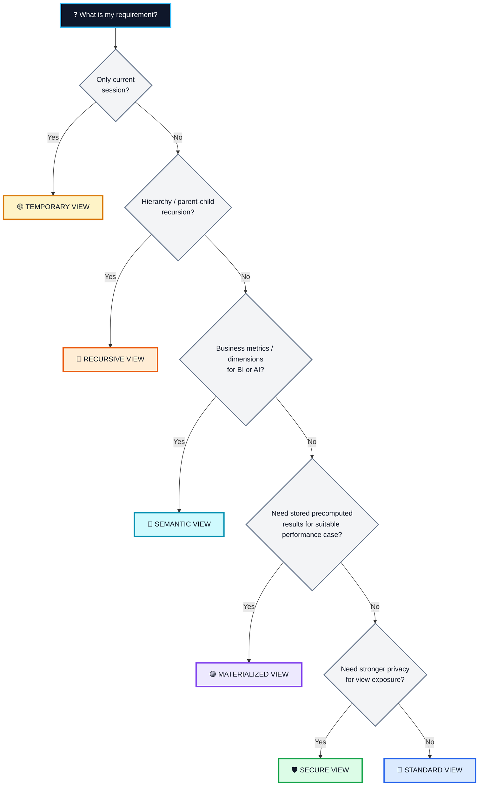

</details>

---

<details>
<summary><b>🧪 14. Small Hands-On Lab for Freshers</b></summary>

## <span style="color:#2563EB;">Step 1 — Create Demo Data</span>

```sql
CREATE OR REPLACE DATABASE VIEW_DEMO_DB;
CREATE OR REPLACE SCHEMA VIEW_DEMO_DB.ECOMMERCE;

USE DATABASE VIEW_DEMO_DB;
USE SCHEMA ECOMMERCE;

CREATE OR REPLACE TABLE ORDERS (
    ORDER_ID      NUMBER,
    CUSTOMER_NAME STRING,
    ORDER_DATE    DATE,
    STATUS        STRING,
    AMOUNT        NUMBER(10,2)
);

INSERT INTO ORDERS VALUES
(101, 'Asha', '2026-08-01', 'COMPLETED', 2500),
(102, 'Kumar', '2026-08-01', 'CANCELLED', 900),
(103, 'John', '2026-08-02', 'COMPLETED', 4200),
(104, 'Meena', '2026-08-03', 'PENDING', 1800),
(105, 'David', '2026-08-04', 'COMPLETED', 6500);
```

---

## <span style="color:#16A34A;">Step 2 — Create Standard View</span>

```sql
CREATE OR REPLACE VIEW COMPLETED_ORDERS_V AS
SELECT
    ORDER_ID,
    CUSTOMER_NAME,
    ORDER_DATE,
    AMOUNT
FROM ORDERS
WHERE STATUS = 'COMPLETED';
```

```sql
SELECT *
FROM COMPLETED_ORDERS_V;
```

---

## <span style="color:#7C3AED;">Step 3 — Prove That the View Reflects Base Data</span>

```sql
INSERT INTO ORDERS VALUES
(106, 'Priya', CURRENT_DATE(), 'COMPLETED', 7200);
```

```sql
SELECT *
FROM COMPLETED_ORDERS_V;
```

Ask students:

> “Did we insert into the view?”

**No.** We changed the base table; the standard view uses the underlying data when queried.

---

## <span style="color:#16A34A;">Step 4 — Create Secure View</span>

```sql
CREATE OR REPLACE SECURE VIEW COMPLETED_ORDERS_SECURE_V AS
SELECT
    ORDER_ID,
    ORDER_DATE,
    AMOUNT
FROM ORDERS
WHERE STATUS = 'COMPLETED';
```

```sql
SHOW VIEWS LIKE 'COMPLETED_ORDERS_SECURE_V';
```

---

## <span style="color:#D97706;">Step 5 — Create Temporary View</span>

```sql
CREATE OR REPLACE TEMP VIEW HIGH_VALUE_ORDERS_TEMP_V AS
SELECT *
FROM ORDERS
WHERE AMOUNT >= 5000;
```

```sql
SELECT *
FROM HIGH_VALUE_ORDERS_TEMP_V;
```

Then end the session and explain that the temporary view is session-scoped.

---

## <span style="color:#7C3AED;">Step 6 — Materialized View (Only if Account Edition Supports It)</span>

```sql
CREATE OR REPLACE MATERIALIZED VIEW COMPLETED_ORDER_MV AS
SELECT
    ORDER_ID,
    ORDER_DATE,
    AMOUNT
FROM ORDERS
WHERE STATUS = 'COMPLETED';
```

Check:

```sql
SHOW MATERIALIZED VIEWS;
```

> ⚠️ Materialized views require Snowflake Enterprise Edition.

</details>

---

<details>
<summary><b>⚠️ 15. Common Fresher Mistakes</b></summary>

## <span style="color:#DC2626;">Mistake 1 — “A standard view stores another copy of the data.”</span>

❌ Wrong.

A normal/non-materialized view stores the query definition.

---

## <span style="color:#DC2626;">Mistake 2 — “A view is always faster than a table.”</span>

❌ Wrong.

A standard view mainly provides abstraction and reusable logic. It does not automatically mean better performance.

---

## <span style="color:#DC2626;">Mistake 3 — “Secure view means users automatically get access.”</span>

❌ Wrong.

Snowflake privileges still matter. Secure behavior and access control are related concepts, but creating a secure view does not magically grant everyone permission.

---

## <span style="color:#DC2626;">Mistake 4 — “Materialized view is free.”</span>

❌ Wrong.

Precomputed results require storage and maintenance, which can incur cost.

---

## <span style="color:#DC2626;">Mistake 5 — “Temporary view survives logout.”</span>

❌ Wrong.

It is session-scoped.

---

## <span style="color:#DC2626;">Mistake 6 — “Secure and materialized are mutually exclusive.”</span>

❌ Wrong.

Snowflake supports **secure materialized views**.

---

## <span style="color:#DC2626;">Mistake 7 — “Semantic view is just another saved SELECT.”</span>

❌ Wrong.

Semantic views model business entities, relationships, dimensions, facts, and metrics.

</details>

---

<details>
<summary><b>🆚 16. Table vs View vs Materialized View</b></summary>

## <span style="color:#9333EA;">Quick Comparison</span>

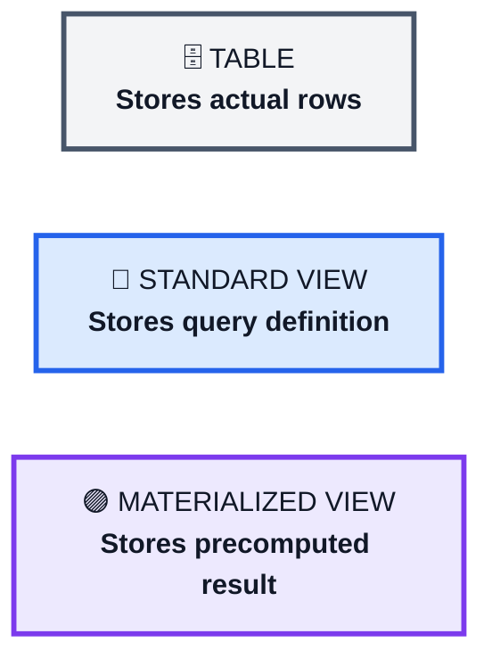

| Question | Table | Standard View | Materialized View |
|---|---|---|---|
| Stores actual business rows? | ✅ | ❌ | Stores derived/precomputed result |
| Has own data storage? | ✅ | No dedicated result storage | ✅ |
| Based on another table/query? | Not necessarily | ✅ | ✅ |
| Automatically reflects source changes? | N/A | Query evaluates source | Snowflake maintains MV |
| Extra storage for result? | ✅ table storage | ❌ view result | ✅ |
| Main purpose | Store data | Abstraction | Performance |

</details>

---

<details>
<summary><b>💡 17. View vs Dynamic Table — Don't Confuse Them</b></summary>

## <span style="color:#0EA5E9;">A useful modern Snowflake distinction</span>

A **dynamic table is not simply another traditional view type**.

A dynamic table stores query results and refreshes them to meet a defined target freshness/lag, making it useful for declarative data pipelines.

A normal view:

```text
Query → Evaluate underlying objects when queried
```

A materialized view:

```text
Snowflake-managed precomputed materialization
```

A dynamic table:

```text
Declarative pipeline result
↓
Refreshed based on target lag / freshness requirements
```

For a fresher:

> Use **views** primarily for abstraction, **materialized views** for suitable query-performance scenarios, and **dynamic tables** for declarative transformation pipelines.

</details>

---

<details>
<summary><b>🎤 18. Interview Questions & Answers</b></summary>

### Q1. What is a view in Snowflake?

A view is a schema object whose definition contains a query. A standard/non-materialized view provides table-like access to the query result without storing a dedicated persistent copy of those result rows.

---

### Q2. What is the difference between a view and a materialized view?

A standard view stores the query definition, whereas a materialized view stores precomputed results and Snowflake maintains them as the underlying data changes.

---

### Q3. Why use a secure view?

Use a secure view when stronger privacy of the view's data exposure and definition is important, especially in secure data-sharing scenarios.

---

### Q4. Can a materialized view be secure?

**Yes.** Snowflake allows materialized views to be defined as secure.

---

### Q5. What is a temporary view?

A temporary view exists only for the session that created it and is dropped when the session ends.

---

### Q6. What is a recursive view?

A recursive view is a non-materialized view that can refer to itself, commonly used for hierarchical parent-child data.

---

### Q7. What is a semantic view?

A semantic view is a schema-level Snowflake object that defines business concepts such as logical entities, relationships, dimensions, facts, and metrics.

---

### Q8. Do standard views automatically improve performance?

No. Their primary purposes are abstraction, reuse, simplification, governance, and controlled exposure. Performance depends on the underlying query and Snowflake optimization.

---

### Q9. Why would a materialized view cost more?

Because its precomputed results consume storage and Snowflake performs maintenance as source data changes.

---

### Q10. What happens if an underlying table column used by a view is dropped?

The view definition is not automatically rewritten. Querying the affected view can fail because the referenced object/column is no longer valid.

</details>

---

<details open>
<summary><b>🧠 19. Final Memory Cheat Sheet</b></summary>

<div align="center">

### <span style="color:#2563EB;">🔵 STANDARD VIEW</span>
**SAVE THE QUERY**

### <span style="color:#16A34A;">🛡️ SECURE VIEW</span>
**PROTECT THE INTERFACE**

### <span style="color:#7C3AED;">🟣 MATERIALIZED VIEW</span>
**SAVE THE RESULT**

### <span style="color:#EA580C;">🔁 RECURSIVE VIEW</span>
**WALK THE HIERARCHY**

### <span style="color:#D97706;">🟡 TEMPORARY VIEW</span>
**USE IT THIS SESSION**

### <span style="color:#0891B2;">🧠 SEMANTIC VIEW</span>
**SAVE THE BUSINESS MEANING**

</div>

---

### One-picture mental model

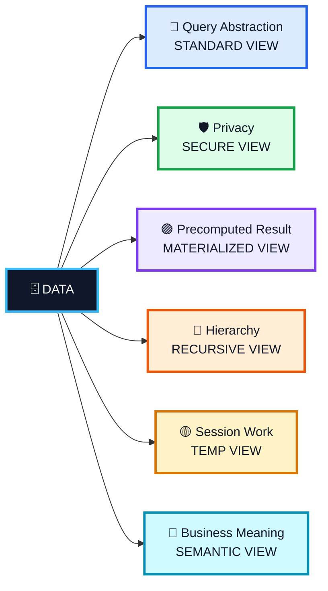

</details>

---

<details>
<summary><b>📚 20. Official Snowflake References</b></summary>

The notes above are aligned with Snowflake's official documentation:

- **Overview of Views**  
  https://docs.snowflake.com/en/user-guide/views-introduction

- **CREATE VIEW**  
  https://docs.snowflake.com/en/sql-reference/sql/create-view

- **Working with Secure Views**  
  https://docs.snowflake.com/en/user-guide/views-secure

- **Working with Materialized Views**  
  https://docs.snowflake.com/en/user-guide/views-materialized

- **CREATE MATERIALIZED VIEW**  
  https://docs.snowflake.com/en/sql-reference/sql/create-materialized-view

- **Overview of Semantic Views**  
  https://docs.snowflake.com/en/user-guide/views-semantic/overview

- **CREATE SEMANTIC VIEW**  
  https://docs.snowflake.com/en/sql-reference/sql/create-semantic-view

</details>

---

> 📝 **Rendering Note:** Mermaid diagrams render directly in platforms that support Mermaid (for example, many Markdown preview tools and Git hosting environments). The HTML color styling used in headings depends on the Markdown viewer.
